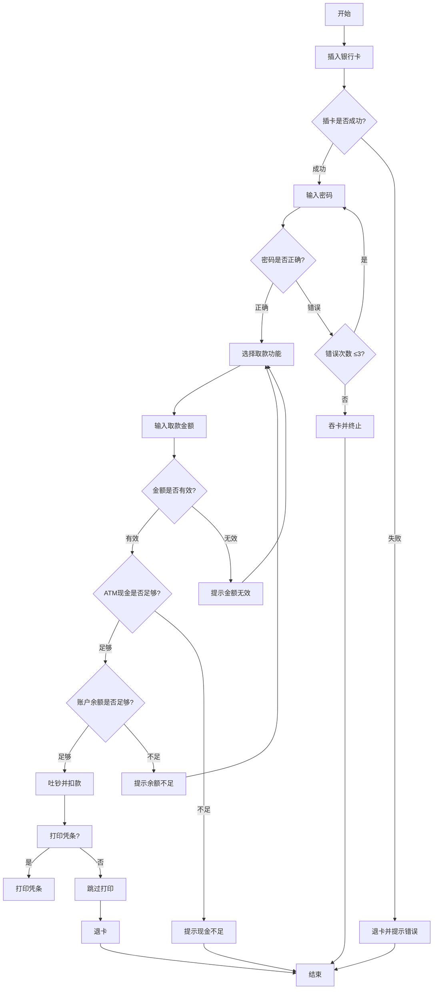

场景法是一种通过用户使用“场景”对软件系统的功能点或业务流程进行描述，即针对需求模拟出不同的场景进行所有功能点及业务流程的覆盖，从而提高测试效率并达到良好效果的方法。

场景法要求我们通过两个层面去理解被测软件，分别是业务层面和技术层面。

业务层面：测试人员要熟悉所测软件的业务逻辑，对业务了如指掌
技术层面：
基本流：也叫有效流或正确流，模拟用户正确的业务操作流程
备选流：也叫无效流或错误流，模拟用户错误的业务操作流程

- **基本流（Happy Path）**  
  用户完成目标的最理想路径（如：电商下单→支付→收货）

- **备选流（Alternative Flow）**  
  异常或分支路径（如：支付失败、库存不足、地址修改）

- **异常流（Exception Flow）**  
  系统错误处理路径（如：网络中断、服务超时）

使用场景法进行黑盒测试的一般步骤如下：

构造基本流和备选流
根据基本流和备选流构造场景
根据场景审计测试用例
对每个测试用例补充必要的测试数据
#### 1. **定义基本流（正确流程）**

**场景描述**：用户成功完成取款操作  
**流程步骤**：

```
插卡 → 输入正确密码 → 选择"取款" → 输入有效金额（≤账户余额且≤ATM限额）  
→ ATM有足够现金 → 吐钞 → 打印凭条 → 退卡 → 结束
```

**对应测试用例**：  

| 用例编号 | 输入金额 | ATM现金 | 账户余额 | 预期结果            |
| -------- | -------- | ------- | -------- | ------------------- |
| T1       | 500      | 10000   | 2000     | 成功取款500元，退卡 |

---

#### 2. **定义备选流（错误流程）**

**备选流 1**：插卡失败  

```
插卡 → 卡片无法识别 → 退卡 → 终止流程
```

**测试用例**：  

| T2   | 输入动作   | 预期结果             |
| ---- | ---------- | -------------------- |
|      | 插入损坏卡 | 提示"卡片无效"，退卡 |

---

**备选流 2**：密码错误（分层处理）  

- **首次错误**：  

  ```
  输入错误密码 → 提示"密码错误，请重试" → 返回基本流（重新输入）
  ```

- **三次错误**：  

  ```
  连续错误3次 → 吞卡 → 终止流程
  ```

  **测试用例**：  

| T3   | 输入密码    | 预期结果                   |
| ---- | ----------- | -------------------------- |
|      | 错误→正确   | 允许重新输入，最终成功取款 |
| T4   | 连续错误3次 | 吞卡并提示"请联系银行"     |

---

**备选流 3**：ATM现金不足  

```
输入金额500 → ATM仅剩300元 → 提示"现金不足" → 退卡 → 终止流程
```

**测试用例**：  

| T5   | 输入金额 | ATM现金 | 预期结果             |
| ---- | -------- | ------- | -------------------- |
|      | 500      | 300     | 提示"现金不足"，退卡 |

---

**备选流 4**：账户余额不足  

```
输入金额2000 → 账户余额1000 → 提示"余额不足" → 返回基本流（重新输入）
```

**测试用例**：  

| T6   | 输入金额 | 账户余额 | 预期结果                     |
| ---- | -------- | -------- | ---------------------------- |
|      | 2000     | 1000     | 提示"余额不足"，允许重新输入 |

---

#### 3. **场景法执行路径示意图

```plaintext
        开始
          ↓
        [插卡] → 失败 → 备选流1（退卡终止）
          ↓
  [输入密码] → 错误 → 备选流2（重试/吞卡）
          ↓
      [选择取款] → 输入金额 → 无效 → 备选流4（余额不足）
          ↓
      [ATM吐钞] → 失败 → 备选流3（现金不足）
          ↓
    成功取款 → 退卡结束
```

---

### 场景法核心思想总结

1. **基本流**：覆盖用户最常用的完整成功路径（如T1）。  
2. **备选流**：  
   - 模拟真实操作中的**分支场景**（如密码错误、余额不足）  
   - 关注流程的**中断与恢复**（如T3允许重试，T4强制终止）  
3. **测试设计目标**：  
   - 通过 **基本流+备选流组合**，覆盖所有可能路径  
   - 验证系统在**异常分支**下的行为是否符合预期（如吞卡、凭条打印）  
4. **与ATM取款映射关系**：  
   - 基本流 ≈ 用户顺利取款  
   - 备选流 ≈ 插卡异常、密码错误、ATM故障等现实问题

```

```


以下是使用 **Mermaid 流程图**对 ATM 取款场景法的完整说明：



---

### **关键说明**：

1. **基本流路径**（绿色路径）：  
   `A → B → C(成功) → D → F(正确) → G → J → K(有效) → L(足够) → N(足够) → P → U → END`  
   **对应测试用例**: T1（正常取款流程）

2. **备选流分支**（红色路径）：  
   - **插卡失败**：`C → E → END`（用例T2）  
   - **密码错误**：  
     - 单次错误：`F → H(≤3) → D`（允许重试）  
     - 三次错误：`F → H(>3) → I → END`（用例T4）  
   - **现金不足**：`L → O → END`（用例T5）  
   - **余额不足**：`N → Q → G`（用例T6）

3. **决策节点**：  
   - 菱形节点 `{}` 表示条件判断（如密码是否正确）  
   - 圆角矩形 `[]` 表示操作或状态（如吐钞、退卡）

---

### **与场景法的映射关系**：

| Mermaid 元素         | 场景法对应内容               |
| -------------------- | ---------------------------- |
| 基本流路径           | 用户成功取款的核心流程       |
| 备选流分支           | 密码错误、现金不足等异常场景 |
| 条件节点（菱形）     | 流程中的关键决策点           |
| 操作节点（圆角矩形） | 具体的系统响应动作           |


