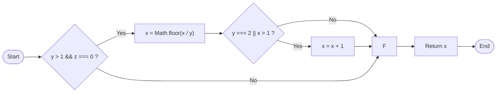
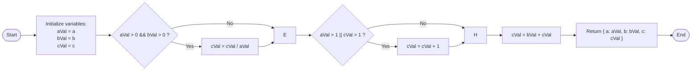

          
# 条件覆盖法（白盒测试）

## 条件覆盖

### 主要特点

条件覆盖要求设计足够多的测试用例，使得判定中的每个条件获得各种可能的结果，即每个条件至少有一次为真值，有一次为假值。

### 优点

显然条件覆盖比判定覆盖，增加了对复合判定情况的测试，增加了测试路径。

### 缺点

要达到条件覆盖，需要足够多的测试用例，但条件覆盖并不能保证判定覆盖。条件覆盖只能保证每个条件至少有一次为真，而不考虑所有的判定结果。

## 示例分析

假设有以下代码：

```javascript
function processData(a, b, c) {
  if (a > 0 && b > 0 || c > 0) {
    return "条件满足";
  } else {
    return "条件不满足";
  }
}
```

在这个例子中，判定表达式为 `a > 0 && b > 0 || c > 0`，包含三个条件：
- 条件1：`a > 0`
- 条件2：`b > 0`
- 条件3：`c > 0`

### 条件覆盖测试用例设计

为了满足条件覆盖，我们需要确保每个条件至少有一次为真，一次为假：

| 测试用例 | a | b | c | 条件1(a>0) | 条件2(b>0) | 条件3(c>0) | 判定结果 |
|---------|---|---|---|------------|------------|------------|---------|
| 1       | 1 | 1 | 0 | 真         | 真         | 假         | 真      |
| 2       | -1| 0 | 1 | 假         | 假         | 真         | 真      |

通过这两个测试用例，我们已经满足了条件覆盖的要求：
- 条件1：在测试用例1中为真，在测试用例2中为假
- 条件2：在测试用例1中为真，在测试用例2中为假
- 条件3：在测试用例1中为假，在测试用例2中为真

### 条件覆盖的局限性

虽然我们满足了条件覆盖的要求，但这并不能保证判定覆盖。例如，我们没有测试判定表达式整体为假的情况（当a≤0, b≤0, c≤0时）。

为了同时满足判定覆盖，我们还需要增加一个测试用例：

| 测试用例 | a | b | c | 条件1(a>0) | 条件2(b>0) | 条件3(c>0) | 判定结果 |
|---------|---|---|---|------------|------------|------------|---------|
| 3       | -1| -1| -1| 假         | 假         | 假         | 假      |

这说明条件覆盖虽然考虑了每个条件的不同取值，但不能保证测试了所有可能的判定结果组合，这是它的主要缺点。

## example2
### 一、JavaScript 代码转换（修正语法与逻辑）

```javascript
function test3(x, y, z) {
  if (y > 1 && z === 0) {
    x = Math.floor(x / y);
    if (y === 2 || x > 1) {
      x = x + 1;
    }
  }
  return x;
}
```

---

### 二、Mermaid 流程图（从左到右）



---

### 三、测试用例表（覆盖分支/判定路径）

| 用例编号 | 输入 (x, y, z) | 期望输出 (x) | 实际输出 (x) | 覆盖分支路径      | 语句覆盖率 | 分支覆盖率 |
| -------- | -------------- | ------------ | ------------ | ----------------- | ---------- | ---------- |
| 1        | (3, 2, 0)      | 2            | 2            | 条件1真 → 条件2真 | ✔️ 100%     | 50%        |
| 2        | (1, 3, 0)      | 0            | 0            | 条件1真 → 条件2假 | ✔️ 100%     | 75%        |
| 3        | (2, 0, 1)      | 2            | 2            | 条件1假           | ✔️ 100%     | 100%       |
| 4*       | (3, 2, 1)      | 3            | 3            | 条件1假           | ✔️ 100%     | 100%       |

---


## example3
### 一、JavaScript 源代码（原图逻辑实现）

```javascript
function calculate(a, b, c) {

  let aVal = a;
  let bVal = b;
  let cVal = c;

  if (aVal > 0 && bVal > 0) {
    cVal = cVal / aVal;
  }


  if (aVal > 1 || cVal > 1) {
    cVal = cVal + 1;
  }

 
  cVal = bVal + cVal;
  return { a: aVal, b: bVal, c: cVal };
}
```

---

### 二、Mermaid 时序图（从左到右）



---

### 三、用例表（原图测试用例）

| 用例编号 | 输入 (a, b, c) | 期望输出 (c) | 实际输出 (c) | 语句覆盖率 | 路径覆盖率 | 错误标注                       |
| -------- | -------------- | ------------ | ------------ | ---------- | ---------- | ------------------------------ |
| 1        | a=2, b=1, c=6  | 5            | 5            | ✔️ 100%     | 50%        | 无错误                         |
| 2        | a=1, b=1, c=1  | 2            | 2            | ✔️ 100%     | 50%        | 无错误                         |
| 3*       | a=1, b=-1, c=1 | 2            | 0            | -          | -          | ❗ 迭代代码逻辑错误 (原图第7行) |

