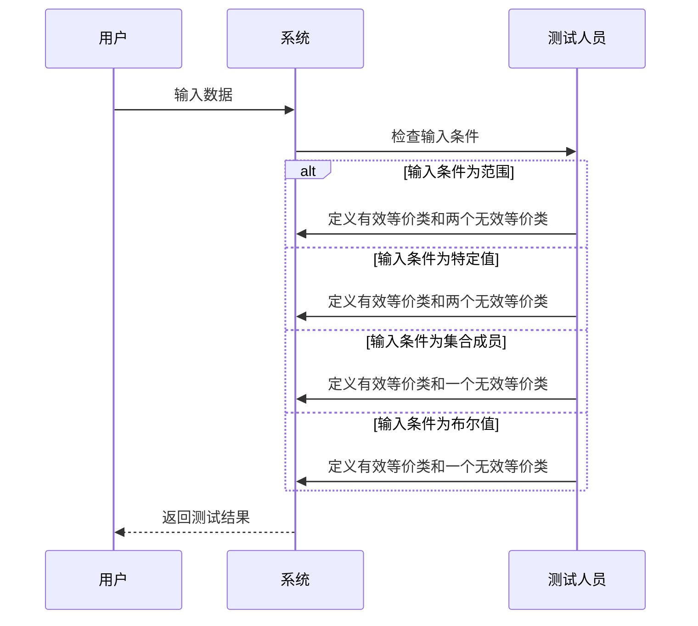

### 1. 等价类划分法（Equivalence Partitioning Method）
- **定义**：等价类划分法是一种软件测试技术，也称为黑盒测试。它将输入域划分为不同的数据类别，并利用这些数据类别派生出测试用例。理想的测试用例能够识别出某一类错误，而这些错误可能需要执行许多测试用例才能发现普遍性错误。
- **目的**：通过将输入域划分为等价类，减少测试用例的数量，同时确保测试覆盖所有可能的输入情况。
- **特点**：
  - 等价类是根据给定的输入条件进行评估的。
  - 每当给定任何输入时，都会检查输入条件的类型，然后针对该输入条件，等价类表示或描述一组有效或无效的状态。
  - 通过等价类划分，可以有效地减少测试用例的数量，同时确保测试的全面性。
- **应用场景**：
  - 输入字段的有效和无效值测试
  - 数值范围的边界值测试
  - 日期和时间的有效性测试


          
以下是等价类划分法的操作指南，使用时序图来说明：

### 等价类划分法的操作指南
1. **范围条件作为输入**：
   - 定义一个有效等价类和两个无效等价类。
   - 示例：输入范围为 1 到 100，有效等价类为 1 ≤ 输入 ≤ 100，无效等价类为 输入 < 1 和 输入 > 100。

2. **特定值作为输入**：
   - 定义一个有效等价类和两个无效等价类。
   - 示例：输入值为 50，有效等价类为 输入 = 50，无效等价类为 输入 < 50 和 输入 > 50。

3. **集合成员作为输入**：
   - 定义一个有效等价类和一个无效等价类。
   - 示例：输入为集合 {A, B, C} 的成员，有效等价类为 输入 ∈ {A, B, C}，无效等价类为 输入 ∉ {A, B, C}。

4. **布尔值作为输入**：
   - 定义一个有效等价类和一个无效等价类。
   - 示例：输入为布尔值，有效等价类为 输入 = true 或 false，无效等价类为 输入 ≠ true 且 输入 ≠ false。

### 时序图说明


### 例子1 

// ... existing code ...

### 2. 等价类划分法的代码示例
```javascript
function validatePercentage(percentage) {
    // 定义有效等价类和无效等价类
    const validRange = { min: 50, max: 90 };
    const invalidLow = percentage < validRange.min;
    const invalidHigh = percentage > validRange.max;

    // 检查输入是否在有效范围内
    if (invalidLow || invalidHigh) {
        return "Invalid percentage. Please enter a value between 50 and 90.";
    } else {
        return "Valid percentage. Proceeding with admission process.";
    }
}

// 测试用例
const testCases = [49, 50, 75, 90, 91];
testCases.forEach(testCase => {
    console.log(`Percentage: ${testCase}% - ${validatePercentage(testCase)}`);
});
```

```txt
Percentage: 49% - Invalid percentage. Please enter a value between 50 and 90.
Percentage: 50% - Valid percentage. Proceeding with admission process.
Percentage: 75% - Valid percentage. Proceeding with admission process.
Percentage: 90% - Valid percentage. Proceeding with admission process.
Percentage: 91% - Invalid percentage. Please enter a value between 50 and 90.
```


          
### 等价类划分法的操作过程和测试用例表格输出说明

#### 操作过程
1. **确定输入条件**：
   - 输入条件为百分比，范围为 50% 到 90%。
   - 有效等价类：50 ≤ 百分比 ≤ 90
   - 无效等价类：百分比 < 50 或 百分比 > 90

2. **设计测试用例**：
   - 有效等价类测试用例：50, 75, 90
   - 无效等价类测试用例：49, 91

3. **执行测试**：
   - 对每个测试用例进行验证，检查系统是否正确处理输入。

4. **记录结果**：
   - 记录每个测试用例的输入和输出结果，确保系统行为符合预期。

#### 测试用例表格
| 测试用例编号 | 输入百分比 | 预期结果 | 实际结果 |
|--------------|------------|----------|----------|
| 1            | 49         | 无效百分比 | 无效百分比 |
| 2            | 50         | 有效百分比 | 有效百分比 |
| 3            | 75         | 有效百分比 | 有效百分比 |
| 4            | 90         | 有效百分比 | 有效百分比 |
| 5            | 91         | 无效百分比 | 无效百分比 |

#### 解释
- **有效等价类**：输入百分比在 50 到 90 之间，系统应接受并继续录取流程。
- **无效等价类**：输入百分比小于 50 或大于 90，系统应拒绝并显示错误信息。

通过以上操作过程和测试用例表格，可以清晰地展示等价类划分法在实际应用中的使用方式和验证过程。

          
### 示例 2：在线购物网站的产品搜索
// ... existing code ...

### 3. 等价类划分法的代码示例（在线购物网站）
```javascript
function validateProductID(productID) {
    // 定义有效产品 ID 集合
    const validProductIDs = [45, 54, 67, 76, 34];
    const isValid = validProductIDs.includes(productID);

    // 检查输入是否为有效产品 ID
    if (isValid) {
        return "Valid product ID. Displaying product information.";
    } else {
        return "Invalid product ID. Redirecting to error page.";
    }
}

// 测试用例
const testCases = [45, 54, 67, 76, 34, 100];
testCases.forEach(testCase => {
    console.log(`Product ID: ${testCase} - ${validateProductID(testCase)}`);
});
```
```txt
Product ID: 45 - Valid product ID. Displaying product information.
Product ID: 54 - Valid product ID. Displaying product information.
Product ID: 67 - Valid product ID. Displaying product information.
Product ID: 76 - Valid product ID. Displaying product information.
Product ID: 34 - Valid product ID. Displaying product information.
Product ID: 100 - Invalid product ID. Redirecting to error page.
```
#### 操作过程
1. **确定输入条件**：
   - 输入条件为产品 ID 或产品名称。
   - 有效等价类：有效的产品 ID 或产品名称
   - 无效等价类：无效的产品 ID 或产品名称

2. **设计测试用例**：
   - 有效等价类测试用例：45（手机）, 54（笔记本电脑）, 67（随身碟）, 76（键盘）, 34（耳机）
   - 无效等价类测试用例：100（无效产品 ID）

3. **执行测试**：
   - 对每个测试用例进行验证，检查系统是否正确处理输入。

4. **记录结果**：
   - 记录每个测试用例的输入和输出结果，确保系统行为符合预期。

#### 测试用例表格
| 测试用例编号 | 输入产品 ID | 预期结果 | 实际结果 |
|--------------|-------------|----------|----------|
| 1            | 45          | 有效产品 ID | 有效产品 ID |
| 2            | 54          | 有效产品 ID | 有效产品 ID |
| 3            | 67          | 有效产品 ID | 有效产品 ID |
| 4            | 76          | 有效产品 ID | 有效产品 ID |
| 5            | 34          | 有效产品 ID | 有效产品 ID |
| 6            | 100         | 无效产品 ID | 无效产品 ID |

#### 解释
- **有效等价类**：输入产品 ID 在有效范围内，系统应接受并显示相应产品信息。
- **无效等价类**：输入产品 ID 不在有效范围内，系统应拒绝并显示错误信息。

通过以上操作过程和测试用例表格，可以清晰地展示等价类划分法在实际应用中的使用方式和验证过程。


          
### 示例 3：OTP 验证功能

// ... existing code ...

### 4. 等价类划分法的代码示例（OTP 验证）
```javascript
function validateOTP(otp) {
    // 定义有效 OTP 的长度
    const validLength = 6;
    const isLengthValid = otp.length === validLength;

    // 检查输入是否为 6 位数字
    if (isLengthValid) {
        return "Valid OTP. Proceeding with verification.";
    } else {
        return "Invalid OTP. Redirecting to error page.";
    }
}

// 测试用例
const testCases = ["12345", "123456", "1234567"];
testCases.forEach(testCase => {
    console.log(`OTP: ${testCase} - ${validateOTP(testCase)}`);
});
```

```txt
OTP: 12345 - Invalid OTP. Redirecting to error page.
OTP: 123456 - Valid OTP. Proceeding with verification.
OTP: 1234567 - Invalid OTP. Redirecting to error page.
```


#### 操作过程
1. **确定输入条件**：
   - 输入条件为 OTP 号码，必须为 6 位数字。
   - 有效等价类：输入为 6 位数字
   - 无效等价类：输入少于 6 位或多于 6 位

2. **设计测试用例**：
   - 有效等价类测试用例：123456
   - 无效等价类测试用例：12345（少于 6 位）, 1234567（多于 6 位）

3. **执行测试**：
   - 对每个测试用例进行验证，检查系统是否正确处理输入。

4. **记录结果**：
   - 记录每个测试用例的输入和输出结果，确保系统行为符合预期。

#### 测试用例表格
| 测试用例编号 | 输入 OTP | 预期结果 | 实际结果 |
|--------------|----------|----------|----------|
| 1            | 12345    | 无效 OTP | 无效 OTP |
| 2            | 123456   | 有效 OTP | 有效 OTP |
| 3            | 1234567  | 无效 OTP | 无效 OTP |

#### 解释
- **有效等价类**：输入为 6 位数字，系统应接受并继续验证流程。
- **无效等价类**：输入少于 6 位或多于 6 位，系统应拒绝并显示错误信息。

通过以上操作过程和测试用例表格，可以清晰地展示等价类划分法在实际应用中的使用方式和验证过程。


          
### **测试用例设计实战：等价类划分法**

#### **二、实战案例1：用户名输入框测试（慕课网登录）**

##### **需求**：用户名支持手机号或邮箱登录。  

##### **等价类划分**：  

| **输入类型** | **有效等价类**           | **无效等价类**                       |  
| ------------ | ------------------------ | ------------------------------------ |  
| **手机号**   | 13812345678（11位数字）  | 138123456（位数不足）、abc（非数字） |  
| **邮箱**     | user@163.com（符合格式） | user@（无后缀）、123（无@符号）      |  

##### **测试用例设计**（部分示例）：  

| **用例编号** | **用例名称**           | **优先级** | **测试输入** | **预期结果**                 |  
| ------------ | ---------------------- | ---------- | ------------ | ---------------------------- |  
| TC_LOGIN_01  | 正确手机号登录         | P1         | 13812345678  | 无错误提示                   |  
| TC_LOGIN_02  | 正确邮箱登录           | P1         | user@163.com | 无错误提示                   |  
| TC_LOGIN_03  | 错误手机号（位数不足） | P2         | 138123456    | 提示“请输入正确手机号或邮箱” |  
| TC_LOGIN_04  | 错误邮箱（无@符号）    | P2         | user163.com  | 提示“请输入正确手机号或邮箱” |  

---

#### **三、实战案例2：联动校验（用户名+密码登录）**

##### **需求**：用户名和密码需同时校验，错误时统一提示“用户名或密码错误”。  

##### **测试用例设计**：  

| **用例编号** | **用例名称**        | **测试输入**         | **预期结果**           |  
| ------------ | ------------------- | -------------------- | ---------------------- |  
| TC_LOGIN_05  | 正确手机号+正确密码 | 13812345678 + 123456 | 登录成功，页面刷新     |  
| TC_LOGIN_06  | 正确手机号+错误密码 | 13812345678 + 000000 | 提示“用户名或密码错误” |  
| TC_LOGIN_07  | 错误手机号+任意密码 | 138123456 + 123456   | 提示“用户名或密码错误” |  

**安全设计逻辑**：  

- 不明确提示“用户名错误”或“密码错误”，防止黑客通过提示信息撞库攻击。  

---

#### **四、扩展场景：其他常见等价类划分**

1. **区间值（如考试分数0-100）**  
   - 有效：50、0、100  
   - 无效：-1、101  

2. **枚举值（如学历选项）**  
   - 有效：专科、本科  
   - 无效：初中、高中  

3. **组合规则（如密码6-12位字母+数字）**  
   - 有效：Abc123  
   - 无效：123456（纯数字）、Abcdef（纯字母）  

---

#### **五、设计要点总结**

1. **覆盖全面**：每个有效/无效等价类至少设计1条用例。  
2. **优先级划分**：核心功能（如登录）优先覆盖（P1）。  
3. **避免冗余**：同一等价类无需重复测试（如多个错误手机号用例可合并优先级为P2）。  
4. **联动校验**：涉及多字段时，需组合测试（如用户名+密码）。  

**模板工具**：使用Excel或测试管理工具（如Jira、TestLink）规范编写，包含：  

- 用例编号、名称、优先级、前置条件、操作步骤、预期结果。  

通过等价类划分法，可系统化设计用例，高效发现输入类缺陷！  

以下是结合您提供的"Bug的一生"流程图风格，用Mermaid绘制的测试用例设计等价类划分法示意图：  


          
### **测试用例设计实战：等价类划分法**

#### **一、等价类划分法核心概念**

1. **定义**：将输入数据划分为若干类（等价类），每类数据在测试中具有相同效果。  
2. **分类**：  
   - **有效等价类**：符合输入规则的数据（如正确的手机号、邮箱）。  
   - **无效等价类**：不符合输入规则的数据（如错误的手机号、非邮箱格式）。  

---

#### **二、实战案例1：用户名输入框测试（慕课网登录）**

##### **需求**：用户名支持手机号或邮箱登录。  

##### **等价类划分**：  

| **输入类型** | **有效等价类**           | **无效等价类**                       |  
| ------------ | ------------------------ | ------------------------------------ |  
| **手机号**   | 13812345678（11位数字）  | 138123456（位数不足）、abc（非数字） |  
| **邮箱**     | user@163.com（符合格式） | user@（无后缀）、123（无@符号）      |  

##### **测试用例设计**（部分示例）：  

| **用例编号** | **用例名称**           | **优先级** | **测试输入** | **预期结果**                 |  
| ------------ | ---------------------- | ---------- | ------------ | ---------------------------- |  
| TC_LOGIN_01  | 正确手机号登录         | P1         | 13812345678  | 无错误提示                   |  
| TC_LOGIN_02  | 正确邮箱登录           | P1         | user@163.com | 无错误提示                   |  
| TC_LOGIN_03  | 错误手机号（位数不足） | P2         | 138123456    | 提示“请输入正确手机号或邮箱” |  
| TC_LOGIN_04  | 错误邮箱（无@符号）    | P2         | user163.com  | 提示“请输入正确手机号或邮箱” |  

---

#### **三、实战案例2：联动校验（用户名+密码登录）**

##### **需求**：用户名和密码需同时校验，错误时统一提示“用户名或密码错误”。  

##### **测试用例设计**：  

| **用例编号** | **用例名称**        | **测试输入**         | **预期结果**           |  
| ------------ | ------------------- | -------------------- | ---------------------- |  
| TC_LOGIN_05  | 正确手机号+正确密码 | 13812345678 + 123456 | 登录成功，页面刷新     |  
| TC_LOGIN_06  | 正确手机号+错误密码 | 13812345678 + 000000 | 提示“用户名或密码错误” |  
| TC_LOGIN_07  | 错误手机号+任意密码 | 138123456 + 123456   | 提示“用户名或密码错误” |  

**安全设计逻辑**：  

- 不明确提示“用户名错误”或“密码错误”，防止黑客通过提示信息撞库攻击。  

---

#### **四、扩展场景：其他常见等价类划分**

1. **区间值（如考试分数0-100）**  
   - 有效：50、0、100  
   - 无效：-1、101  

2. **枚举值（如学历选项）**  
   - 有效：专科、本科  
   - 无效：初中、高中  

3. **组合规则（如密码6-12位字母+数字）**  
   - 有效：Abc123  
   - 无效：123456（纯数字）、Abcdef（纯字母）  

---

#### **五、设计要点总结**

1. **覆盖全面**：每个有效/无效等价类至少设计1条用例。  
2. **优先级划分**：核心功能（如登录）优先覆盖（P1）。  
3. **避免冗余**：同一等价类无需重复测试（如多个错误手机号用例可合并优先级为P2）。  
4. **联动校验**：涉及多字段时，需组合测试（如用户名+密码）。  

**模板工具**：使用Excel或测试管理工具（如Jira、TestLink）规范编写，包含：  

- 用例编号、名称、优先级、前置条件、操作步骤、预期结果。  
