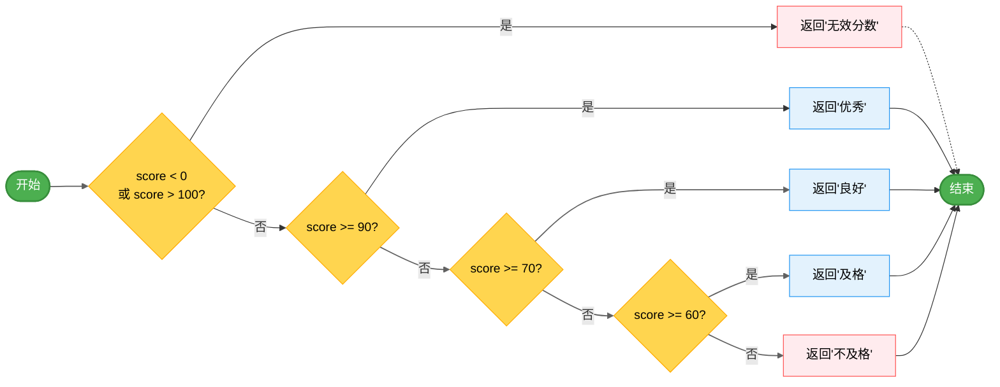
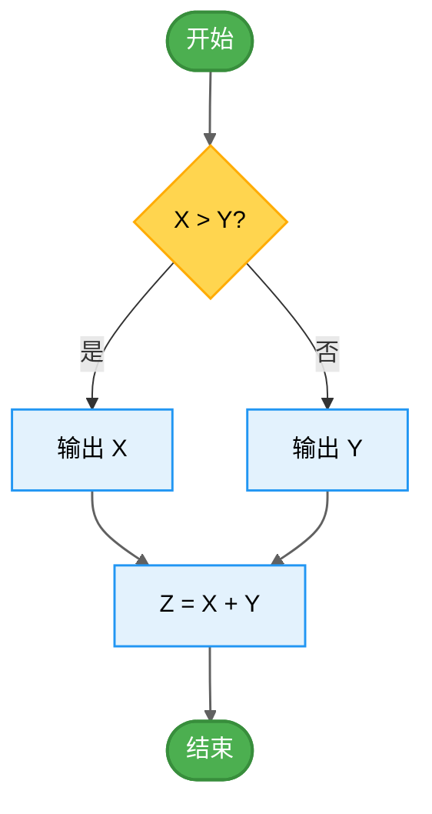

          
# 语句覆盖法（白盒测试）

## 1、语句覆盖

### 主要特点

语句覆盖是最基本的结构覆盖要求，语句覆盖要求设计足够多的测试用例，使得程序中每条语句至少被执行一次。

### 优点

可以很直观地从源代码得到测试用例，无须细分每条判定表达式。

### 缺点

由于这种测试方法仅仅针对程序逻辑中显式存在的语句，但对于隐藏的条件和可能到达的隐式逻辑分支，是无法测试的。在本例中去掉了语句1一Print去掉，那么就少了一条测试路径。在if结构中若源代码没有给出else后面的执行分支。那么语句覆盖测试就不会考虑这种情况。但是我们不能排除这种以外的分支不会被执行，而往往这种错误会经常出现。再如，在Do-While结构中，语句覆盖执行其中某一个条件分支。那么显然，语句覆盖对于多分支的逻辑运算是无法全面反映的，它只在乎运行一次，而不考虑其他情况。


## exmaple1




### 1. 被测试的函数

首先，让我们创建一个简单的函数，它包含一些条件分支：

```javascript
// gradeCalculator.js
export function calculateGrade(score) {
  if (score < 0 || score > 100) {
    return "无效分数";
  }
  
  if (score >= 90) {
    return "优秀";
  } else if (score >= 70) {
    return "良好";
  } else if (score >= 60) {
    return "及格";
  } else {
    return "不及格";
  }
}
```

### 2. 语句覆盖测试

现在，让我们为这个函数编写测试用例，确保每一条语句至少被执行一次：

```javascript
// gradeCalculator.test.js
import { assertEquals } from "https://deno.land/std/testing/asserts.ts";
import { calculateGrade } from "./gradeCalculator.js";

// 测试用例1: 测试无效分数 (负数)
Deno.test("无效分数 - 负数", () => {
  const result = calculateGrade(-10);
  assertEquals(result, "无效分数");
});

// 测试用例2: 测试优秀等级
Deno.test("优秀等级", () => {
  const result = calculateGrade(95);
  assertEquals(result, "优秀");
});

// 测试用例3: 测试良好等级
Deno.test("良好等级", () => {
  const result = calculateGrade(75);
  assertEquals(result, "良好");
});

// 测试用例4: 测试及格等级
Deno.test("及格等级", () => {
  const result = calculateGrade(65);
  assertEquals(result, "及格");
});

// 测试用例5: 测试不及格等级
Deno.test("不及格等级", () => {
  const result = calculateGrade(45);
  assertEquals(result, "不及格");
});

// 测试用例6: 测试无效分数 (超过100)
Deno.test("无效分数 - 超过100", () => {
  const result = calculateGrade(110);
  assertEquals(result, "无效分数");
});
```

### 4. 语句覆盖分析

让我们分析一下我们的测试用例是否覆盖了所有语句：

1. `if (score < 0 || score > 100)` - 由测试用例1和6覆盖
2. `return "无效分数"` - 由测试用例1和6覆盖
3. `if (score >= 90)` - 由测试用例2覆盖
4. `return "优秀"` - 由测试用例2覆盖
5. `else if (score >= 70)` - 由测试用例3覆盖
6. `return "良好"` - 由测试用例3覆盖
7. `else if (score >= 60)` - 由测试用例4覆盖
8. `return "及格"` - 由测试用例4覆盖
9. `else` - 由测试用例5覆盖
10. `return "不及格"` - 由测试用例5覆盖

### 5. 语句覆盖的局限性

虽然我们的测试用例覆盖了所有语句，但这并不意味着我们测试了所有可能的情况。例如：

- 我们没有测试边界值（如分数为60、70、90等）
- 我们没有测试所有可能的分支组合
- 我们没有测试所有可能的输入类型（如非数字输入）

这正是语句覆盖法的局限性 - 它只确保每条语句至少执行一次，但不能保证所有可能的执行路径都被测试。

## example2




### 代码实现示例

```javascript
function processValues(x, y) {
  let z;
  
  if (x > y) {
    console.log("X值更大:", x); // 这是语句B
  } else {
    console.log("Y值更大或相等:", y); // 这是语句C
  }
  
  z = x + y; // 这是语句D
  return z;
}

// 测试用例1: X=50, Y=50 (路径O→A→C→D→E)
console.log("测试用例1结果:", processValues(50, 50));

// 测试用例2: X=90, Y=70 (路径O→A→B→D→E)
console.log("测试用例2结果:", processValues(90, 70));
```
#### 原始程序路径：

- 路径1：O → A → B → D → E (当X>Y时)
- 路径2：O → A → C → D → E (当X≤Y时)

#### 测试用例设计：

如果将A路径上的语句B(输出X)去掉，那么测试用例如下：

| 编号 | X    | Y    | 执行路径 |
| ---- | ---- | ---- | -------- |
| 1    | 50   | 50   | O→B→D→E  |
| 2    | 90   | 70   | O→C→D→E  |

### 3. 优点

可以很直观地从源代码得到测试用例，无须细分每条判定表达式。

### 4. 缺点

由于这种测试方法仅仅针对程序逻辑中显式存在的语句，但对于隐藏的条件和可能到达的隐式逻辑分支，是无法测试的。

在本例中去掉了语句B(输出X)，那么就少了一条测试路径。在if结构中若源代码没有给出else后面的执行分支，那么语句覆盖测试就不会考虑这种情况。但是我们不能排除这种意外的分支不会被执行，而往往这种错误会经常出现。

再如，在Do-While结构中，语句覆盖只执行其中某一个条件分支。那么显然，语句覆盖对于多分支的逻辑运算是无法全面反映的，它只在乎运行一次，而不考虑其他情况。

