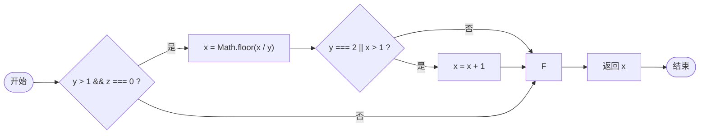

# 软件测试技术-路径覆盖法（白盒）

## 路径覆盖

### 主要特点

路径覆盖要求用例集合中的测试用例能够覆盖程序中所有可能的执行路径。这是最严格的结构化测试覆盖标准之一。

### 目标
- 用例覆盖程序中的所有可能的执行路径
- 远为严格及复杂于判定覆盖和条件覆盖

### 不切实际
- 由于循环及条件组合导致可能的路径数量呈指数级增长
- 在有循环的程序中，可能的路径数量甚至是无限的
- 任何实际的程序都可能有太多路径无法全部测试

### 实例

考虑以下JavaScript代码：

```javascript
function test3(x, y, z) {
  if (y > 1 && z === 0) {
    x = Math.floor(x / y);
    if (y === 2 || x > 1) {
      x = x + 1;
    }
  }
  return x;
}
```

#### Mermaid 流程图



#### 路径覆盖测试用例

对于上面的代码，可能的执行路径有：

1. 路径1：A → B(否) → F → G → H
2. 路径2：A → B(是) → C → D(否) → F → G → H
3. 路径3：A → B(是) → C → D(是) → E → F → G → H

为了实现路径覆盖，我们需要设计至少3个测试用例：

| 用例编号 | 输入 (x, y, z) | 期望输出 (x) | 覆盖路径 |
|---------|--------------|------------|---------|
| 1       | (3, 0, 1)    | 3          | 路径1    |
| 2       | (1, 3, 0)    | 0          | 路径2    |
| 3       | (3, 2, 0)    | 2          | 路径3    |

## 路径覆盖量化方法

### McCabe 环路复杂度方法

McCabe环路复杂度是衡量程序复杂度的一种方法，也可用于估计路径覆盖所需的测试用例数量。

计算公式：V(G) = e - n + 2p

其中：
- e：图中边的数量
- n：图中节点的数量
- p：连通分量的数量（对于单个函数通常为1）

当程序较小时，我们可以直观地识别所有路径。

### 示例计算

对于上面的流程图：
- 节点数(n)：8（A, B, C, D, E, F, G, H）
- 边数(e)：9
- 连通分量(p)：1

V(G) = 9 - 8 + 2*1 = 3

这意味着我们需要至少3个测试用例来实现路径覆盖，与我们之前的分析一致。

## 路径覆盖的实际应用

### 优点
- 最彻底的覆盖方式，能发现与路径相关的所有潜在错误
- 适合测试关键性系统的核心功能

### 缺点
- 测试用例数量可能非常大，甚至无限
- 设计和执行成本高
- 维护困难
- 某些路径可能在实际中不可达

### 实际应用策略

由于完全路径覆盖通常不切实际，实际应用中常采用以下策略：

1. **基本路径测试**：覆盖独立路径的最小集合
2. **有限路径覆盖**：限制循环执行次数
3. **关键路径优先**：优先测试业务关键路径
4. **结合其他覆盖标准**：与判定/条件覆盖结合使用

## 总结

路径覆盖是最严格的白盒测试覆盖标准之一，理论上能够发现与程序路径相关的所有潜在错误。但由于路径数量可能非常大甚至无限，完全路径覆盖在实际应用中通常不切实际。因此，在实际测试中，通常会结合其他覆盖标准，或者采用基本路径测试等策略，在测试成本和覆盖程度之间取得平衡。

        