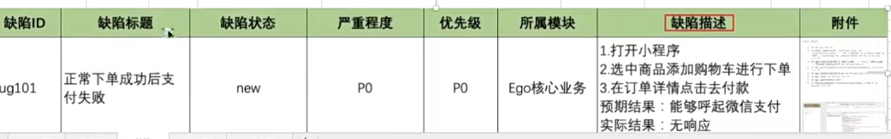
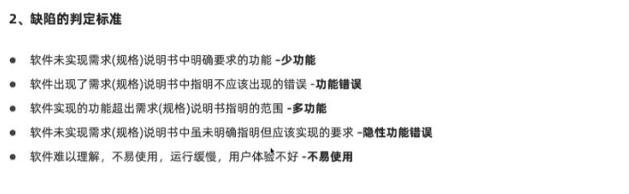
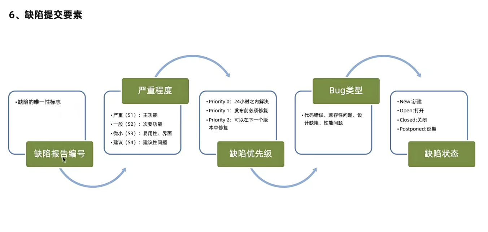
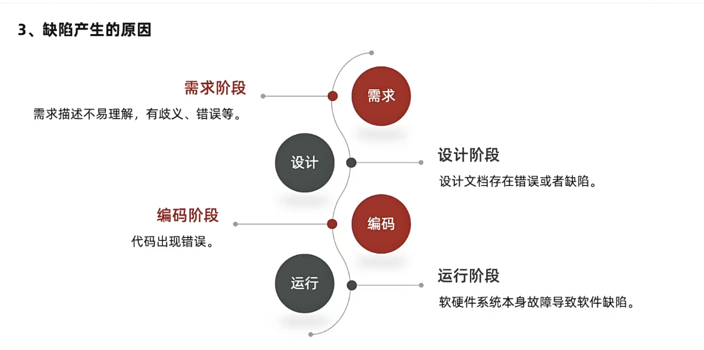
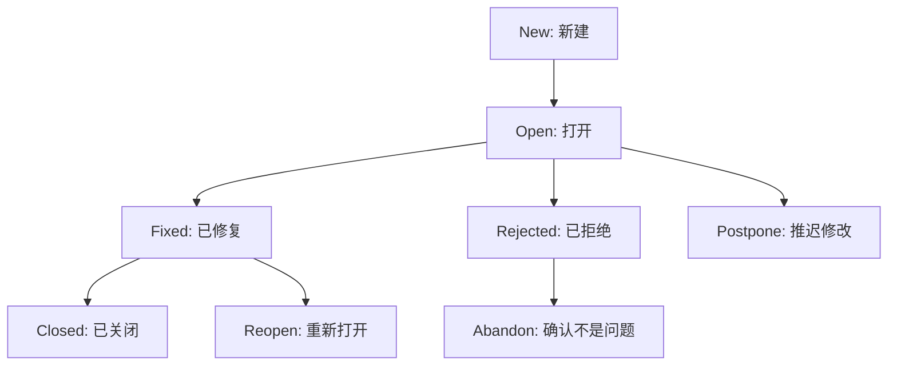
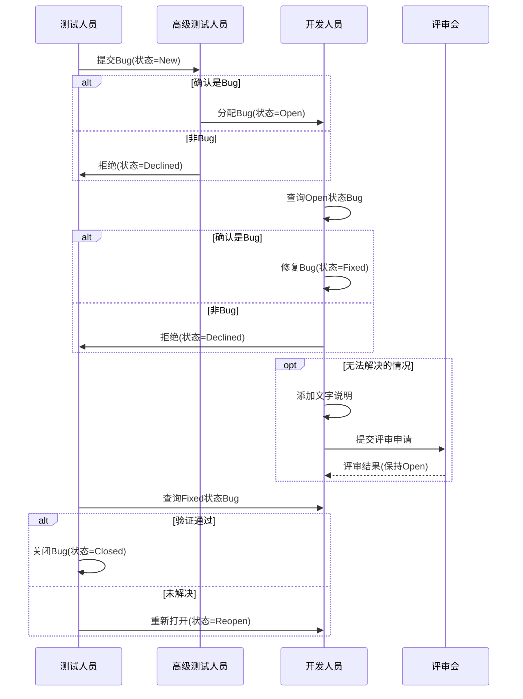
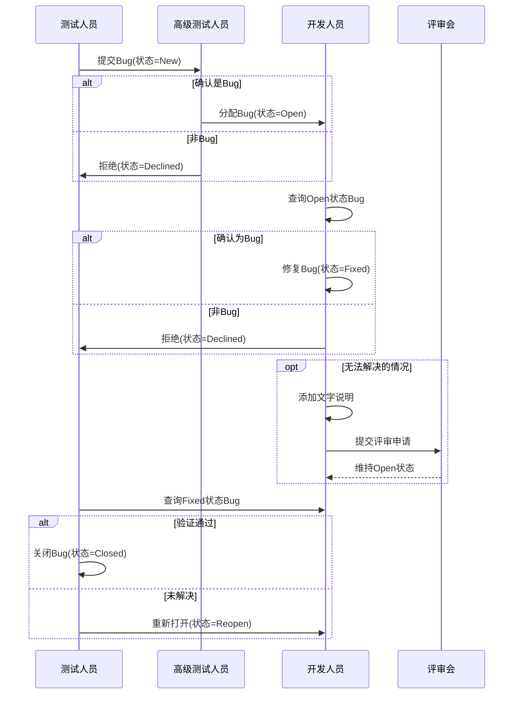
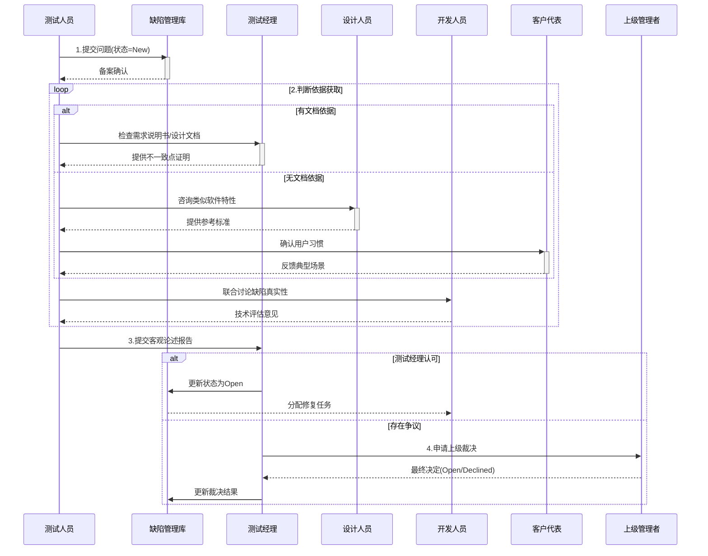
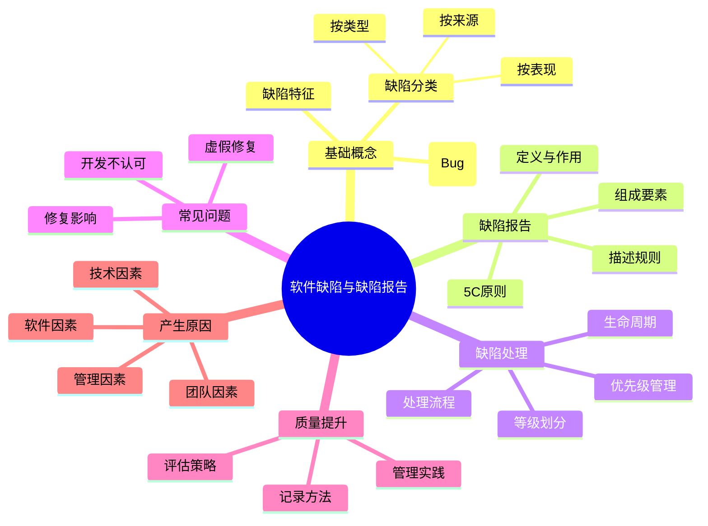

# 软件缺陷与缺陷报告全面指南：从理论到实践

作为软件测试领域的核心内容，缺陷管理是确保软件质量的关键环节。本文将系统性地介绍软件缺陷的相关概念、缺陷报告的编写方法、缺陷处理流程以及常见问题的解决方案。通过深入理解这些知识，软件测试学习者能够建立完整的缺陷管理知识体系，提升测试效率和缺陷管理能力。

## 软件缺陷基础概念

### 什么是软件缺陷(Bug)?

软件缺陷(通常称为Bug)是指**计算机软件或程序中存在的某种破坏正常运⾏能⼒的问题、错误，或者隐藏的功能缺陷**。IEEE 729-1983对缺陷的标准定义指出：从产品内部看，缺陷是软件产品开发或维护过程中存在的错误、毛病等各种问题；从产品外部看，缺陷是系统所需要实现的某种功能的失效或违背。

软件缺陷的具体含义包括以下几个因素：
1. 软件未达到客户需求的功能和性能
2. 软件超出客户需求的范围
3. 软件出现客户需求不能容忍的错误
4. 软件的使用未能符合客户的习惯和工作环境

### 软件缺陷的主要特征

软件缺陷具有几个显著特征：

1. **普遍性**：在软件开发过程中，缺陷的产生是不可避免的，任何规模的软件项目都会存在缺陷
2. **隐蔽性**：许多缺陷只有在特定条件或环境下才会显现
3. **传播性**：一个缺陷可能引发其他相关功能的缺陷
4. **免疫性**：测试人员采用的测试方法越多，缺陷的"免疫能力"就越强，寻找更多缺陷会更加困难
5. **修复成本递增**：缺陷发现得越晚，修复成本越高

### **软件缺陷标准（判定条件）**

符合以下任一条件即为缺陷：  

1. **功能未实现**：需求明确描述的功能未完成（如“支付按钮点击无响应”）。  
2. **功能错误**：功能实现与需求不符（如“搜索商品显示结果错误”）。  
3. **性能问题**：系统响应超时、资源占用过高（如“首页加载超过5秒”）。  
4. **兼容性问题**：特定环境/设备下功能异常（如“iOS端无法上传图片”）。  
5. **用户体验缺陷**：交互不符合直觉（如“错误提示语不明确”）。  

### 软件缺陷的分类标准

根据不同的维度，软件缺陷可以分为多种类型：

1. **按缺陷类型**：
   - 功能缺陷(F-Function)：影响重要特性、用户界面等
   - 赋值缺陷(A-Assignment)：需要修改少量代码
   - 接口缺陷(I-Interface)：与其他组件、模块相互影响
   - 检查缺陷(C-Checking)：错误信息不当、数据验证问题等

2. **按缺陷来源**：
   - 需求阶段缺陷
   - 设计阶段缺陷
   - 编码阶段缺陷
   - 测试阶段缺陷
   - 集成阶段缺陷

3. **按表现形式**：
   - 遗漏(Missing)：未实现规格说明要求的功能
   - 错误(Error)：实现了规格说明指明不应该出现的错误
   - 额外实现(Extra)：实现了规格说明没有提到的功能
   - 未达隐含目标：未实现虽未明确提及但应该实现的目标
   - 用户体验差：软件难以理解、不易使用等

## 缺陷报告的核心要素

### 什么是缺陷报告？

缺陷报告是**描述软件缺陷现象和重现步骤的集合**，也称为软件缺陷报告(Software Bug Report, SBR)或软件问题报告(Software Problem Report, SPR)。它是软件测试人员的主要工作成果之一，体现了软件测试的价值。

1. 缺陷报告是描述软件缺陷现象和重现步骤的集合。软件缺陷报告 Software Bug Report(SBR) 或软件问题报告 software Problem Report(SPR)。
2. 缺陷报告是软件测试人员的工作成果之一，体现软件测试的价值缺陷报告可以把软件存在的缺陷准 确的描述出来，便于开发人员修正缺陷报告可以反映项目 / 产品当前的质量状态，便于项目整体进度和 质量控制软件测试缺陷报告是软件测试的输出成果之一，可以衡量测试人员的工作能力。
3. 标题 (Title) 简洁、准确、完整、反映缺陷本质、方便查询前缀 + 标题正文，标题正文采用结果和动作， 或者现象和位置的方式表达；步骤 (Steps) 可复现、完整、简洁、准确按数字编号；实际结果 (Actual results) 准确、详细描述软件的现象和特征；期望结果 (Expected results) 准确、丰富、有理有据；平台 (Platforms) 准确；截图 (Sereenshots) 准确反映缺陷特征；注释 (Notes) 关于缺陷的辅助说明

### 缺陷报告的作用

缺陷报告在软件开发和质量保障过程中发挥着多重重要作用：

1. **沟通桥梁**：将软件存在的缺陷准确地描述出来，便于开发人员理解和修正
2. **质量指标**：反映项目产品当前的质量状态，便于项目整体进度和质量控制
3. **工作成果**：作为软件测试的输出成果之一，可以衡量测试人员的工作能力
4. **决策依据**：为项目管理者提供数据支持，帮助做出版本发布等关键决策
5. **知识积累**：形成项目知识库，避免类似缺陷在后续项目中重复出现

### 缺陷报告的基本组成项

缺陷报告包括：软件名称、版本号、功能模块、缺陷编号、对应的用例编号、编写时间、编写人、 测试员、预期结果、实际结果、缺陷描述、严重级别、优先级别

一个完整的缺陷报告通常包括以下核心内容：

1. **缺陷编号**：唯一标识符，便于跟踪和管理
2. **缺陷标题**：简明扼要地描述缺陷本质
3. **缺陷描述**：详细说明缺陷现象，包括：
   - 实际结果
   - 期望结果
4. **重现步骤**：清晰列出复现缺陷的操作步骤
5. **所属模块**：缺陷所在的系统模块或组件
6. **发现版本**：测试时的软件版本号
7. **缺陷严重程度**：对系统影响的严重性评估
8. **缺陷优先级**：修复的紧急程度
9. **缺陷类型**：功能、界面、性能等分类
10. **环境信息**：
    - 硬件平台
    - 操作系统
    - 浏览器版本等
11. **附件**：
    - 截图
    - 日志文件
    - 视频记录等
12. **提交信息**：
    - 提交人
    - 提交日期
13. **指派人**：负责修复该缺陷的开发人员
14. **缺陷状态**：跟踪缺陷修复进展的状态标识

| **字段**     | **内容示例**                                                 |
| ------------ | ------------------------------------------------------------ |
| **标题**     | 【P1】支付页面点击“确认支付”按钮无响应                       |
| **优先级**   | P1（阻塞主流程）                                             |
| **严重程度** | 严重                                                         |
| **环境**     | 环境：Chrome 115/Windows 11                                  |
| **复现步骤** | 1. 进入商品页，点击“立即购买” 2. 跳转至支付页，点击“确认支付”按钮 |
| **预期结果** | 跳转至支付成功页                                             |
| **实际结果** | 页面无反应，控制台报错“Uncaught TypeError”                   |
| **附件**     | 截图：支付页按钮点击前后状态 日志：浏览器控制台报错信息   |

### 缺陷报告的5C原则

1. Correct（准确）：每个组成部分的描述准确，不会引起误解；
2.  Clear（清晰）：每个组成部分的描述清晰，易于理解；
3. Concise（简洁）：只包含必不可少的信息，不包括任何多余的内容；
4. Complete（完整）：包含复现该缺陷的完整步骤和其他本质信息；
5. Consistent（一致）：按照一致的格式书写全部缺陷报告。

### 缺陷描述的7项规则

有效的缺陷描述应遵循以下规则：

1. **单一准确**：每个报告只针对一个软件缺陷
2. **可以再现**：提供精确的操作步骤使开发人员能重现缺陷
3. **完整统一**：提供完整、前后统一的信息和附件
4. **短小简练**：使用关键词使描述简明扼要又能准确解释现象
5. **特定条件**：不忽视必要的特定条件(如特定操作系统、浏览器等)
6. **补充完善**：从发现Bug起持续保证它被正确报告和跟踪
7. **不做评价**：客观描述事实，不对开发人员进行评价

## 缺陷处理全流程

### 缺陷生命周期

缺陷生命周期是指**缺陷从被发现到最终关闭的完整过程**。根据IEEE Std 1044-1993，缺陷生命周期主要由四个阶段组成：识别(Recognition)、调查(Investigation)、改正(Action)、总结(Disposition)。

更详细的缺陷生命周期通常包括以下状态：

1. **New(新建)**：测试人员新发现的缺陷，初始状态
2. **Assigned(已分配)**：分配给开发团队处理
3. **Open(打开)**：开发人员确认是缺陷并开始修复
4. **Fixed(已修复)**：开发人员完成修复并自验证通过
5. **Pending Test/Verify(待验证)**：等待测试人员回归验证
6. **Rejected(已拒绝)**：开发团队拒绝修复(可能因为重复、不是缺陷或不可重现)
7. **Delay(延迟)**：暂缓修复，需说明理由
8. **Reopen(重新打开)**：验证未通过，缺陷仍然存在
9. **Closed(已关闭)**：验证通过，缺陷确认修复

### 缺陷管理报告：QQ账号验证与城市电话验证

---

### **1. QQ账号验证缺陷**

| 缺陷ID       | 标题                                             | 优先级 | 严重程度 | 复现步骤                               | 预期结果       | 实际结果     | 环境              | 附件                |
| ------------ | ------------------------------------------------ | ------ | -------- | -------------------------------------- | -------------- | ------------ | ----------------- | ------------------- |
| BUG-01       | 有效QQ账号（12345678）验证失败                   | P0     | 严重     | 1. 输入QQ号：12345678 2. 点击“验证” | 显示“合法账号” | 显示“不合法” | Chrome 115/Win 11 | [截图] 验证失败页面 |
| **修复方案** | 检查账号长度验证逻辑，确保6-10位自然数正确识别。 |        |          |                                        |                |              |                   |                     |

| 缺陷ID       | 标题                                         | 优先级 | 严重程度 | 复现步骤                                   | 预期结果         | 实际结果   | 环境              | 附件                  |
| ------------ | -------------------------------------------- | ------ | -------- | ------------------------------------------ | ---------------- | ---------- | ----------------- | --------------------- |
| BUG-02       | 无效QQ账号（12345）未正确拦截                | P1     | 高       | 1. 输入QQ号：12345（5位） 2. 点击“验证” | 提示“长度不合法” | 无错误提示 | Chrome 115/Win 11 | [日志] 未触发验证逻辑 |
| **修复方案** | 修复长度校验逻辑，对位数不足的账号强制拦截。 |        |          |                                            |                  |            |                   |                       |

| 缺陷ID       | 标题                               | 优先级 | 严重程度 | 复现步骤                             | 预期结果         | 实际结果       | 环境              | 附件            |
| ------------ | ---------------------------------- | ------ | -------- | ------------------------------------ | ---------------- | -------------- | ----------------- | --------------- |
| BUG-03       | 非数字字符（123a56）未正确拦截     | P1     | 高       | 1. 输入QQ号：123a56 2. 点击“验证” | 提示“必须为数字” | 显示“合法账号” | Chrome 115/Win 11 | [截图] 错误结果 |
| **修复方案** | 增强字符类型校验，过滤非数字输入。 |        |          |                                      |                  |                |                   |                 |

---

#### **2. 城市电话验证缺陷**

| 缺陷ID       | 标题                                       | 优先级 | 严重程度 | 复现步骤                                                     | 预期结果                | 实际结果       | 环境              | 附件                |
| ------------ | ------------------------------------------ | ------ | -------- | ------------------------------------------------------------ | ----------------------- | -------------- | ----------------- | ------------------- |
| BUG-04       | 前缀码以0开头未拦截                        | P0     | 严重     | 1. 输入区号：010 2. 前缀码：034 3. 后缀码：5678 4. 点击“验证” | 提示“前缀码不能以0开头” | 显示“号码合法” | Chrome 115/Win 11 | [截图] 错误验证通过 |
| **修复方案** | 修复前缀码规则校验，禁止以0或1开头的数字。 |        |          |                                                              |                         |                |                   |                     |

| 缺陷ID       | 标题                                        | 优先级 | 严重程度 | 复现步骤                                                     | 预期结果            | 实际结果       | 环境              | 附件                  |
| ------------ | ------------------------------------------- | ------ | -------- | ------------------------------------------------------------ | ------------------- | -------------- | ----------------- | --------------------- |
| BUG-05       | 区号非3位数字未正确拦截                     | P1     | 高       | 1. 输入区号：01（2位） 2. 前缀码：234 3. 后缀码：5678 4. 点击“验证” | 提示“区号必须为3位” | 显示“号码合法” | Chrome 115/Win 11 | [日志] 未触发长度校验 |
| **修复方案** | 修复区号长度校验逻辑，仅允许空值或3位数字。 |        |          |                                                              |                     |                |                   |                       |

| 缺陷ID       | 标题                                        | 优先级 | 严重程度 | 复现步骤                                                     | 预期结果              | 实际结果       | 环境              | 附件            |
| ------------ | ------------------------------------------- | ------ | -------- | ------------------------------------------------------------ | --------------------- | -------------- | ----------------- | --------------- |
| BUG-06       | 后缀码非4位数字未拦截                       | P1     | 高       | 1. 输入区号：空 2. 前缀码：234 3. 后缀码：567 4. 点击“验证” | 提示“后缀码必须为4位” | 显示“号码合法” | Chrome 115/Win 11 | [截图] 错误结果 |
| **修复方案** | 修复后缀码长度校验逻辑，严格限制为4位数字。 |        |          |                                                              |                       |                |                   |                 |

---

测试人员提交新的 Bug 入库，错误状态为 New。

高级测试人员验证错误，如果确认是错误，分配给相应的开发人员，设置状态为 Open。

如果不是错误， 则拒绝， 设置为 Declined（拒绝）状态。

开发人员查询状态为 Open 的 Bug，如果不是错误，则置状态为 Declined；如果是 Bug 则修复并置状态为 Fixed。

不能解决的 Bug，要留下文字说明及保持 Bug 为 Open 状态。

对于不能解决和延期解决的 Bug，不能由开发人员自己决定， 一般要通过某种会议（评审会）通过才能认可。

测试人员查询状态为 Fixed 的 Bug， 然后验证 Bug 是否已解决，如解决置 Bug 的状态为 Closed，如没有解决置状态为 Reopen。

 以下是使用 Mermaid 语法绘制的 Bug 管理时序图，完整呈现题目描述的流程：

### 缺陷处理流程

测试人员提交新的 Bug 入库，错误状态为 New。

高级测试人员验证错误，如果确认是错误，分配给相应的开发人员，设置状态为 Open。如果不是错误，则拒绝，设置为 Declined（拒绝）状态。

开发人员查询状态为 Open 的 Bug，如果不是错误，则置状态为 Declined； 如果是 Bug 则修复并置状态为 Fixed。

不能解决的 Bug，要留下文字说明及保持 Bug 为 Open 状态。

对于不能解决和延期解决的 Bug，不能由开发人员自己决定，一般要通过某种会议（评审会）通过才能认可。

测试人员查询状态为 Fixed 的 Bug，然后验证 Bug 是否已解决，如解决置 Bug 的状态为 Closed， 如没有解决置状态为 Reopen。

### 缺陷等级划分

缺陷通常按严重程度分为四个等级：

- 严重： 系统崩溃、数据丢失、数据毁坏
- 较严重：操作性失误、错误结果、遗漏功能
- 一般：小问题、错别字、UI 布局、罕见故障
- 建议：不影响使用的瑕疵或更好的实现

缺陷等级的划分通常结合"缺陷发生率"和"影响强度"两个维度进行评估：

| 缺陷发生率 \ 影响强度 | 灾难性(Disastrous) | 障碍性(Obstruction) | 干扰性(Disturbing) |
| --------------------- | ------------------ | ------------------- | ------------------ |
| 不可避免(Unavoidable) | Critical           | Critical            | Major              |
| 经常(Frequent)        | Critical           | Major               | Normal             |
| 偶尔(Occasional)      | Major              | Normal              | Minor              |
| 很少(Rare)            | Normal             | Minor               | Minor              |

### 缺陷优先级管理

缺陷优先级表示修复的紧急程度，通常分为：

1. **立即解决(Resolve Immediately)**：必须立即修复，通常对应致命缺陷
2. **正常排队(Normal Queue)**：按计划排期修复，通常对应严重和一般缺陷
3. **不紧急(Not Urgent)**：方便时修复，通常对应轻微缺陷

## 缺陷管理中的常见问题与解决方案

##  如果一个缺陷被提交后，开发人员认为不是问题，怎么处理？？

1. 首先，将问题提交到缺陷管理库里面进行备案。
2. 然后，要获取判断的依据和标准：
   - 根据需求说明书、产品说明、设计文档等，确认实际结果是否与计划有不一致的地方，提供 缺陷是否确认的直接依据；
   - 如果没有文档依据，可以根据类似软件的一般特性来说明是否存在不一致的地方，来确认是 否是缺陷；
   - 根据用户的一般使用习惯，来确认是否是缺陷；
   - 与设计人员、开发人员和客户代表等相关人员探讨，确认是否是缺陷；
3. 合理的论述，向测试经理说明自己的判断的理由，注意客观、严谨，不掺杂个人情绪。
4. 等待测试经理做出最终决定，如果仍然存在争议，可以通过公司政策所提供的渠道，向上级反映， 并有上级做出决定。

### 如何保证修复不影响其他功能？

重新执行用例、看是否出现错误结果。并对周围的一些相关功能点追加新的测试用例。

### 状态为已修改但实际未修改怎么办？

加强项目质量管理，提高项目执行能力。如果测试人员发现了这样的问题，首先要弄清楚是什么 原因导致这种情况，最终还是要督促开发人员，修改掉这些问题。如果是不能重现的问题或者是老版 本中遗留下来的问题不能修改的 要做好标示。

## 提高缺陷记录质量的实践方法

1. - 通用 UI 要统一、准确；尽量使用业界惯用的表达术语和表达方法；使用业界惯用的表达术语和表达方法，保证表达准确，体现专业化；每条缺陷报告只包括一个缺陷；不可重现的缺陷也要报告；明确 指明缺陷类型；明确指明缺陷严重等级和优先等级；描述 (Description) ，简洁、准确，完整，揭示缺陷实质，记录缺陷或缺陷出现的位置；短行之间使用自动数字序号，使用相同的字体、字号、行间距；每一个步骤尽量只记录一个操作；确认步骤完整，准确，简短；根据缺陷，可选择是否进行图象捕捉；检查拼写和语法缺陷；尽量使用短语和短句，避免复杂句型句式；缺陷描述内容。

## 软件缺陷产生的原因分析

了解软件缺陷的产生原因有助于从源头预防缺陷。软件缺陷的产生主要源于以下几个方面：

1. 软件产品说明书（需求）——56%
2. 设计——27%
3. 编写代码——7%
4. 其他——10%

## 缺陷评估与管理策略

### 如何进行缺陷评估

评估软件质量的重要指标，通常评估模型假设缺陷的发现是呈泊松分布的；严格的缺陷评估要考察在 测试过程中发现缺陷的间隔时间长短。评估要估计软件当前的可靠性并预测随着测试的继续进行，软 件可靠性会怎样提高。

SQA Suite 提供四种形式进行缺陷评估：

1. 缺陷分布报告可以生成缺陷数量与缺陷属性的函数。如测试需求和状态。
2. 缺陷趋势报告可以看出缺陷增长和减少的趋势；
3. 缺陷年龄报告展示一个缺陷处于某种状态的时间长短
4. 测试结果进度报告展示测试过程在被测应用的几个版本中的执行结果以
5. 测试周期。

具体步骤

1. 回顾测试日记
2. 评估测试需求的覆盖率
3. 分析缺陷
4. 决定是否达到完成测试的标准，没有满足标准时
5. 再测试
6. 降低标准
7. 确定软件的一个满足标准的子集，看是否可以发布。

### 缺陷管理的二八原则

在缺陷管理中，二八原则(帕累托原则)有着重要应用：

1. **缺陷分布**：80%的缺陷集中在20%的模块中
2. **发现阶段**：80%的缺陷可在分析、设计、实现阶段的复审和测试中发现
3. **剩余缺陷**：系统测试能找出剩余缺陷中的80%
4. **隐藏缺陷**：最后4%的缺陷可能只有在大范围长时间使用后才会暴露
5. **测试方法**：80%的缺陷可通过人工测试发现，20%需要自动化测试

### 缺陷管理的最佳实践

基于行业经验，有效的缺陷管理应遵循以下实践：

1. **早期介入**：在需求和分析阶段就开始缺陷预防
2. **全员参与**：开发、测试、产品等角色共同负责质量
3. **分类管理**：按类型、模块、严重程度等多维度分类
4. **数据驱动**：基于缺陷数据分析改进开发过程
5. **持续改进**：建立缺陷根本原因分析和预防机制
6. **工具支持**：使用专业的缺陷管理系统提高效率
7. **知识共享**：建立缺陷知识库避免重复问题
8. **平衡策略**：在测试成本和质量效益间找到平衡点

##  什么是 Bug？

软件的 Bug 指的是软件中（包括程序和文档）不符合用户需求的问题。

常见的软件 Bug 分为以下三类：

1. 没有实现的功能
2. 完成了用户需求的功能，但是运行时会出现一些功能或性能上的问题
3. 实现了用户不需要的多余的功能

## 总结与思维导图

通过以上全面介绍，我们对软件缺陷及其管理有了系统性的认识。为帮助理解和记忆，以下是本文核心内容的思维导图：

根据图片示例，优化后的缺陷报告内容如下：

| **缺陷ID**  | **缺陷标题**             | **缺陷状态** | **严重程度** | **优先级** | **所属模块** | **缺陷描述**                                                 | **附件**                        |
| ----------- | ------------------------ | ------------ | ------------ | ---------- | ------------ | ------------------------------------------------------------ | ------------------------------- |
| BUG-EGO-001 | 【支付】下单后支付无响应 | New          | S1           | P0         | Ego核心业务  | **操作步骤**： 1. 打开小程序 2. 选中商品，添加购物车并下单 3. 在订单详情页点击“去付款” **预期结果**：呼起微信支付弹窗 **实际结果**：页面无响应 | [截图] 支付按钮点击前后状态对比 |

### **缺陷报告标准模板**

| **缺陷ID** | **缺陷标题**       | **缺陷状态** | **严重程度** | **优先级** | **所属模块** | **缺陷描述**                                                 | **附件**          |
| ---------- | ------------------ | ------------ | ------------ | ---------- | ------------ | ------------------------------------------------------------ | ----------------- |
| BUG-xxx    | 【模块】+ 异常现象 | New/Assigned | S1/S2/S3/S4  | P0/P1/P2   | 模块名称     | **操作步骤**： 1. 步骤1 2. 步骤2 3. 步骤3 **预期结果**： 正常预期行为 **实际结果**： 观察到的异常现象 | 截图/日志/GIF链接 |

---

### **

#### 模板字段解释**

| **字段**     | **说明**                                                     | **用户图表示例**                   |
| ------------ | ------------------------------------------------------------ | ---------------------------------- |
| **缺陷ID**   | 唯一标识符，建议格式：`BUG-模块缩写-序号`（如`BUG-ORDER-001`） | `ug101`（建议优化为`BUG-EGO-001`） |
| **缺陷标题** | 简明描述问题（格式：`【模块】+ 现象`）                       | `正常下单成功后支付失败`           |
| **缺陷状态** | 跟踪进度，如 `New`（新建）、`Assigned`（已分配）、`Closed`（已关闭） | `new`                              |
| **严重程度** | 问题影响等级（如 `S1-致命`、`S2-严重`，图中`PO`应为`S1`）    | `PO`（需修正为`S1`）               |
| **优先级**   | 修复紧急程度（如 `P0-紧急`、`P1-高`，图中`PO`应为`P0`）      | `PO`（需修正为`P0`）               |
| **所属模块** | 缺陷归属的功能模块                                           | `Ego核心业务`                      |
| **缺陷描述** | **操作步骤**（分步复现路径） **预期结果** **实际结果**（核心字段用红色框标出） | 用户示例符合要求                   |
| **附件**     | 提供截图、日志或其他证据                                     | 用户示例未填写（需补充）           |
### **缺陷编写练习示例**

---

#### **示例1：QQ账号验证功能缺陷**  

| **字段**     | **内容**                                                     |
| ------------ | ------------------------------------------------------------ |
| **缺陷编号** | BUG-ACCOUNT-001                                              |
| **标题**     | 【P1】QQ账号验证功能未校验非数字字符                         |
| **模块**     | 用户认证模块                                                 |
| **优先级**   | P0（24小时内修复）                                           |
| **严重程度** | S1（主功能阻断）                                             |
| **状态**     | 新建（New）                                                  |
| **缺陷类型** | 功能错误                                                     |
| **前置条件** | 1. 打开QQ验证工具 2. 网络连接正常                         |
| **复现步骤** | 1. 输入QQ号：`123a56` 2. 点击“验证”                       |
| **预期结果** | 提示“QQ号必须为6-10位自然数”                                 |
| **实际结果** | 显示“合法账号”                                               |
| **附件**     | [截图] 输入非数字字符后验证通过 [日志] validation_error.log |

---

#### **示例2：城市电话前缀码兼容性缺陷**  

| **字段**     | **内容**                                                     |
| ------------ | ------------------------------------------------------------ |
| **缺陷编号** | BUG-PHONE-002                                                |
| **标题**     | 【P1】城市电话前缀码以0开头未拦截                            |
| **模块**     | 电话验证模块                                                 |
| **优先级**   | P1（3天内修复）                                              |
| **严重程度** | S1（违反业务规则）                                           |
| **状态**     | 已分配（Assigned）                                           |
| **缺陷类型** | 兼容性错误                                                   |
| **前置条件** | 1. 打开电话验证工具 2. 区号为空或3位数字                  |
| **复现步骤** | 1. 输入区号：`010` 2. 输入前缀码：`034` 3. 输入后缀码：`5678` |
| **预期结果** | 提示“前缀码不能以0或1开头”                                   |
| **实际结果** | 显示“号码合法”                                               |
| **附件**     | [截图] 前缀码以0开头验证通过 [日志] phone_validation_error.log |