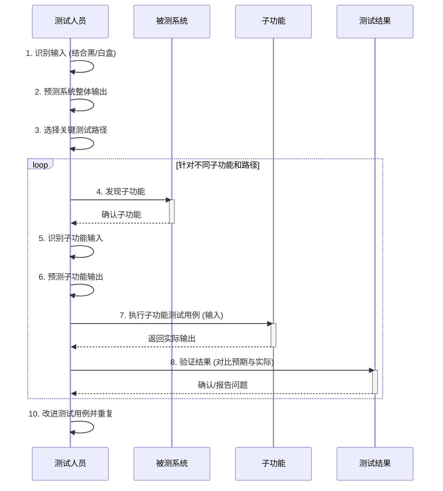
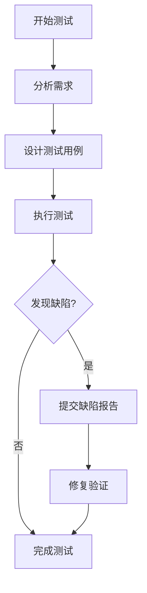

# 软件测试的类型

软件测试可以从多个维度进行分类，以下我们将从测试阶段、测试方法、测试技术等不同角度来详细介绍各种测试类型。

## 一、按测试阶段分类

### 1. 单元测试（Unit Testing）
- **定义**：单元测试是对代码中最小可测试单元（如函数、方法）进行验证的过程。它通过隔离测试每个单元来提高代码质量，是软件开发的关键部分。开发人员为这些代码单元编写测试，并在每次代码更改时自动运行。测试失败时能快速定位并修复问题。单元测试有助于促进代码模块化，确保更好的测试覆盖率，并节省手动测试的时间。
    单元测试是一小段代码，它检查应用程序中的特定函数或方法是否按预期工作。它通过提供输入给函数并验证其输出来实现。这些测试根据开发人员预期的逻辑来检查代码行为。
    通常会为一个函数编写多个测试用例（Test Cases），以覆盖不同的可能场景。虽然理想情况是覆盖所有预期行为，但并不总是需要测试每一个可能的场景。
    单元测试应独立运行，不依赖于数据库、网络等其他系统部分。可以使用数据存根（Data Stubs）来模拟这些外部依赖。对于简单、自包含的代码块，编写单元测试最为容易。

- **单元测试策略 (Unit testing strategies)**：要创建有效的单元测试，可以遵循以下策略以确保覆盖各种场景：
    - **逻辑检查 (Logic checks)**：验证系统是否执行正确的计算，并在有效输入下遵循预期路径。确保代码中所有可能的执行路径都经过测试。
    - **边界检查 (Boundary checks)**：测试系统如何处理典型值、边界值（边缘情况）和无效输入。例如，如果预期输入是3到7之间的整数，需要测试输入5（典型值）、3和7（边界值）以及9（无效输入）时系统的反应。
    - **错误处理 (Error handling)**：检查系统是否能正确处理错误情况。例如，当发生错误时，系统是提示用户重新输入，还是直接崩溃？
    - **面向对象检查 (Object-oriented checks)**：如果代码会修改对象的状态，需要确认在代码执行后，对象的状态是否按预期正确更新。

- **单元测试的优缺点 (Advantages and Disadvantages of Unit Testing)**：

| 优点 (Advantages) | 缺点 (Disadvantages) |
|---|---|
| ✅ **早期发现问题**：在开发早期捕获和修复缺陷，防止问题扩大。 | ❌ **时间和精力投入**：创建和维护测试用例需要大量时间和精力，尤其对复杂系统。 |
| ✅ **提高代码质量**：确保每个单元按预期工作，满足需求，提升整体软件质量。 | ❌ **依赖开发人员**：测试效果依赖于开发人员编写清晰、全面的测试用例。 |
| ✅ **增强开发信心**：验证每个单元的功能，让开发者对代码更有信心。 | ❌ **测试复杂单元困难**：隔离和测试复杂单元可能具有挑战性。 |
| ✅ **加速开发**：快速验证代码更改，无需等待完整系统测试，提高效率。 | ❌ **测试交互困难**：单元测试主要关注单个单元，难以充分测试单元间的交互。 |
| ✅ **更好的文档**：测试用例是代码行为的清晰文档，便于理解和维护。 | ❌ **测试UI困难**：通常不适用于测试用户界面，主要关注功能逻辑。 |
| ✅ **便于重构**：确保修改代码时不破坏现有功能，使重构更安全。 | ❌ **过度依赖自动化的风险**：可能产生虚假安全感，自动化测试无法发现所有问题。 |
| ✅ **减少时间和成本（长期）**：早期修复缺陷可降低后期测试和修复的成本。 | ❌ **维护开销**：代码和测试用例需随软件变更持续维护更新。 |

- **开发人员如何使用单元测试 (How developers use unit tests)**：
    单元测试在整个软件开发过程中扮演着重要角色：
    1.  **测试驱动开发 (Test-Driven Development - TDD)**：
        -   在编写实际功能代码之前先编写单元测试。
        -   编写刚好能让测试通过的功能代码。
        -   重构代码，同时确保测试仍然通过。
        -   这种方式确保代码从一开始就满足功能需求，并有助于设计出更易于测试的代码。
    2.  **代码块完成后测试 (After Completing Code Blocks)**：
        -   如果未使用TDD，则在完成一个代码单元（如函数或方法）后为其编写单元测试。
        -   运行测试以验证该代码单元是否按预期工作。
        -   这是一种补充性的做法，确保代码质量。
    3.  **DevOps 和 CI/CD 集成 (DevOps and CI/CD)**：
        -   在持续集成/持续交付 (CI/CD) 流程中，每次代码提交或合并时自动运行单元测试。
        -   如果测试失败，构建过程会中断，阻止有问题的代码进入主分支或部署。
        -   这确保了代码变更的快速反馈和质量控制，是自动化测试的核心应用场景。

    ```mermaid
    graph LR
        subgraph TDD [测试驱动开发]
            direction LR
            TDD1[编写失败的单元测试] --> TDD2[编写刚好通过测试的代码]
            TDD2 --> TDD3[重构代码]
            TDD3 --> TDD1
        end

        subgraph AfterCoding [代码完成后测试]
            direction LR
            AC1[编写功能代码] --> AC2[编写单元测试]
            AC2 --> AC3[运行测试验证]
        end

        subgraph CICD [CI/CD 集成]
            direction LR
            CI1[提交代码] --> CI2{自动运行单元测试}
            CI2 -- 测试通过 --> CI3[集成/部署]
            CI2 -- 测试失败 --> CI4[反馈失败，阻止流程]
        end

        Start --> TDD & AfterCoding & CICD
    ```

！[单元测试](./img/单元测试.png)
- **对象**：函数、方法、类等独立组件
- **特点**：
  - 由开发人员编写和执行
  - 通常使用自动化测试框架
  - 验证单个组件的功能正确性
- **工具**：JUnit、PyTest、NUnit等

### 2. 集成测试（Integration Testing）
- **定义**：集成测试是一种软件测试技术，专注于验证软件应用程序不同组件或模块之间的交互和数据交换。其目标是识别当不同组件组合并相互作用时出现的任何问题或错误。集成测试可以逐个模块地进行，以确保遵循正确的顺序并覆盖所有集成场景。暴露集成单元交互时的缺陷是集成测试的主要关注点。集成测试通常在单元测试之后、系统测试之前进行，有助于在开发周期早期识别和解决集成问题，降低后期风险。
- **为什么集成测试如此重要？**
集成测试非常重要，因为它可以验证各个软件模块或组件能否作为一个整体系统正常协同工作。这可以确保集成后的软件能够按预期运行，并有助于识别系统不同部分之间的兼容性或通信问题。通过及早发现并解决集成问题，集成测试有助于提高软件产品的整体可靠性、性能和质量。

- **如何编写集成测试？ (How to Write Integration Tests?)**
    设计集成测试用例是确保软件不同组件协同工作的关键。以下是简化步骤：
    1.  **识别待测组件**：确定需要一起测试的软件部分（通常是相互交互或依赖的模块）。
    2.  **确定测试目标**：明确测试目的，例如验证模块间数据流是否正确，或组件交互时系统行为是否符合预期。
    3.  **定义测试数据**：准备用于测试的数据，确保其能代表真实场景，使测试有意义。
    4.  **设计测试用例**：规划每个测试的具体步骤，包括操作和预期结果。
    5.  **开发测试脚本/文档**：编写自动化测试脚本，或为手动测试编写清晰的步骤文档。
    6.  **设置测试环境**：确保测试环境尽可能模拟真实部署环境，以获得准确结果。
    7.  **执行测试**：运行测试，观察组件交互和性能是否符合预期。
    8.  **评估结果**：回顾测试结果，检查组件是否按预期工作，是否存在错误或意外行为。

    ```mermaid
    sequenceDiagram
        participant Tester as 测试人员
        participant DevEnv as 开发/测试环境
        participant ComponentA as 组件A
        participant ComponentB as 组件B
        participant Report as 测试报告

        Tester->>DevEnv: 1. 识别待测组件 (A, B)
        Tester->>Tester: 2. 确定测试目标 (e.g., A调用B接口)
        Tester->>Tester: 3. 定义测试数据
        Tester->>Tester: 4. 设计测试用例 (输入, 预期输出)
        Tester->>DevEnv: 5. 开发/准备测试脚本或文档
        Tester->>DevEnv: 6. 设置测试环境
        Tester->>DevEnv: 7. 执行测试
        activate DevEnv
        DevEnv->>ComponentA: 调用操作
        activate ComponentA
        ComponentA->>ComponentB: 发起交互/调用
        activate ComponentB
        ComponentB-->>ComponentA: 返回结果
        deactivate ComponentB
        ComponentA-->>DevEnv: 返回最终结果
        deactivate ComponentA
        DevEnv-->>Tester: 输出实际结果
        deactivate DevEnv
        Tester->>Report: 8. 评估结果 (对比预期与实际)
        activate Report
        Report-->>Tester: 生成测试报告
        deactivate Report
    ```

- **对象**：多个组件的组合
- **类型**：
  - **大爆炸集成测试 (Big-Bang Integration Testing)**：
    - **定义**：这是最简单的集成测试方法。所有模块在单独测试完成后被一次性组合起来，然后对整个系统进行测试。这种方法通常只适用于非常小的系统，或者组件间相互依赖程度很低的情况。其目标是验证系统的整体功能并识别组件组合时出现的集成问题。
    - **过程**：简单地将所有模块组装在一起进行测试。
    - **风险**：如果在测试中发现错误，定位错误会非常困难且成本高昂，因为错误可能源于任何一个被集成的模块。系统的复杂性和组件间的交互数量使得识别和诊断问题变得困难。
    - **优缺点**：

      | 优点 (Advantages) | 缺点 (Disadvantages) |
      |---|---|
      | ✅ 对小型系统方便 | ❌ 需要等待所有模块完成才能集成，导致延迟 |
      | ✅ 方法简单直接 | ❌ 无法优先测试高风险关键模块 |
      | ✅ 可以快速完成 | ❌ 不适合大型或长期项目 |
      | ✅ 不需要大量规划协调 | ❌ 集成问题风险高，难以定位和诊断 |
      | ✅ 适合组件依赖低的系统 | ❌ 调试和故障排除工作漫长复杂 |
      | | ❌ 可能导致系统停机和开发成本增加 |
      | | ❌ 对组件交互和数据交换的可见性不足 |
      | | ❌ 可能导致对系统稳定性和可靠性缺乏信心 |
      | | ❌ 可能导致效率和生产力下降 |
      | | ❌ 可能导致对开发团队缺乏信心 |
      | | ❌ 可能导致系统故障和用户满意度下降 |

  - **自底向上集成测试 (Bottom-Up Integration Testing)**：
    - **定义**：从软件结构的最底层模块开始测试，逐步向上集成和测试更高级别的模块，直到整个系统被集成完毕。测试较低层模块时，需要使用“测试驱动程序 (Test Drivers)”来模拟调用这些模块的上层模块，并传递测试数据。主要目的是测试构成子系统的各个模块之间的接口。
    - **过程**：首先测试最底层的单元或模块，然后将它们组合成子系统进行测试，逐步向上进行，直到测试完顶层模块。
    - **优缺点**：

      | 优点 (Advantages) | 缺点 (Disadvantages) |
      |---|---|
      | ✅ 不需要或很少需要测试桩 (Stubs)。 | ❌ 需要开发测试驱动程序 (Test Drivers)。 |
      | ✅ 可以并行测试多个不相关的子系统。 | ❌ 当系统由大量小型子系统构成时，管理和协调会变得复杂。 |
      | ✅ 创建测试条件相对容易。 | ❌ 在较高层模块完成前，无法展示一个可工作的系统原型。 |
      | ✅ 适合采用自底向上设计方法的应用。 | ❌ 顶层模块的缺陷发现较晚。 |
      | ✅ 容易观察底层模块的测试结果。 | |

  - **自顶向下集成测试 (Top-Down Integration Testing)**：
    - **定义**：从软件结构的顶层模块开始测试，逐步向下集成和测试更低级别的模块。测试较高层模块时，需要使用“测试桩 (Stubs)”来模拟尚未集成的低层模块的行为。测试首先在高层模块进行，然后是低层模块，最后将低层模块集成到高层，以确保系统按预期工作。
    - **过程**：首先测试顶层模块（通常需要测试桩），然后逐步用实际的下层模块替换测试桩并进行测试，直到集成完所有模块。
    - **优缺点**：

      | 优点 (Advantages) | 缺点 (Disadvantages) |
      |---|---|
      | ✅ 可以较早地验证系统主要控制流程和架构。 | ❌ 需要开发和维护大量的测试桩 (Stubs)。 |
      | ✅ 接口错误更容易被隔离和发现。 | ❌ 较低层模块的功能可能测试不充分。 |
      | ✅ 可以在早期发现设计缺陷。 | ❌ 观察底层模块的测试输出可能比较困难。 |
      | ✅ 最终形成一个可工作的系统原型。 | ❌ 测试桩的设计可能很复杂。 |
      | ✅ 几乎不需要或不需要测试驱动程序 (Drivers)。 | |

  - **混合集成测试 (Mixed/Sandwich Integration Testing)**：
    - **定义**：也称为三明治集成测试或混合集成测试，它结合了自顶向下和自底向上的策略。通常，系统被视为三层：顶层、中间层和底层。顶层模块使用自顶向下方法进行测试，底层模块使用自底向上方法进行测试，最后将中间层作为集成点进行测试。这种方法旨在利用两种策略的优点并克服它们的缺点。测试桩和测试驱动程序都会被使用。
    - **过程**：同时从顶部向下和从底部向上进行集成测试，最后在中间层汇合。
    - **优缺点**：

      | 优点 (Advantages) | 缺点 (Disadvantages) |
      |---|---|
      | ✅ 结合了自顶向下和自底向上的优点。 | ❌ 成本较高，因为它同时实施两种不同的策略。 |
      | ✅ 对于具有多个子项目的大型项目非常有用。 | ❌ 不适用于模块间相互依赖性很强的小型系统。 |
      | ✅ 顶层和底层测试可以并行进行，提高效率。 | ❌ 管理和协调可能更复杂。 |
      | ✅ 克服了单一策略中早期无原型或底层测试不充分的问题。 | |

- **单元测试 vs 集成测试对比 (Unit Testing vs Integration Testing)**

  | 序号 (S. No.) | 特征 (Feature) | 单元测试 (Unit Testing) | 集成测试 (Integration Testing) |
  |---|---|---|---|
  | 1 | 测试范围 (Scope) | 单独测试软件的每个模块。 | 组合测试软件的所有模块。 |
  | 2 | 内部设计知识 (Internal Design Knowledge) | 测试人员（通常是开发人员）了解软件的内部设计。 | 测试人员通常不关心或不了解软件的内部设计。 |
  | 3 | 执行顺序 (Execution Order) | 在所有测试过程中最先执行。 | 在单元测试之后、系统测试之前执行。 |
  | 4 | 测试方法类型 (Testing Method Type) | 通常被视为白盒测试。 | 通常被视为黑盒测试（但也可能涉及灰盒）。 |
  | 5 | 执行者 (Performed By) | 通常由开发人员执行。 | 通常由专门的测试人员执行（有时开发人员也参与）。 |

- **关注点**：接口、数据流、功能协作

### 3. 系统测试（System Testing）
- **定义**：系统测试是一种在完全集成的系统上执行的软件测试，旨在评估系统是否符合相应的需求。它将通过集成测试的组件作为输入，检测集成单元和整个系统内的缺陷。系统测试在系统需求规范和/或功能需求规范的背景下进行，验证系统的设计、行为以及是否满足客户期望。通常由独立于开发团队的测试团队执行，以确保公正性。它属于黑盒测试，包含功能性和非功能性测试，执行于集成测试之后、验收测试之前。
- **范围**：完整的软件系统
- **测试内容**：
  - 功能性测试
  - 性能测试
  - 安全性测试
  - 兼容性测试

**系统测试的优缺点 (Advantages and Disadvantages of System Testing)**

  | 优点 (Advantages) | 缺点 (Disadvantages) |
  |---|---|
  | ✅ 测试人员无需深入的编程知识。 | ❌ 比其他测试技术更耗时。 |
  | ✅ 测试整个产品，易于发现单元/集成测试遗漏的缺陷。 | ❌ 测试成本高，因覆盖整个软件。 |
  | ✅ 测试环境模拟真实的生产/业务环境。 | ❌ 需要良好的调试工具来发现隐藏错误。 |
  | ✅ 检查系统整体功能，覆盖技术和业务需求。 | ❌ 可能很复杂且具有挑战性，尤其对大型系统。 |
  | ✅ 测试后产品缺陷覆盖较全，增强验收测试信心。 | ❌ 需要充足的资源和基础设施。 |
  | ✅ 验证系统的整体功能。 | ❌ 依赖于需求和设计文档的质量。 |
  | ✅ 在开发周期早期检测和识别系统级问题。 | ❌ 对系统内部运作的可见性有限。 |
  | ✅ 帮助验证需求，确保系统满足用户需求。 | ❌ 可能受硬件和网络配置等外部因素影响。 |
  | ✅ 提高系统可靠性和质量。 | ❌ 需要适当的规划、协调和执行。 |
  | ✅ 促进开发和测试团队之间的协作与沟通。 | ❌ 可能受开发过程中变更的影响。 |
  | ✅ 增强系统的整体性能。 | ❌ 需要专业技能和知识。 |
  | ✅ 增加用户信心并降低风险。 | ❌ 可能需要多个测试周期才能达到预期结果。 |
  | ✅ 有助于早期发现和解决错误和缺陷。 | |
  | ✅ 支持识别系统级依赖和模块间交互。 | |
  | ✅ 提高系统的可维护性和可扩展性。 | |

- **系统测试流程 (System Testing Process)**：
    系统测试通常按以下步骤进行：
    1.  **测试环境设置 (Test Environment Setup)**：创建适合进行高质量测试的测试环境。
    2.  **创建测试用例 (Create Test Case)**：为测试过程设计和生成详细的测试用例。
    3.  **创建测试数据 (Create Test Data)**：准备或生成用于执行测试用例所需的测试数据。
    4.  **执行测试用例 (Execute Test Case)**：在准备好的环境中，使用测试数据执行测试用例。
    5.  **缺陷报告 (Defect Reporting)**：记录和报告在测试过程中发现的系统缺陷。
    6.  **回归测试 (Regression Testing)**：在缺陷修复后，重新测试相关功能及可能受影响的部分，以确保修复没有引入新问题。
    7.  **记录缺陷 (Log Defects)**：跟踪缺陷状态，确认缺陷已被修复。 (注：原文此步描述为修复缺陷，流程上通常指跟踪记录)
    8.  **重新测试 (Retest)**：对已修复的缺陷进行验证测试，确保问题已解决。如果测试失败，则重复缺陷报告和修复流程。

    ```mermaid
    sequenceDiagram
        participant Tester as 测试团队
        participant Environment as 测试环境
        participant System as 被测系统
        participant BugTracker as 缺陷跟踪系统

        Tester->>Environment: 1. 设置测试环境
        Tester->>Tester: 2. 创建测试用例
        Tester->>Tester: 3. 创建测试数据
        Tester->>Environment: 准备就绪
        Tester->>System: 4. 执行测试用例
        activate System
        System-->>Tester: 返回测试结果
        deactivate System
        alt 发现缺陷
            Tester->>BugTracker: 5. 报告缺陷
            activate BugTracker
            BugTracker-->>Tester: 记录缺陷ID
            deactivate BugTracker
            Note right of BugTracker: 开发团队修复缺陷...
            Tester->>System: 8. 重新测试 (验证修复)
            activate System
            System-->>Tester: 返回验证结果
            deactivate System
            alt 验证通过
                 Tester->>BugTracker: 更新缺陷状态 (已修复/关闭)
            else 验证失败
                 Tester->>BugTracker: 重新打开缺陷
            end
        else 未发现缺陷
            Tester->>Tester: 测试通过
        end
        Tester->>System: 6. 执行回归测试 (可能并行或后续)
        activate System
        System-->>Tester: 返回回归测试结果
        deactivate System
        Note over Tester, BugTracker: 7. 记录/跟踪缺陷状态
    ```
- **系统测试的类型和工具 (Types and Tools of System Testing)**

    ```mermaid
    mindmap
      root((System Testing))
        Types
          Functional Testing
          Performance Testing
          Security Testing
          Compatibility Testing
          Usability Testing
          Regression Testing
          Acceptance Testing
        Tools
          JMeter
          Gallen Framework
          HP Quality Center/ALM
          IBM Rational Quality Manager
          Microsoft Test Manager
          Selenium
          Appium
          LoadRunner
          Gatling
          SoapUI
    ```


### 4. 验收测试（Acceptance Testing）
- **定义**：确认系统是否满足用户需求
- **类型**：
  - 用户验收测试（UAT）
  - 业务验收测试
  - 合同验收测试
  - 规范验收测试

## 二、按测试方法分类

### 1. 黑盒测试 (Black Box Testing)
- **定义**：黑盒测试是一种软件测试类型，测试人员不关心软件的内部代码结构或实现细节，而是专注于根据提供的规范或需求来验证软件的功能。测试人员将系统视为一个“黑盒子”，只关注输入和输出，而不考虑其内部工作原理。
- **特点 (Features)**：
  - **独立测试 (Independent testing)**：由不参与开发的测试人员执行，确保测试的公正性。
  - **用户视角 (User's perspective)**：从最终用户的角度进行测试，确保满足用户需求和易用性。
  - **无需代码知识 (No knowledge of internal code)**：测试人员不需了解内部代码，专注于外部行为和功能。
  - **基于需求 (Requirements-based testing)**：通常基于需求规格进行测试，确保满足规定要求。
  - **多样化技术 (Different testing techniques)**：可结合功能测试、可用性测试、验收测试、回归测试等多种技术。
  - **易于自动化 (Easy to automate)**：可以使用自动化工具执行，减少时间和工作量。
  - **可扩展性 (Scalability)**：可根据应用的大小和复杂度调整测试规模。
  - **优缺点总结**：黑盒测试的主要优点是从用户角度验证功能且无需代码知识，适用于大型系统；缺点是强依赖清晰需求，难以发现内部结构错误，且可能因输入复杂或测试冗余而耗时。
- **技术/主要类型 (Techniques/Main Types)**：
  - **功能测试 (Functional Testing)**：
    - **定义**：验证系统是否满足其功能需求和规格说明。测试人员提供输入，检查输出是否符合预期，确保应用程序的每个功能都按设计工作。
    - **关注点**：用户界面、API、数据库交互、安全性、客户端/服务器通信等。
  - **非功能测试 (Non-functional Testing)**：
    - **定义**：验证系统的非功能性需求，如性能、可用性、可靠性、可扩展性等。它测试系统在特定条件下的行为表现，而不是具体的功能逻辑。
    - **关注点**：性能（响应时间、吞吐量）、压力、负载、安全性、易用性、兼容性等。
  - **回归测试 (Regression Testing)**：
    - **定义**：在代码修改（如缺陷修复、功能增强）后重新运行测试，以确保更改没有对现有功能产生负面影响，即没有引入新的缺陷或导致旧缺陷重现。
    - **目的**：确保软件更新后系统的稳定性和完整性。
  - 等价类划分 (Equivalence Partitioning)
  - 边界值分析 (Boundary Value Analysis)
  - 决策表测试 (Decision Table Testing)
  - 状态转换测试 (State Transition Testing)
- **黑盒测试的方法 (Ways of Black Box Testing Done)**：
    除了上述主要类型，黑盒测试还包含多种具体的设计和执行方法：
    - **语法驱动测试 (Syntax-Driven Testing)**：适用于可以通过某种形式化语言（如上下文无关文法）描述其输入的系统。测试用例旨在覆盖语言的每个语法规则。常用于编译器、解析器等场景。
    - **等价类划分 (Equivalence Partitioning - ECP)**：将输入数据划分为若干个等价类，假设同一类中的数据在揭示错误方面具有相同的效果。测试时从每个类中选取一个代表值作为测试输入，以减少测试用例数量。通常分为有效等价类和无效等价类。
    - **边界值分析 (Boundary Value Analysis - BVA)**：基于经验，错误往往发生在输入域的边界上。此方法专注于测试有效和无效等价类划分的边界值及其相邻值。是等价类划分的补充。
    - **因果图 (Cause-Effect Graphing)**：一种形式化技术，用于识别输入条件（因）和输出结果（果）之间的逻辑关系，并将其转换为决策表，最终生成测试用例。适用于输入条件组合复杂的情况。
    - **基于需求的测试 (Requirement-Based Testing)**：直接基于软件需求规格说明来设计测试用例，确保每个需求都得到验证。强调测试的可追溯性，即每个测试用例都应能追溯到其对应的需求。
    - **兼容性测试 (Compatibility Testing)**：验证软件在不同的环境（如不同的操作系统、浏览器、硬件配置、网络环境、后端组件等）下是否能正常工作。确保软件的适应性和广泛适用性。

### 2. 白盒测试 (White Box Testing)
- **定义 (Definition)**：白盒测试是一种软件测试技术，涉及测试软件应用程序的内部结构和工作原理。测试人员可以访问源代码，并利用这些知识来设计测试用例，以在代码级别验证软件的正确性。它也被称为结构测试 (Structural Testing) 或基于代码的测试 (Code-based Testing)，用于测试软件的内部逻辑、流程和结构。测试人员创建测试用例来检查代码路径和逻辑流程，以确保它们满足指定的要求。
- **特点 (Features)**：
    - **代码覆盖率分析 (Code coverage analysis)**：有助于分析应用程序的代码覆盖率，识别未经测试的代码区域。
    - **访问源代码 (Access to the source code)**：需要访问应用程序的源代码，以便测试单个函数、方法和模块。
    - **编程语言知识 (Knowledge of programming languages)**：测试人员必须具备相关编程语言（如 Java, C++, Python, PHP 等）的知识，以理解代码结构并编写测试。
    - **识别逻辑错误 (Identifying logical errors)**：有助于识别代码中的逻辑错误，如无限循环或不正确的条件语句。
    - **集成测试支持 (Integration testing)**：可用于集成测试，验证不同组件是否按预期协同工作。
    - **单元测试应用 (Unit testing)**：常用于单元测试，确保单个代码单元正常工作。
    - **代码优化 (Optimization of code)**：通过识别性能问题、冗余代码或其他可改进区域来帮助优化代码。
    - **安全测试应用 (Security testing)**：可用于安全测试，识别应用程序代码中的漏洞。
    - **设计验证 (Verification of Design)**：验证软件内部设计是否按设计文档实现。
    - **代码准确性检查 (Check for Accurate Code)**：验证代码是否按指南和规范运行。
    - **识别编码错误 (Identifying Coding Mistakes)**：发现并修复代码中的编程缺陷，包括语法和逻辑错误。
    - **路径检查 (Path Examination)**：确保探索代码执行的每条可能路径，并测试代码的各种迭代。
    - **确定死代码 (Determining the Dead Code)**：查找并删除程序正常运行时未使用的代码（死代码）。
- **关注点 (Focus On)**：白盒测试深入了解软件的内部代码和结构，允许测试人员基于应用的设计和功能创建详细的测试用例。主要关注以下方面：
    - **路径测试 (Path Testing)**：检查程序中所有可能的执行路径，确保每个函数按预期运行，验证所有逻辑条件正确且高效，避免不必要的步骤，提高代码复用性。
    - **输入和输出验证 (Input and Output Validation)**：通过提供不同输入，检查函数是否每次都返回正确的输出，确认软件在各种条件下能稳定产生所需结果。
    - **安全测试 (Security Testing)**：专注于发现代码中的安全问题，使用静态代码分析等工具检查潜在安全漏洞，确保遵循安全开发最佳实践。
    - **循环测试 (Loop Testing)**：检查程序中的循环（如 `for`、`while`）是否正确、高效地运行，处理变量是否正确，以及是否会导致无限循环或逻辑缺陷等错误。
    - **数据流测试 (Data Flow Testing)**：跟踪变量在程序中的流动，确保变量被正确声明、初始化并在正确的位置使用，防止因数据处理不当引发的错误。
- **白盒测试的优缺点 (Advantages and Disadvantages of White Box Testing)**：

  | 优点 (Advantages) | 缺点 (Disadvantages) |
  |---|---|
  | ✅ **彻底性 (Thorough Testing)**：测试覆盖整个代码和结构。 | ❌ **需要编程知识和源码访问 (Programming Knowledge and Source Code Access)**：测试人员需具备编程能力并能访问源代码。 |
  | ✅ **代码优化 (Code Optimization)**：有助于消除错误和冗余代码。 | ❌ **可能忽略外部问题 (Overemphasis on Internal Workings)**：过于关注内部实现，可能遗漏外部用户交互或系统级问题。 |
  | ✅ **早期缺陷检测 (Early Detection of Defects)**：可在开发早期进行，无需等待接口完成。 | ❌ **测试偏见 (Bias in Testing)**：熟悉内部代码可能导致测试人员产生偏见。 |
  | ✅ **易于集成SDLC (Integration with SDLC)**：可轻松融入软件开发生命周期。 | ❌ **测试用例维护开销 (Test Case Overhead)**：代码重构或重写时，需要同步更新测试用例。 |
  | ✅ **检测复杂缺陷 (Detection of Complex Defects)**：能发现其他测试方法难以发现的内部逻辑错误。 | ❌ **依赖测试人员专业知识 (Dependency on Tester Expertise)**：对测试人员的代码和语言掌握程度要求高。 |
  | ✅ **全面的测试用例 (Comprehensive Test Cases)**：可以设计覆盖所有代码路径的有效测试用例。 | ❌ **无法检测缺失功能 (Inability to Detect Missing Functionalities)**：只能测试现有代码，无法发现未实现的需求。 |
  | | ❌ **可能增加生产错误 (Increased Production Errors)**：虽然能发现内部错误，但若测试不全面或存在偏见，仍可能遗漏导致生产环境出错的问题。 |

- **技术 (Techniques)**：
  - 语句覆盖 (Statement Coverage)
  - 分支覆盖 (Branch Coverage)
  - 路径覆盖 (Path Coverage)
  - 条件覆盖 (Condition Coverage)

- **白盒测试流程 (White Box Testing Process)**：
    白盒测试通常遵循以下步骤：

    1.  **输入 (Input)**：收集所有相关文档，包括：
        *   **需求 (Requirements)**：描述应用功能和预期行为。
        *   **功能规范 (Functional Specifications)**：描述特定条件下的软件性能。
        *   **设计文档 (Design Documents)**：提供系统架构、组件和流程的详细信息。
        *   **源代码 (Source Code)**：应用程序的实际代码，是白盒测试的主要焦点。

    2.  **处理 (Processing)**：
        *   **风险分析 (Risk Analysis)**：分析代码，识别潜在风险区域，优先测试这些区域以提高效率。
        *   **测试计划 (Test Planning)**：设计详细的测试用例，覆盖代码的所有方面（路径、条件、循环、函数），确保没有遗漏。

    3.  **测试执行 (Test Execution)**：
        *   **执行测试 (Execute the Tests)**：运行测试用例，验证应用程序的内部逻辑，包括函数、循环和条件。
        *   **错误识别和修复 (Error Identification and Fixing)**：发现错误或缺陷后报告给开发团队。开发团队修复后，重新运行测试进行验证，此过程循环直至关键问题解决。
        *   **结果沟通 (Results Communication)**：记录测试结果并传达给所有利益相关者，确保信息同步。

    4.  **输出 (Output)**：
        *   **最终报告 (Final Report)**：准备详细报告，包含所有发现、测试结果、错误日志和改进措施，以易于理解的格式记录测试过程和软件质量，并分享给相关团队和人员。

    ```mermaid
    sequenceDiagram
        participant Docs as 相关文档 (需求, 规范, 设计)
        participant SourceCode as 源代码
        participant Tester as 测试人员
        participant DevTeam as 开发团队
        participant TestEnv as 测试环境
        participant Report as 测试报告
        participant Stakeholders as 利益相关者

        Tester->>Docs: 1. 获取文档
        Tester->>SourceCode: 1. 获取源代码
        Tester->>Tester: 2. 进行风险分析
        Tester->>Tester: 2. 制定测试计划 (设计测试用例)
        Tester->>TestEnv: 3. 准备测试环境
        Tester->>TestEnv: 3. 执行测试用例
        activate TestEnv
        TestEnv-->>Tester: 返回测试结果
        deactivate TestEnv
        alt 发现错误/缺陷
            Tester->>DevTeam: 3. 报告错误
            activate DevTeam
            DevTeam->>SourceCode: 修复代码
            DevTeam-->>Tester: 通知修复完成
            deactivate DevTeam
            Tester->>TestEnv: 3. 重新执行测试 (验证修复)
            activate TestEnv
            TestEnv-->>Tester: 返回验证结果
            deactivate TestEnv
        end
        Tester->>Report: 4. 准备最终报告
        activate Report
        Report-->>Tester: 生成报告
        deactivate Report
        Tester->>Stakeholders: 3/4. 沟通结果 & 分享最终报告
        Tester->>DevTeam: 3/4. 沟通结果 & 分享最终报告

    ```
    **总结**：在白盒测试中，测试人员需要理解应用程序代码，编写测试用例验证特定部分和功能。然后执行测试，识别问题，并确保软件按预期工作。


### 3. 灰盒测试 (Gray Box Testing)
- **定义 (Definition)**：灰盒测试是一种结合了黑盒测试和白盒测试技术的软件测试技术。在黑盒测试中，测试人员不了解被测项的内部结构；而在白盒测试中，内部结构是已知的。在灰盒测试中，内部结构是部分已知的，测试人员可以访问内部数据结构和算法来设计测试用例。它之所以被称为灰盒测试，是因为软件程序就像一个半透明或灰色的盒子，测试人员可以部分看到其内部。灰盒测试通常关注与 Web 系统相关的特定上下文错误，并且基于需求测试用例生成，因为它在程序测试前就呈现了所有条件。

灰盒测试流程 (Gray Box Testing Process) ：
以下是灰盒测试的一个简化流程：

1. 识别输入 (Identify Inputs) ：结合黑盒和白盒测试方法，确定测试所需的输入。
2. 预测输出 (Predict Outputs) ：基于选定的输入，预测系统应产生的预期输出。
3. 选择关键测试路径 (Select Key Testing Paths) ：结合内部结构和外部行为，识别系统中需要重点测试的关键区域或路径。
4. 发现子功能 (Spot Sub-Functions) ：仔细检查系统，找出需要特别关注的较小功能或特性。
5. 识别子功能的输入 (Identify Inputs for Sub-Functions) ：确定适用于这些子功能的具体输入，以确保充分测试。
6. 预测子函数的预期输出 (Predict Expected Outputs for Sub-Functions) ：基于子功能及其输入，预测其应产生的输出。
7. 运行子功能测试用例 (Run the Sub-Function Test Cases) ：执行针对子功能的测试，模拟真实场景和输入。
8. 验证结果 (Verify the Results) ：将测试的实际结果与预期输出进行比较，以发现任何偏差或问题。
9. 重复步骤 4-8 (Repeat Steps 4-8) ：针对不同的子功能和路径重复测试过程，确保全面覆盖。
10. 改进和重复 (Refine and Repeat) ：根据测试结果不断优化测试用例，重新验证并进行必要的调整。


## 三、按测试属性分类

### 1. 功能测试
- **定义 (Definition)**：功能测试是一种验证软件应用程序的每个功能是否符合需求和规范的测试类型。此测试不关心应用程序的源代码。通过提供适当的测试输入，预期输出，并将实际输出与预期输出进行比较来测试软件应用程序的每个功能。此测试侧重于检查用户界面 (UI)、应用程序接口 (API)、数据库、安全性、客户端/服务器应用程序以及被测应用程序 (AUT) 的功能。功能测试可以是手动的，也可以是自动化的。
- **目的 (Purpose)**：功能测试主要涉及黑盒测试，其目的是：
    - **测试应用程序的每个功能**：通过提供适当的输入并根据功能需求验证输出来测试每个功能。
    - **测试主要入口点**：检查应用程序的所有入口和出口点。
    - **测试 GUI 屏幕流程**：确保用户可以在整个应用程序中顺畅导航
- **主要测试内容 (Key Areas to Test)**：功能测试的目标是确保应用的功能正常运行，主要关注以下关键领域：
    - **基本可用性 (Basic Usability)**：检查用户是否可以轻松、顺畅地浏览应用程序，确保体验流畅。
    - **主要功能 (Main Functions)**：验证应用程序的核心功能是否按照预期正常运行。
    - **无障碍 (Accessibility)**：确保应用程序对所有用户（包括残障人士）都可访问，检查无障碍功能是否到位且正常运行。
    - **错误处理 (Error Handling)**：测试应用程序如何处理错误，确保在出现问题时显示正确的错误消息，并通知用户。
**功能测试流程 (Functional Testing Process)**：
    功能测试通常包括以下步骤：
    1.  **确定测试输入 (Identify test input)**：确定需要测试的功能，范围可包括可用性、主要功能或错误条件。
    2.  **计算预期结果 (Compute expected outcomes)**：根据功能规范创建输入数据，并确定预期的输出。
    3.  **执行测试用例 (Execute test cases)**：执行设计的测试用例并记录实际输出。
    4.  **比较实际与预期输出 (Compare actual and expected output)**：将实际输出与预期输出进行比较，以确定是否存在偏差，判断系统是否按预期工作。

    ```mermaid
    sequenceDiagram
        participant Tester as 测试人员
        participant System as 被测系统
        participant Requirements as 需求/规范
        participant Results as 测试结果

        Tester->>Requirements: 1. 确定测试输入 (基于功能)
        activate Requirements
        Requirements-->>Tester: 确认功能点
        deactivate Requirements

        Tester->>Requirements: 2. 计算预期结果 (基于规范)
        activate Requirements
        Requirements-->>Tester: 提供预期输出标准
        deactivate Requirements

        Tester->>System: 3. 执行测试用例 (输入数据)
        activate System
        System-->>Tester: 返回实际输出
        deactivate System

        Tester->>Results: 4. 比较实际与预期输出
        activate Results
        Results-->>Tester: 生成对比报告 (偏差/通过)
        deactivate Results
    ```
 **功能测试技术的类型 (Types of Functional Testing Techniques)**：
    功能测试包含多种具体的技术和类型，以下是一些常见的：
    - **单元测试 (Unit testing)**：测试应用程序的单个单元或模块，确保其独立工作正常。
    - **集成测试 (Integration testing)**：将单独的单元组合起来作为一组进行测试，暴露它们之间交互的缺陷。
    - **冒烟测试 (Smoke testing)**：测试应用程序的基本或核心功能，确保最重要的部分能正常工作。
    - **用户验收测试 (User acceptance testing - UAT)**：由客户或最终用户进行，以确认系统满足需求并按预期工作，通常是发布前的最后阶段。
    - **接口测试 (Interface testing)**：检查不同软件系统之间交互的正确性。
    - **系统测试 (System testing)**：在完整的集成系统上进行测试，评估系统是否符合整体需求。
    - **回归测试 (Regression testing)**：确保代码更改没有负面影响应用程序的现有功能。
    - **健全性测试 (Sanity testing)**：回归测试的子集，快速检查代码更改是否按预期工作，通常在修复缺陷后进行。
    - **白盒测试 (White box testing)**：测试人员了解并利用软件的内部结构（代码、基础设施）进行测试。
    - **黑盒测试 (Black box testing)**：测试人员不关心内部结构，仅根据输入和输出来测试软件功能。
    - **数据库测试 (Database testing)**：检查数据库的模式、表、触发器等是否正确。
    - **临时测试 (Adhoc testing)**：也称为随机测试或猴子测试，不遵循预定计划或文档进行测试，凭直觉探索。
    - **恢复测试 (Recovery testing)**：验证软件从各种故障（如崩溃、硬件故障）中恢复的能力。
    - **静态测试 (Static testing)**：在不实际执行代码的情况下检查软件（如代码审查、文档检查）。
    - **灰盒测试 (Grey box testing)**：结合了黑盒和白盒测试的方法，测试人员对内部结构有部分了解。
    - **组件测试 (Component testing)**：在单元测试之后进行，独立测试某个组件，无需与其他组件集成。

 **功能测试的最佳实践、优点和局限性 (Best Practices, Advantages, and Limitations of Functional Testing)**

  | 最佳实践 (Best Practices) | 优点 (Advantages) | 局限性 (Limitations) |
  |---|---|---|
  | **自动化 (Automate)**：尽可能自动化重复性高、耗时的测试，特别是重要的测试用例，以提高效率和 ROI。 | **无错误的产品 (Bug-free product)**：有助于交付无错误、高质量的产品。 | **可能错过关键错误 (Missed critical errors)**：可能遗漏一些逻辑或关键错误。 |
  | **专门的自动化团队 (Dedicated automation team)**：将自动化任务分配给具备相应技能的团队或人员。 | **客户满意度 (Customer satisfaction)**：确保满足用户需求，提升客户满意度。 | **冗余测试 (Redundant testing)**：存在执行重复测试的可能性。 |
  | **尽早创建测试 (Create test early)**：在项目早期需求明确时开始创建测试用例，后续可修改。 | **以规格为重点 (Testing focused on specifications)**：测试紧密围绕用户需求和功能规格进行。 | **依赖完整需求 (Incomplete requirements)**：如果需求不完整或不明确，测试会变得困难。 |
  | **选择正确的测试 (Pick the right tests)**：优先自动化需要重复执行、易出错的测试；避免自动化需要复杂设置的测试。 | **确保应用正常工作 (Proper working of application)**：验证应用程序及其所有功能按预期运行。 | |
  | **确定优先级 (Prioritize)**：优先测试高优先级的核心功能。 | **提高产品质量 (Improves quality of the product)**：通过确保功能正确性和一定的安全性来提升整体产品质量。 | |
  | **频繁测试 (Test frequently)**：建立自动化测试集并制定策略进行频繁执行。 | | |

### 4. 性能测试（Performance Testing）
- **定义**：性能测试是一种软件测试，侧重于评估系统或应用程序的性能和可扩展性。性能测试旨在识别瓶颈，衡量系统在各种负载和条件下的性能，并确保系统能够处理预期的用户数量或事务。它是分析产品质量和功能的过程，用于确定系统在不同工作负载下的速度、可靠性和稳定性方面的性能。性能测试也称为Perf测试。

- **性能测试的类型**：
  - **负载测试（Load Testing）**：模拟系统在实际负载下的表现，以了解其在压力下的性能。它有助于识别瓶颈并确定系统能够处理的最大用户数或事务数。它检查产品在预期用户负载下的运行能力。其目的是在软件产品上市之前识别性能拥堵问题。
  
  - **压力测试（Stress Testing）**：是一种负载测试，用于测试系统处理超出正常使用水平的高负载的能力。它有助于识别系统的临界点以及高负载条件下可能出现的任何潜在问题。它涉及在极端工作负载下测试产品，以了解其是否能够处理高流量。其目的是识别软件产品的临界点。
  
  - **尖峰测试（Spike Testing）**：是一种负载测试，用于测试系统处理突发流量峰值的能力。它有助于识别系统突然受到大量请求冲击时可能出现的任何问题。它测试产品对用户产生的突发负载峰值的反应。
  
  - **浸泡测试（Soak Testing）**：是一种负载测试，用于测试系统长时间处理持续负载的能力。它有助于识别系统长时间使用后可能出现的任何问题。
  
  - **耐久性测试（Endurance Testing）**：与浸泡测试类似，但它侧重于系统在恒定负载下的长期行为。执行此测试是为了确保软件能够长期处理预期负载。
  
  - **容量测试（Volume Testing）**：在容量测试中，大量数据被保存在数据库中，并观察整个软件系统的行为。目的是检查产品在不同数据库容量下的性能。
  
  - **可扩展性测试（Scalability Testing）**：在可扩展性测试中，软件应用程序的有效性是通过扩展来支持用户负载的增加来确定的。它有助于规划软件系统的容量扩展。

// ... existing code ...

### 4. 性能测试（Performance Testing）
- **定义**：性能测试是一种软件测试，侧重于评估系统或应用程序的性能和可扩展性。性能测试旨在识别瓶颈，衡量系统在各种负载和条件下的性能，并确保系统能够处理预期的用户数量或事务。它是分析产品质量和功能的过程，用于确定系统在不同工作负载下的速度、可靠性和稳定性方面的性能。性能测试也称为Perf测试。

- **性能测试的类型**：
  - **负载测试（Load Testing）**：模拟系统在实际负载下的表现，以了解其在压力下的性能。它有助于识别瓶颈并确定系统能够处理的最大用户数或事务数。它检查产品在预期用户负载下的运行能力。其目的是在软件产品上市之前识别性能拥堵问题。
  
  - **压力测试（Stress Testing）**：是一种负载测试，用于测试系统处理超出正常使用水平的高负载的能力。它有助于识别系统的临界点以及高负载条件下可能出现的任何潜在问题。它涉及在极端工作负载下测试产品，以了解其是否能够处理高流量。其目的是识别软件产品的临界点。
  
  - **尖峰测试（Spike Testing）**：是一种负载测试，用于测试系统处理突发流量峰值的能力。它有助于识别系统突然受到大量请求冲击时可能出现的任何问题。它测试产品对用户产生的突发负载峰值的反应。
  
  - **浸泡测试（Soak Testing）**：是一种负载测试，用于测试系统长时间处理持续负载的能力。它有助于识别系统长时间使用后可能出现的任何问题。
  
  - **耐久性测试（Endurance Testing）**：与浸泡测试类似，但它侧重于系统在恒定负载下的长期行为。执行此测试是为了确保软件能够长期处理预期负载。
  
  - **容量测试（Volume Testing）**：在容量测试中，大量数据被保存在数据库中，并观察整个软件系统的行为。目的是检查产品在不同数据库容量下的性能。
  
  - **可扩展性测试（Scalability Testing）**：在可扩展性测试中，软件应用程序的有效性是通过扩展来支持用户负载的增加来确定的。它有助于规划软件系统的容量扩展。

- **性能测试流程**：
  1. **设置测试环境**：准备测试环境，确保环境配置尽可能接近生产环境
  2. **确定性能指标**：明确需要测量的指标，如响应时间、吞吐量、资源利用率等
  3. **规划测试场景**：设计测试场景，考虑用户行为模式和数据特征
  4. **配置测试工具**：选择并配置适当的性能测试工具和监控系统
  5. **创建并执行测试**：根据计划创建测试脚本并执行测试，记录数据
  6. **分析测试结果**：分析测试数据，识别性能瓶颈和问题
  7. **持续优化测试**：根据分析结果调整测试参数，重新执行测试直到达到目标

  ```mermaid
  sequenceDiagram
      participant 测试团队
      participant 测试环境
      participant 被测系统
      participant 监控工具
      participant 分析报告

      测试团队->>测试环境: 1. 设置测试环境
      测试团队->>测试团队: 2. 确定性能指标
      测试团队->>测试团队: 3. 规划测试场景
      测试团队->>测试环境: 4. 配置测试工具
      测试团队->>被测系统: 5. 执行测试
      activate 被测系统
      测试团队->>监控工具: 启动监控
      activate 监控工具
      
      loop 测试执行过程
          被测系统-->>监控工具: 性能数据
          监控工具-->>测试团队: 实时监控结果
      end
      
      deactivate 被测系统
      监控工具-->>分析报告: 收集完整测试数据
      deactivate 监控工具
      
      测试团队->>分析报告: 6. 分析测试结果
      分析报告-->>测试团队: 分析报告和建议
      
      alt 性能不满足要求
          测试团队->>被测系统: 调整系统配置
          测试团队->>测试团队: 修改测试参数
          测试团队->>被测系统: 7. 重新执行测试
      else 性能满足要求
          测试团队->>测试团队: 7. 完成测试并记录基准
      end
  ```
- 能测试的优缺点 ：
优点 缺点 ✅ 提前发现性能问题 ：在系统部署前识别性能瓶颈和问题 ❌ 资源密集型 ：需要专门的硬件、软件和技术专家 ✅ 验证系统需求 ：确保系统满足性能规格和用户期望 ❌ 时间消耗大 ：设计、执行和分析性能测试需要大量时间 ✅ 优化系统性能 ：通过识别瓶颈来提高系统效率 ❌ 复杂性高 ：需要模拟真实环境和用户行为 ✅ 增强用户体验 ：确保系统在各种负载下保持响应性 ❌ 结果解释困难 ：性能数据分析需要专业知识 ✅ 降低系统风险 ：减少生产环境中出现性能问题的可能性 ❌ 环境差异 ：测试环境与生产环境的差异可能影响结果准确性 ✅ 支持容量规划 ：帮助确定系统扩展需求 ❌ 维护成本高 ：性能测试脚本需要随系统变化而更新


### 3. 安全测试
 **定义 (Definition)**：安全测试是一种软件测试，用于发现系统中的漏洞，并确定系统的数据和资源是否受到保护，免受潜在入侵者的侵害。它确保软件系统和应用程序免受任何可能导致损失的威胁或风险。任何系统的安全测试都侧重于查找系统中所有可能导致信息丢失或组织声誉受损的漏洞和弱点。
- **安全测试的类型 (Types of Security Testing)**：
    安全测试对于检查并确保应用程序和系统免受各种威胁至关重要。安全测试有多种类型，每种类型都针对特定的漏洞和安全方面：
    1.  **漏洞扫描 (Vulnerability Scanning)**：使用自动化工具扫描系统以查找已知的漏洞和弱点，旨在检测常见的攻击模式。
    2.  **安全扫描 (Security Scanning)**：识别网络或系统中的弱点，并提供解决方案以减轻风险，可手动或自动执行。
    3.  **渗透测试 (Penetration Testing)**：模拟恶意黑客攻击以识别系统漏洞，帮助组织从攻击者视角审视系统。
    4.  **风险评估 (Risk Assessment)**：分析可能影响组织的安全风险，将其分类（低、中、高），并提出控制措施。
    5.  **安全审计 (Security Auditing)**：对系统进行内部检查（如审查配置、代码），以识别安全缺陷并确保合规性。
    6.  **道德黑客 (Ethical Hacking)**：也称白帽黑客，雇佣安全专家模拟攻击以发现并修复漏洞。
    7.  **态势评估 (Posture Assessment)**：结合安全扫描、道德黑客和风险评估，提供系统安全性的整体视图。
    8.  **应用程序安全测试 (Application Security Testing)**：专注于识别应用程序本身（代码、配置、依赖项）的漏洞。
    9.  **网络安全测试 (Network Security Testing)**：针对网络基础设施（防火墙、路由器等）的漏洞进行测试。
    10. **社交工程测试 (Social Engineering Testing)**：测试人为因素的安全性，例如通过钓鱼邮件等方式诱骗用户泄露信息。（注：原文标题缺失，根据上下文补充）

    # 安全测试的优缺点对比表

| **优点**                                                     | **缺点**                                                     |
| ------------------------------------------------------------ | ------------------------------------------------------------ |
| **识别漏洞**：发现系统中可能被攻击者利用的漏洞（如弱密码、未修复软件、配置错误） | **资源密集型**：需要大量硬件和软件资源模拟攻击               |
| **提升系统安全性**：通过修复漏洞和潜在威胁增强整体安全性     | **复杂性高**：需专业知识和技能才能有效实施                   |
| **确保合规性**：验证是否符合安全标准（如HIPAA、PCI DSS、SOC2） | **测试范围有限**：无法覆盖所有漏洞类型                       |
| **降低风险**：在系统部署前修复问题，减少生产环境的安全事故风险 | **误报和漏报**：可能产生错误警报或遗漏真实威胁               |
| **改善事件响应**：帮助组织预判风险并制定应急预案             | **耗时较长**：对大型复杂系统测试时间显著增加                 |
| **增强用户信任**：通过安全验证提升用户对系统的信心（Enhance user trust: Security validation boosts user confidence） | **高成本**：专业工具和第三方服务可能费用高昂（High costs: Expenses for tools or third-party services） |
| **预防数据泄露**：识别敏感数据保护漏洞，降低泄露风险（Prevent data breaches: Identify data protection flaws） | **可能影响系统性能**：渗透测试或负载测试时可能干扰正常服务（Potential performance impact: Testing may disrupt services） |
| **发现设计缺陷**：早期发现架构级安全问题（如身份验证逻辑缺陷）（Identify design flaws: Detect architectural-level issues） | **需持续维护**：需定期更新测试以适应新威胁（Requires ongoing maintenance: Regular updates needed for new threats） |
| **支持持续改进**：通过自动化测试集成到DevOps流程（Support continuous improvement: Integration with DevOps） | **依赖专业知识**：内部团队可能缺乏安全测试经验（Dependence on expertise: Internal teams may lack experience） |
| **成本效益**：早期修复比事故后补救更经济（Cost-effective: Fixing issues early is cheaper than post-breach recovery） | **难以预测攻击模式**：无法完全模拟新型攻击手法（Difficulty predicting attack patterns: Emerging attack methods may be missed） |
| **提升品牌声誉**：减少安全事件对品牌形象的损害（Enhance brand reputation: Minimize damage from security incidents） | **可能引发误判**：过度依赖测试结果可能导致错误的安全感（False sense of security: Over-reliance on test results） |

### 4. 兼容性测试


### 1. 什么是兼容性测试？  
兼容性测试属于**非功能性测试**范畴，用于验证应用程序在不同平台/环境（如操作系统、硬件、浏览器、网络）下的运行能力。它通常在应用程序稳定后进行，目的是确保软件在多种技术生态中的功能一致性。  

**关键目标**：  
- 避免产品发布后的兼容性问题  
- 确保跨平台用户体验的一致性  
- 验证软硬件组合的适配性  

---

### 2. 兼容性测试的类型  
| **测试类型**       | **描述**                                                                 | **示例场景**                                                                 |
|--------------------|--------------------------------------------------------------------------|-----------------------------------------------------------------------------|
| **软件兼容性**     | 验证应用程序与不同操作系统、数据库、设备等的适配性                        | 测试Windows 11与macOS Ventura上的软件运行差异                               |
| **硬件兼容性**     | 检查与硬件配置（CPU、GPU、内存等）的兼容性                                | 验证软件在4GB RAM与16GB RAM设备上的性能表现                                 |
| **网络兼容性**     | 测试不同带宽、延迟和协议下的表现                                          | 评估在3G/4G/5G网络中的数据传输稳定性                                       |
| **浏览器兼容性**   | 确保网页在Chrome、Firefox、Safari等浏览器中的渲染一致性                   | 检测CSS样式在Edge和Safari中的兼容性问题                                     |
| **版本兼容性**     | 包括前向（新版环境）和后向（旧版环境）兼容性测试                          | • 新版微信在Android 14的适配性（前向）<br>• 旧版ERP系统在Windows 10的运行（后向） |

---

### 3. 如何进行兼容性测试？  
**标准流程**：  
1. **需求分析**  
   - 确定目标平台（如iOS 16+/Android 13+）  
   - 列出支持的硬件配置（如最低GPU型号）  

2. **测试环境搭建**  
   - 使用虚拟机（VMware/VirtualBox）模拟多操作系统  
   - 借助云测试平台（BrowserStack/Sauce Labs）覆盖多设备组合  

3. **测试用例设计**  
   ```markdown
   - 示例1: 验证Photoshop在MacBook M2与Intel i7设备上的启动速度差异  
   - 示例2: 检查Web应用在Chrome 115和Safari 16中的表单提交功能

4. **自动化工具集成**  
   - Selenium（Web浏览器兼容性）  
   - Appium（移动端跨平台测试）  

5. **缺陷跟踪与修复**  
   - 使用Jira记录分辨率不一致问题  
   - 通过A/B测试验证修复方案  

---

### 4. 兼容性测试的重要性  

| **维度**     | **价值体现**                                              |
| ------------ | --------------------------------------------------------- |
| **用户体验** | 避免因平台差异导致的崩溃或功能缺失（如iOS字体渲染问题）   |
| **市场覆盖** | 支持95%+的主流设备组合，扩大用户基数                      |
| **成本控制** | 早期发现适配问题，修复成本比线上事故低10倍（IBM研究数据） |
| **合规性**   | 满足GDPR/ISO标准对多平台支持的要求                        |

---

### 5. 兼容性测试的常见缺陷  

| **缺陷类型**     | **典型表现**                                | **解决方案**                  |
| ---------------- | ------------------------------------------- | ----------------------------- |
| **UI不一致性**   | 按钮错位/字体缩放失效（如Retina屏显示异常） | 使用响应式布局+CSS媒体查询    |
| **性能波动**     | 同一功能在AMD/NVIDIA显卡耗时差异>30%        | 硬件抽象层优化+驱动版本验证   |
| **API兼容问题**  | 旧版SDK无法调用新版云服务接口               | 版本路由策略+降级兼容模式     |
| **数据格式冲突** | Excel文件在WPS与MS Office中公式计算结果差异 | 统一使用开放格式（如CSV/ODF） |

### 5. 可用性测试
- **关注点**：
  - 用户界面
  - 操作流程
  - 用户体验
  - 易用性评估

## 四、按测试执行方式分类

### 1. 手动测试
- **特点**：
  - 人工执行测试用例
  - 适合探索性测试
  - 需要测试人员经验
  - 执行效率相对较低
以下是简化后的手动测试模块内容，结合表格和Mermaid图例说明：

---

### 手动测试概述
手动测试指人工操作软件验证功能，无需自动化脚本。适用于所有测试阶段，尤其适合用户体验和界面测试。



---

### 手动测试类型对比表
| 类型       | 测试内容                  | 适用场景                 |
|------------|---------------------------|--------------------------|
| 黑盒测试   | 功能验证（输入/输出）     | 用户流程、界面测试       |
| 白盒测试   | 代码逻辑、结构            | 开发阶段的单元测试       |
| 灰盒测试   | 部分代码+功能验证         | 集成测试、安全性测试     |

---

### 手动测试优缺点对比
| **优点**                  | **缺点**                  |
|---------------------------|---------------------------|
| ✅ 灵活适应变更            | ❌ 耗时（大型项目效率低） |
| ✅ 无需编程知识            | ❌ 可能存在人为遗漏       |
| ✅ 直观评估用户体验        | ❌ 难以覆盖所有测试路径   |
| ✅ 适合探索性测试          | ❌ 测试结果依赖人员经验   |

---

### 为什么需要手动测试？
1. **早期测试**：在自动化可行前快速验证原型
2. **复杂场景**：如手势操作、多设备兼容性
3. **成本控制**：小项目无需投入自动化工具


### 总结建议
- **推荐场景**：敏捷开发、UI变更频繁、短周期项目
- **搭配建议**：关键功能手动测试 + 回归测试自动化


### 2. 自动化测试（Automation Testing）

自动化测试是指使用专门的软件工具来执行测试，将人工测试过程转换为自动化脚本执行。这种方式特别适用于敏捷开发和DevOps环境。

#### 基本概念
- **定义**：使用自动化工具执行预设的测试脚本
- **目标**：减少手动测试工作量，提高测试效率
- **特点**：
  - 可在任何时间执行
  - 使用脚本序列检查软件
  - 自动比较预期结果和实际结果
  - 生成详细测试报告

#### 自动化测试流程


为什么要从手动测试转变为自动化测试？
在某些高风险领域，如航空航天，软件缺陷可能导致灾难性后果。1994年的一次飞机事故就是由于软件缺陷且最终测试被忽视所致。在这种场景下，精确的自动化测试变得不可或缺，它可以替代部分手动测试，提高测试的准确性和效率。自动化测试工具（如BrowserStack）能帮助团队进行彻底测试并加速测试套件的执行。

以下是采用自动化测试的主要原因：

1. 质量保证 (Quality Assurance) ：手动测试繁琐且易出错。自动化测试通过提高测试覆盖率来提升软件质量。
2. 减少错误 (Error or Bug-free Software) ：相比手动测试，自动化测试在检测缺陷方面更高效。
3. 无需人工干预 (No Human Intervention) ：自动化测试无需大量人力，测试用例可无人值守执行，而手动测试需要大量人力投入。
4. 增加测试覆盖率 (Increased test coverage) ：自动化测试能确保更广的测试覆盖范围，这是手动测试难以完全实现的。
5. 频繁测试 (Testing can be done frequently) ：自动化使得测试可以更频繁地进行，从而持续改进被测软件的整体质量。


#### 注意事项
- 自动化测试的目标是减少而非消除手动测试
- 需要合理平衡自动化投入和收益
- 持续优化和维护自动化测试框架
- 结合项目特点选择合适的自动化策略

### 自动化测试 vs. 手动测试：适用场景总结

| 测试类型 | 建议方式 | 主要原因和考虑因素 |
|---|---|---|
| **单元测试 (Unit tests)** | **自动化** | 验证最小代码单元，隔离测试，确保新代码不破坏现有功能，适合高频执行。 |
| **集成测试 (Integration tests)** | **自动化** | 测试模块间接口交互，发现集成错误，适合自动化以保证接口稳定性。 |
| **端到端测试 (End-to-End tests)** | **自动化** | 验证完整业务流程，识别系统依赖和数据完整性，自动化可确保流程稳定。 |
| **性能测试 (Performance tests)** | **自动化** | 评估系统在负载下的表现（灵敏度、反应性、稳定性），需要工具模拟负载和收集数据。 |
| **回归测试 (Regression Testing)** | **自动化** | 确保代码修改未引入新缺陷，重复性高，自动化效率高。 |
| **探索性测试 (Exploratory testing)** | **手动** | 测试人员自由探索，利用经验和直觉发现未知问题，难以脚本化。 |
| **可用性测试 (Usability Testing)** | **手动** | 评估用户体验、界面友好度，需要真实用户的直观感受和反馈。 |
| **视觉回归测试 (Visual Regression Testing)** | **手动/自动化结合** | 手动检查细微视觉差异，自动化工具可辅助对比截图，但最终判断常需人工。 |
| **复杂场景测试** | **手动** | 如特殊手势操作、极端网络条件等，难以用自动化精确模拟。 |
| **新功能/原型测试** | **手动** | 需求不稳或UI频繁变更时，手动测试更灵活，自动化成本高。 |

**选择自动化还是手动的考虑因素：**

*   **发布频率 (Frequency of release)**：发布越频繁（如CI/CD），自动化价值越高。
*   **可用工具和生态系统 (Available tools and ecosystem)**：需选择与编程语言和测试模式匹配的工具。
*   **产品市场契合度和代码库成熟度 (Product market fit and code base maturity)**：成熟稳定的产品更适合投入自动化。
*   **成本与收益**：评估自动化脚本开发维护成本与手动测试效率的平衡点。

### 自动化测试的优缺点总结

| 优点 (Advantages) | 缺点 (Disadvantages) |
|---|---|
| ✅ **简化测试执行**：可无人值守运行，监控结果，提高效率。 | ❌ **初始成本高**：工具选型、框架设计、脚本开发需要大量时间和资金投入。 |
| ✅ **提高测试可靠性**：确保对所有测试领域给予同等关注，保证质量。 | ❌ **无法实现100%自动化**：部分测试（如用户体验、设计）仍需人工干预和观察。 |
| ✅ **提高测试覆盖率**：可执行更多测试用例，覆盖更复杂场景和功能，发现更多缺陷。 | ❌ **无法自动化所有测试类型**：用户友好性、图形、声音等主观或非文本内容难以自动化验证。 |
| ✅ **最大限度减少人为错误**：自动化执行减少因疏忽导致的人为错误，减少后期修复成本。 | ❌ **需要编程知识**：编写和维护自动化脚本通常需要具备相应的编程能力。 |
| ✅ **节省时间和成本（长期）**：虽然初始投入高，但长期运行可显著减少测试时间和人力成本。 | ❌ **可能产生误报/漏报**：测试脚本设计不当或环境问题可能导致错误的测试结果。 |
| ✅ **更早发现缺陷**：自动化测试可快速反馈，记录缺陷，便于开发团队及早修复，降低修复成本。 | |


## 五、按测试时机分类

### 1. 冒烟测试
- **定义**：冒烟测试是一种软件测试方法，用于确定所采用的构建版本是否稳定。它可以确认质量保证团队是否可以进行进一步的测试。冒烟测试是针对每个构建版本运行的一组最低限度的测试，是将软件构建版本部署到质量保证环境并进行验证以确保应用程序稳定性的过程。冒烟测试也称为置信度测试或构建验证测试。
- **目的**：验证重要功能是否正常运行，以及测试版本中是否存在任何令人头疼的问题。这是对主要功能进行的小型快速回归测试，表明产品已准备好进行测试。这有助于确定版本是否存在缺陷，从而避免进一步的测试浪费时间和资源。
- **特点**：
  - **测试级别**：不深入研究具体功能，测试过程肤浅且广泛，仅涵盖最重要的功能。
  - **自动化**：自动化烟雾测试是快速有效地确认基本系统功能的常用方法。
  - **执行频率**：冒烟测试通常在新版本发布或重大代码修改后进行。为了及早发现重大问题，可以每天或每次构建都进行一次。
  - **时间管理**：确定构建稳定性的过程通常很快，只需要很少的时间。
  - **环境**：通常，烟雾测试是在与生产环境非常相似的受控环境中进行的。
- **优缺点**：

  | 优点 (Advantages) | 缺点 (Disadvantages) |
  |---|---|
  | ✅ 易于执行 | ❌ 不涵盖应用程序的所有功能，只进行部分测试 |
  | ✅ 有助于在早期阶段识别缺陷 | ❌ 即使实施了所有冒烟测试后仍可能出现错误 |
  | ✅ 提高了系统的质量 | ❌ 对于较大的项目，手动执行测试过程需要花费大量时间 |
  | ✅ 降低了失败的风险 | ❌ 不会针对负面测试或无效输入执行 |
  | ✅ 使进展更容易实现 | ❌ 通常由最少数量的测试用例组成，无法发现测试过程中发生的其他问题 |
  | ✅ 节省了测试精力和时间 | |
  | ✅ 可以轻松检测关键错误并有助于纠正错误 | |
  | ✅ 运行得很快 | |
  | ✅ 最大限度地降低了集成风险 | |

### 2. 回归测试
- **目的**：确保修改未引入新缺陷
- **范围**：
  - 修改的功能
  - 受影响的相关功能
  - 核心功能


## 总结

软件测试是一个多维度的活动，不同类型的测试各有其特点和适用场景：
1. 测试阶段反映了测试的层次性
2. 测试方法体现了测试的技术特点
3. 测试属性关注不同的质量特性
4. 测试执行方式影响测试效率
5. 测试时机决定了测试的目的和范围

选择合适的测试类型需要考虑：
- 项目特点和需求
- 质量目标
- 资源约束
- 时间进度
- 风险因素