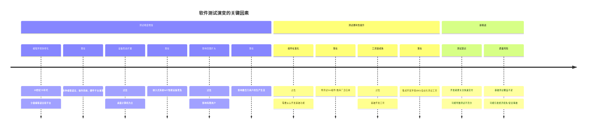

# 第一章 软件测试的概念与过程

## 软件测试的引入

### 1 学习软件测试前的思考

在开始学习软件测试之前，我们需要思考以下问题：

**软件测试就是测试程序吗？**  
软件测试不仅仅是测试程序，它是一个系统性的过程，包括对需求、设计、代码、文档等软件生命周期各阶段产物的验证与确认。

**测试是不是装上软件后点鼠标、敲键盘？**  
这只是测试执行的一小部分。真正的测试包括测试计划制定、测试设计、测试执行、缺陷管理和测试报告等多个环节。

**如何开始测试工作？第一个任务是什么？**  
测试工作应从理解需求开始，第一个任务是分析需求文档，确定测试范围和目标。

**测试早做好还是晚些做好？**  
测试应尽早介入，甚至从需求阶段就开始。越早发现问题，修复成本越低。

**测试需要谋划或者规划吗？**  
测试绝对需要规划。测试计划是测试活动的指南，包括测试策略、资源分配、进度安排等。

**测试要做到非常全面吗？尽善尽美？**  
完全测试在理论上是不可能的。测试应基于风险评估，在有限资源下最大化发现关键缺陷。

**谁会参与测试？谁做最合适？**  
开发人员、专职测试人员、用户都可能参与测试。专职测试人员通常更客观，但开发人员的单元测试和用户的验收测试也很重要。

**测试的最终任务是什么？测试是为了证明软件很棒吗？**  
测试的目的不是证明软件没有错误，而是发现软件中存在的错误。好的测试是能发现更多缺陷的测试。

**如果你找到一个缺陷，你该怎么办？**  
记录缺陷详情，包括复现步骤、环境信息等，提交到缺陷管理系统，并跟踪其解决过程。

**找到的缺陷一定要修改吗？你要不要去修改缺陷？**  
不是所有缺陷都需要修复。应根据缺陷的严重程度、影响范围、修复成本等因素决定。测试人员通常不直接修改缺陷，而是由开发人员负责。

**你希望发现的缺陷越多还是越少？**  
从测试的角度，发现越多缺陷越好，这表明测试有效。但从项目质量角度，希望缺陷越少越好。

**缺陷修改后一定会对软件带来有益的影响吗？**  
不一定。修复缺陷可能引入新的缺陷，这就是所谓的"回归缺陷"。因此需要进行回归测试。

**测试是一次性的任务吗？**  
测试是贯穿软件生命周期的持续活动，而非一次性任务。每次代码变更都可能需要重新测试。

**公司中开发和测试人数上哪种应该更多些？**  
这取决于项目性质、复杂度和质量要求。通常开发人员数量多于测试人员，比例在2:1到4:1之间，但关键系统可能需要更多测试资源。

### 2 回顾软件的概念与分类

#### 2.1 软件的概念

软件是计算机系统中与硬件相互依存的一部分，包括**程序**、**数据**以及与其相关**文档**的完整集合：

- **程序**：按事先设计的功能和性能要求执行的指令序列；
- **数据**：使程序能正常操作信息的数据结构；
- **文档**：与程序开发、维护和使用有关的图文材料。

#### 2.2 软件的分类

**按重要性**：
- **系统软件**：操作系统、数据库管理系统等基础软件
- **支持软件**：编译器、调试器等开发工具
- **应用软件**：满足特定用户需求的软件

**按架构**：
- **单机版软件**：在单台计算机上运行的独立软件
- **分布式软件**：在多台计算机上协同工作的软件
- **C/S架构**：客户端/服务器架构
- **B/S架构**：浏览器/服务器架构

### 3 软件失效

#### 3.1 软件都是安全的吗？软件中有错误吗？

历史上的软件失效案例：

- **1991年，爱国者导弹防御系统**  
  系统时钟的计时错误积累导致跟踪失效，28名士兵丧生。

- **1994年，迪斯尼狮子王游戏**  
  兼容性问题引发大量用户投诉。

- **2000年，千年虫问题**  
  日期格式缺陷导致全球修复成本数千亿美元。

- **2006年，ATM机故障**  
  软件错误导致许霆恶意取款事件。

- **2009年，广州火车站售票系统瘫痪**  
  性能不足导致系统崩溃近3小时。

#### 3.2 软件危机（Software Crisis）

20世纪六七十年代的主要问题：
- 进度和成本估计不准确
- 用户对产品不满意
- 质量不可靠，维护成本高
- 文档匮乏

#### 3.3 软件为什么会失效？

**缺陷产生的原因**：
- 需求的不完善定义
- 客户-开发者通信失效
- 对软件需求的偏离
- 逻辑设计错误
- 编码错误
- 不符合文档与编码规定
- 测试过程的不足
- 规程（Procedure）错误
- 文档编制错误

## 二、软件测试的定义

### 1 软件测试的起源与历史

- **1957年**：测试与调试区分
- **1972年**：Bill Hetzel 首次定义软件测试
- **1979年**：Myers 提出经典定义
- **1983年**：IEEE 制定测试标准
- **1996年**：Kent Beck 提出 TDD 测试驱动开发
- **2009年**：探索式测试理论出现

### 3 软件测试的定义

#### 3.1 经典定义（Myers, 1979）

**目的**：发现错误而执行程序的过程。

**核心**：
- 测试是为了证明程序有错，而非无错。
- 成功的测试是发现未察觉的错误。

#### 3.2 标准定义（IEEE, 1983）

**方法**：人工或自动运行系统。
**目标**：检验是否满足需求，或明确预期与实际结果的差异。

#### 3.3 国内定义（GB/T 11457）

**过程**：依据规范检测软件文档、程序和数据的活动。

#### 3.4 其他理解

- 确认程序正确实现功能（Hetzel, 1973）
- 降低决策风险的过程（现代观点）

## 三、软件测试的过程

### 1 分析测试需求

理解用户需求，确定测试目标。这一阶段需要仔细阅读需求文档，与产品经理和开发人员沟通，明确测试范围和优先级。

### 2 编写测试计划

**内容**：产品概述、测试范围、资源配置、进度安排、风险分析等。
测试计划是测试活动的指南，应包含测试策略、测试环境、测试工具、测试进度、风险评估等内容。

### 3 设计与编写测试用例

设计测试点，按模板编写用例。测试用例应覆盖正常流程、异常流程、边界条件等多种情况，确保测试的全面性。

### 4 执行测试

搭建环境，执行用例，记录缺陷。测试执行过程中应严格按照测试用例操作，详细记录测试结果和发现的问题。

### 5 评估与总结

分析偏差，提交文档，总结经验。测试完成后应对测试结果进行分析，评估软件质量，总结测试经验和教训。

## 四、软件测试的目的/目标

软件测试的主要目的包括：

1. **发现缺陷**：找出软件中存在的错误和问题，确保软件质量。
2. **验证需求**：确认软件是否满足用户需求和规格说明。
3. **评估质量**：评估软件的质量特性，如功能性、可靠性、易用性、效率等。
4. **提供信息**：为项目相关方提供软件质量状况的信息，辅助决策。
5. **预防缺陷**：通过早期测试发现问题，降低修复成本。
6. **建立信心**：增强用户和开发团队对软件的信心。

## 五、区分三个概念

### 1 测试 & 调试

| 区别 | 测试 | 调试 |
| --- | --- | --- |
| 执行者 | 测试人员 | 开发人员 |
| 任务 | 发现、报告和跟踪缺陷 | 定位缺陷原因，修复代码 |
| 目标 | 发现软件中的缺陷 | 修复已知缺陷 |
| 方法 | 按照测试用例执行 | 分析代码，定位问题 |
| 时机 | 代码完成后 | 发现缺陷后 |

### 2 软件质量保证（SQA） & 软件测试

| 区别 | 质量保证（SQA） | 软件测试 |
| --- | --- | --- |
| 目标 | 制定标准，监督过程合规性 | 短时间内发现并修复缺陷 |
| 范围 | 整个软件开发生命周期 | 主要集中在测试阶段 |
| 关注点 | 过程质量 | 产品质量 |
| 活动 | 制定标准、审计、评审 | 测试计划、用例设计、测试执行 |
| 角色 | 质量保证工程师 | 测试工程师 |

## 六、软件测试的原则

### 测试应基于用户需求

验证软件是否满足用户显式/隐式需求。测试的最终目标是确保软件满足用户的实际需求，而不仅仅是技术规格。

### 尽早测试

测试活动应贯穿需求分析、设计、编码全过程（"测试左移"）。越早发现问题，修复成本越低，这是"缺陷放大效应"的体现。

### 缺陷集群性（二八定律）

80%的缺陷集中在20%的模块中。这意味着某些模块比其他模块更容易出错，测试应该重点关注这些高风险区域。

### 杀虫剂悖论

重复相同测试用例会降低发现新缺陷的概率，需持续更新测试方案。就像昆虫对杀虫剂产生抗性一样，软件缺陷也会对固定的测试用例"免疫"。

### 不存在"零缺陷"测试

穷尽测试不可行，需通过风险评估确定测试边界。完全测试需要执行所有可能的输入组合，这在实际中是不可能的。

### 第三方测试更有效

开发人员难以客观审视自身代码。第三方测试人员没有代码编写的心理负担，能更客观地评估软件质量。

## 七、软件测试的分类

### 按测试阶段

| 测试类型 | 描述 |
| --- | --- |
| 单元测试 | 验证代码级模块功能（通常由开发人员实施） |
| 集成测试 | 检验模块间接口与数据传递 |
| 系统测试 | 完整系统在真实环境中的功能/非功能验证 |
| 验收测试 | 用户主导的最终验收（α测试/β测试） |

### 按测试方法

- **黑盒测试**：关注输入输出，不涉及内部结构
- **白盒测试**：基于代码逻辑设计测试用例
- **灰盒测试**：结合黑盒与白盒特性

### 按测试目的

- **功能测试**：验证软件功能是否符合需求
- **性能测试**（负载/压力/容量）：评估系统在不同负载下的性能表现
- **安全测试**：检测系统安全漏洞和风险
- **兼容性测试**：验证软件在不同环境下的兼容性
- **回归测试**：确保修改不会影响现有功能

## 八、测试人员的核心能力

### 需求分析能力

精准理解业务场景与用户痛点。测试人员需要深入理解需求，才能设计出有效的测试用例。

### 用例设计能力

运用等价类划分、边界值分析等设计方法。好的测试用例能够最大化发现缺陷的概率。

### 缺陷洞察力

通过非常规操作发现隐藏缺陷（如探索式测试）。测试人员需要具备"破坏性思维"，从用户可能的误操作角度思考。

### 自动化能力

掌握Selenium/JMeter等工具实施自动化测试。自动化测试可以提高测试效率，特别是对于回归测试。

### 跨团队协作

与产品/开发团队建立高效沟通机制。测试不是孤立的活动，需要与各个角色紧密协作。

## 九、测试行业发展趋势

### AI驱动的智能测试

通过机器学习生成/优化测试用例。AI可以分析历史缺陷数据，预测高风险区域，自动生成测试用例。

### 云测试平台普及

利用云端资源实现大规模并发测试。云测试平台可以提供多种设备和环境，降低测试成本。

### DevOps中的持续测试

在CI/CD流水线中嵌入自动化测试环节。持续测试是DevOps的核心实践，确保每次代码变更都经过充分测试。

### 质量左移与右移

- **左移**：提前介入需求评审，在需求和设计阶段就开始测试活动
- **右移**：监控生产环境用户行为，收集真实用户反馈

# 自评价软件测试
根据原文内容，我使用mermaid的timeline图梳理软件测试演变的关键点如下：

### 图表解读
1. 复杂性增长维度
   
   - 技术多样化 ：早期间语言与硬件单一 → 今语言碎片化、设备泛化（如信创体系的ARM/X86架构之争）。
   - 用户规模激增 ：小型企业应用 → 全民级互联网服务（如支付宝单日请求量过亿次）。
   - 风险权重提升 ：早期功能错误 → 现代安全漏洞可能导致经济或人身损害（如自动驾驶系统失控）。
2. 解决方案演进
   
   - 从手动到自动化 ：告别"Excel记录用例" → Selenium/Scriptless工具链应用。
   - 精准覆盖替代粗放覆盖 ：盲目回归 → AI识别高风险路径优先测试。
   - 左移与右移融合 ：开发阶段引入测试（TDD） + 运维阶段持续监控（混沌工程）。
# 软件测试是什么？
软件测试，就是一个过程或一系列过程，用来确认计算机代码完成了其应该完成的功能，不执行其不该有的操作。软件应当是可预测且稳定的，不会给用户带来惊奇

# 三角形类型判断程序
判断三角形的类型（不规则三角形、等腰三角形或等边三角形）。

以下是实现该功能的JavaScript代码：

javascript

Open Folder

1

2

3

4

5

6

7

8

9

10

11

12

13

14

15

16

17

18

19

20

21

22

23

24

25

26

27

28

29

30

31

32

function determineTriangleType ( ) {

// 获取用户输入的三条边长度

const side1 = parseFloat ( prompt ( "请输入第一条边的长度:" ) ) ;

const side2 = parseFloat ( prompt ( "请输入第二条边的长度:" ) ) ;

const side3 = parseFloat ( prompt ( "请输入第三条边的长度:" ) ) ;

// 检查输入是否有效（是否为数字且大于0）

if ( isNaN ( side1 ) || isNaN ( side2 ) || isNaN ( side3 ) ||

side1 <= 0 || side2 <= 0 || side3 <= 0 ) {

return "输入无效，请确保输入的是大于0的数字。" ;

}

// 检查是否能构成三角形（任意两边之和大于第三边）

if ( side1 + side2 <= side3 || side1 + side3 <=

side2 || side2 + side3 <= side1 ) {

return "这三条边无法构成三角形。" ;

}

// 判断三角形类型

if ( side1 === side2 && side2 === side3 ) {

return "这是一个等边三角形（三条边相等）。" ;

} else if ( side1 === side2 || side1 === side3 || side2

=== side3 ) {

return "这是一个等腰三角形（有两条边相等）。" ;

} else {

return "这是一个不规则三角形（三条边均不相等）。" ;

}

}

// 调用函数并显示结果

const result = determineTriangleType ( ) ;

alert ( result ) ;

// 也可以在控制台输出结果

console . log ( result ) ;

收起代码

## 程序说明
1. 该程序通过 prompt 函数获取用户输入的三条边长度
2. 使用 parseFloat 将输入转换为数字
3. 进行三重验证：
   - 检查输入是否为有效数字且大于0
   - 验证三条边是否能构成三角形（任意两边之和大于第三边）
   - 判断三角形类型：等边、等腰或不规则