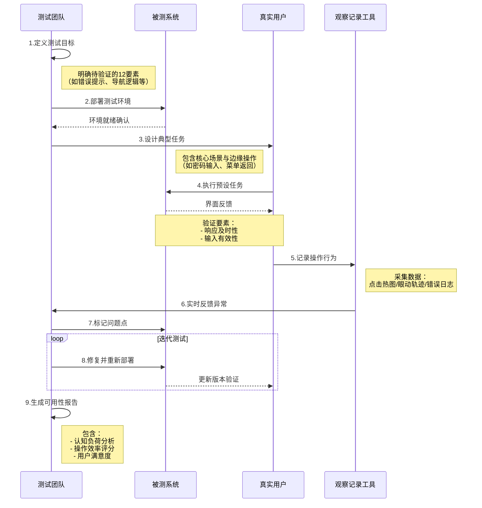

可用性测试是通过观察真实用户与产品的交互，评估其易用性、效率和用户满意度的过程。以下是其核心要点：

1. **定义与目的**  
   - **以用户为中心**：直接由目标用户参与测试，从实际使用场景中发现问题。  
   - **核心目标**：确保产品直观易用，符合用户需求和行为习惯，提升用户体验。

2. **历史背景**  
   - **早期发展**：20世纪80年代由施乐PARC等机构率先探索，80年代末应用于个人电脑软硬件的发布前测试。  
   - **行业转变**：早期开发者多忽视用户交互，但先驱实践证明其价值，推动行业逐渐重视用户测试。

3. **关键作用**  
   - **风险预防**：在产品发布前识别设计缺陷（如界面混乱、操作复杂），避免上市后因体验差导致的失败。  
   - **成本效益**：早期投入测试可减少后期修改成本，提升市场竞争力与用户接受度。

4. **实施价值**  
   - **商业成功**：通过优化用户体验增强产品市场表现，直接影响销售与品牌口碑。  
   - **用户导向设计**：促使开发团队从技术思维转向用户需求驱动，弥合开发者与用户间的认知差距。

**本质**：可用性测试是连接产品设计与真实用户需求的桥梁，通过模拟真实使用场景，将“人”的因素转化为可改进的设计方案，确保技术服务于人的实际需求。

## 可用性测试的基本要素
1.是否每一个用户交互设计都考虑到最终用户的理解力、教育背景以及环境压力？
2.程序的输出是否有意义、没有侮辱性的词语，以及是否含糊不清？
3.用来错误诊断的提示的信息（errormessage）是直白易懂，还是需要计算机博士才可读懂
4.用户界面上是否保持概念的一致、内部的连贯性、语法的一致性？是否符合约定的使用习惯、语义和句法规律、格式、样式以及缩写习惯？
5.需要高精确性和准确度的软件系统是否提供了足够有效的输入验证
6.系统是不是包含了太多选项，或者包含的一些选项不会被使用
7.对于来自用户的输入，系统是否能够及时做出反应？
8.程序的操作是否很容易上手？如是否有效提示用户需要输入大小敏感的文本
9.软件的设计是否有助于用户准确输入？
10.用户的操作可以轻松重复吗？换一句话说，你的软件是否能够让用户学会更好地使用该系统？
11.用户是否确定能够在众多的功能和菜单中来回切换而不发生意外？
12.软件的功能实现是否达到了设计规格要求？

## 可用性测试的基本流程

