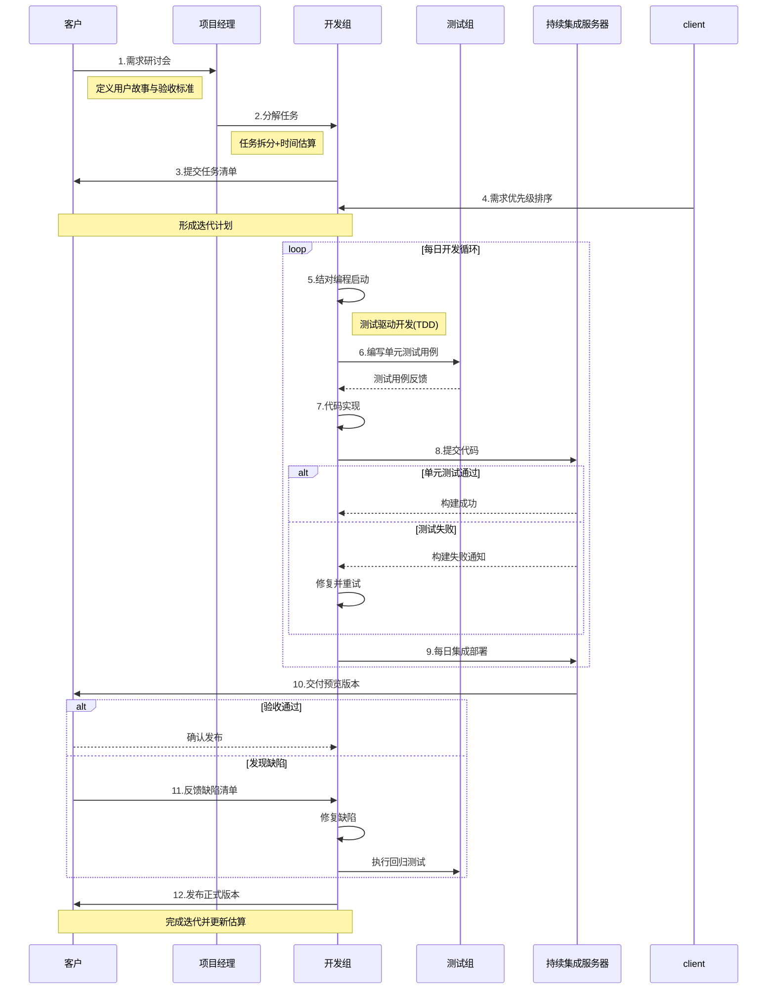

# 敏捷测试

敏捷测试是什么？
敏捷测试是协同测试的一种形式，它要求每一个人都参与到测试计划的设计、实现以及执行中去
敏捷开发的大多数特征无异，敏捷测试需要客户尽早参与到开发周期中来并一直到其结束
在敏捷测试中，测试者都不能仅仅是把问题找出来并交给开发人员修复，他们的任务是通过持续的测试反馈推动项目前行，帮助开发者修复bug、改变需求设计以及其他的一般性质量提升。

### 极限编程（XP）与极限测试（XT）简单解释：

#### **1. 极限编程（XP）是什么？**
- **核心目标**：用最轻量、最灵活的方式快速开发高质量软件。
- **特点**：
  - **客户深度参与**：客户全程定义需求，随时调整优先级。
  - **小步快跑**：将大项目拆成小功能，每1-3周完成一个可用的版本。
  - **团队协作**：程序员结对写代码（一人写，一人实时检查）。
  - **持续改进**：定期优化代码结构（重构），保持代码简洁。

#### **2. 极限测试（XT）是什么？**
- **核心规则**：先写测试，再写代码。
- **运作方式**：
  - **单元测试**：程序员每写一小段代码前，先写测试用例（比如“计算器加法是否正确”），代码必须通过这些测试才能算完成。
  - **验收测试**：客户直接参与设计测试（比如“用户下单流程是否顺畅”），确保软件真正满足需求。
  - **自动化执行**：所有测试自动化运行，每次改代码后自动检测是否破坏原有功能。

#### **3. 为什么需要它们？**
- **传统开发问题**：
  - 开发慢，客户需求变时难调整。
  - 测试在最后阶段，发现错误成本高。
- **XP/XT的优势**：
  - **质量可控**：测试驱动开发，减少Bug。
  - **快速响应**：客户随时改需求，团队灵活调整。
  - **减少返工**：每步都验证，避免最后大修。

#### **比喻理解**：
- **XP**像搭乐高：客户说要一个城堡，团队先搭城门（小功能），客户立刻试用并反馈“城门太矮”，团队马上加高，再接着搭下一块。
- **XT**像安全网：每次加一块新乐高前，先检查会不会让城堡倒塌（测试），确认安全再继续。

**一句话总结**：极限编程是用“小步快跑+客户合作”快速造软件，极限测试是用“先测再写+自动化”确保每一步都稳如磐石。

