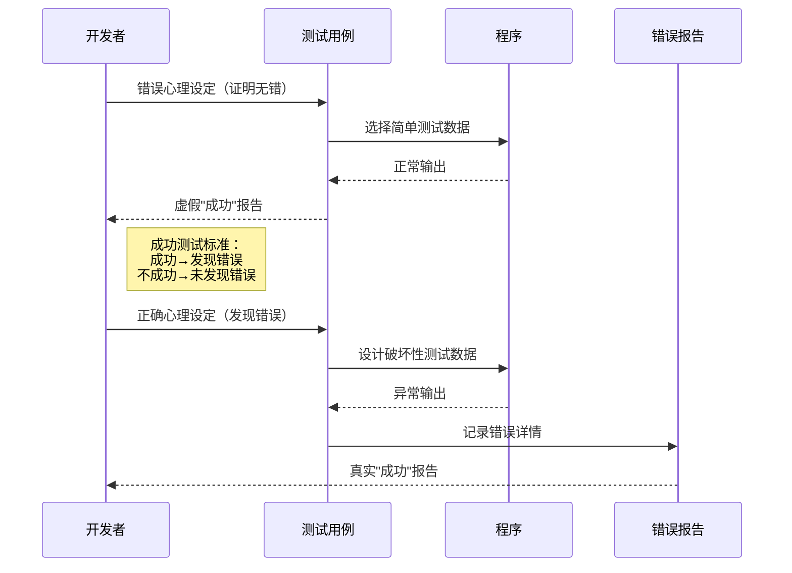
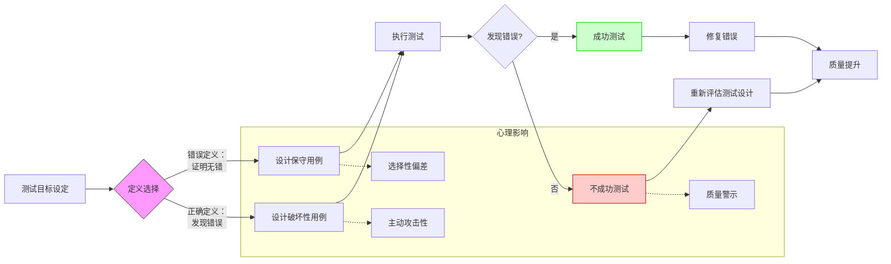
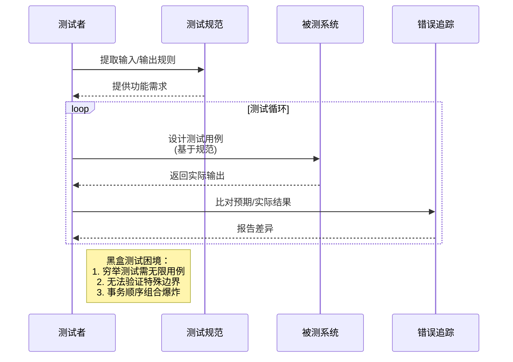
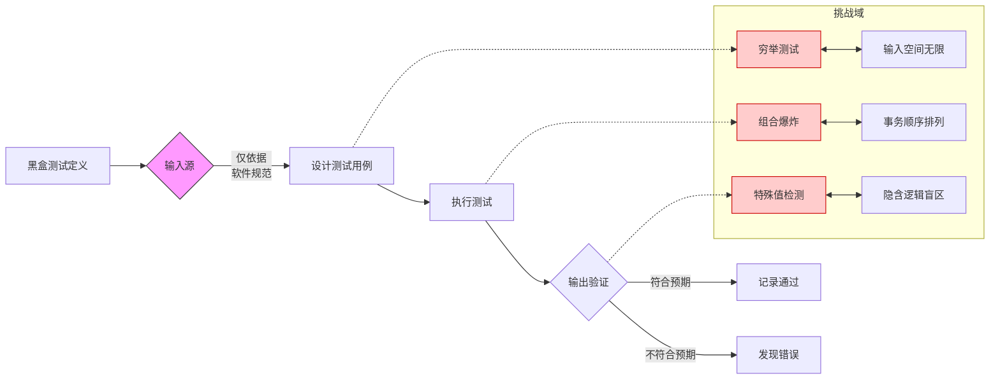

# 软件测试的心理学和经济学
软件测试是一项技术性工作，但同时也涉及经济学和人类心理学的一些重要因素。
即使一个看起来非常简单的程序，其可能的输入与输出组合可达到数百种甚至数千种，对所有的可能情况都设计测试用例是不切合实际的。对一个复杂的应用程序进行完全的测试，将耗费大量的时间和人力资源，这样在经济上是不可行的
## 1. 软件测试的心理学
要成功地测试一个软件应用程序，测试人员也需要有正确的态度（也许用“愿景”​（vision）这个词会更好一些）​。在某些情况下，测试人员的态度可能比实际的测试过程本身还要重要

错误观念
“软件测试就是证明软件不存在错误的过程。​
“软件测试就是证明软件不存在错误的过程”​，这个定义会带来第二个问题。对于几乎所有的程序而言，甚至是非常小的程序，这个目标实际上也是无法达到的。’
”“软件测试的目的在于证明软件能够正确完成其预定的功能。
​”“软件测试就是建立一个‘软件做了其应该做的’信心的过程。​”
但实际上--人类行为总是倾向于具有高度目标性，确立一个正确的目标有着重要的心理学影响 
如果我们的目标在于证明程序中存在错误，我们设计的测试数据就有可能更多地发现问题
当程序没有实现预期功能时，错误是清晰地显现出来的；如果程序做了其不应该做的，这同样是一个错误

正确的观念是“测试是为发现错误而执行程序的过程

## 2. 软件测试的经济学
定软件测试是否能够发现“所有”的错误。我们将证明答案是否定的，即使是规模很小的程序。一般说来，要发现程序中的所有错误也是不切实际的，常常也是不可能的

### 黑盒测试
黑盒测试是一种重要的测试策略，又称为数据驱动的测试或输入/输出驱动的测试。使用这种测试方法时，将程序视为一个黑盒子。测试目标与程序的内部机制和结构完全无关，而是将重点集中放在发现程序不按其规范正确运行的环境条件。
发现穷举测试是不可行的之后 
穷举测试是不可能的，测试投入的目标在于通过有限的测试用例，最大限度地提高发现的问题的数量，以取得最好的测试效果

### 白盒测试
另一种测试策略称为白盒测试或称逻辑驱动的测试，允许我们检查程序的内部结构。这种测试策略对程序的逻辑结构进行检查，从中获取测试数据（遗憾的是，常常忽略了程序的规范）​。

穷举路径测试，即如果使用测试用例执行了程序中所有可能的控制流路径，那么程序有可能得到了完全测试。
穷举路径测试就如同穷举输入测试，非但不可能，也是不切实际的。

          
# 软件测试的原则与测试工程师的要求

我已经查看了您提供的内容，这是关于软件测试原则和测试工程师要求的详细资料。我将根据您的要求，将这些内容补充到《软件测试的艺术读书笔记-第二章软件测试的心理学和经济学》文档中。

以下是我对该文档的补充内容：

## 软件测试的原则

软件测试的原则是指导测试活动的基本准则，它们帮助测试人员更有效地发现错误，提高测试的效率和质量。除了已有的原则外，还有以下重要原则：

### 所有的测试都应追溯到用户需求

根据相关调查，软件缺陷出现最多的地方是软件需求规格说明书（即软件需求定义），而不是程序代码。因此：
- 测试的第一个任务是需求分析
- 时刻都要提醒自己考虑用户需求
- 制造缺陷的罪魁祸首不是程序员
- 做好需求评审，审查所做的内容是否符合用户的需求

### 尽早启动测试工作

测试应该早进行。测试应该是与软件开发或维护工作并行进行的一个过程，测试应该持续进行。这样可以避免缺陷雪崩现象，并降低测试成本。

### 早做测试计划

软件测试不仅仅是测试执行。应在测试工作真正开始前的较长时间内就进行测试计划。

### 穷尽测试不可能 & 软件测试有风险

完全测试、完美测试、充分测试是不可能的，主要原因包括测试数据输入量太大、时间不够等。如果决定不去测试所有的情况，那么我们就面临了很大的风险。解决方法：
- 使用风险分析，确定测试的重点和优先级，控制测试的开销（时间、成本、资源）
- 风险分析需要判断技能、常识、感觉和经验

### 测试工作的 Good-enough 原则

既不要做过多测试，也不做不充分的测试。解决办法是通过需求分析和风险分析（时间、费用、资源）找到测试重点，制定最低测试通过标准和测试内容，然后具体问题具体分析。

### Pareto 法则应用于软件测试

Pareto（帕累托）法则由意大利经济学家帕累托提出，又称为 28 效率法则：
- 一般情况下 80% 的缺陷聚集在 20% 的关键核心业务模块中
- 在分析、设计、实现阶段的复审和测试工作能够发现和避免 80% 的缺陷，而系统测试又能找出其余缺陷中的 80%，最后的 4% 的缺陷可能只有在用户的大范围、长时间使用后才会曝露出来

应用此原则需要：
- 做好测试需求分析和测试计划，分清测试重点
- 尽早测试
- 持续测试

### 尽可能使用分阶段测试

测试应按照单元测试 → 集成测试 → 系统测试 → 验收测试的顺序进行，随着代码规模不断加大，测试的范围和复杂度也随之增加。

### 为了达到最佳效果，应该由独立的第三方来构造测试

"最佳效果"指最有可能发现错误的测试：
- 程序员从来都不会承认自己写的程序有错误
- 程序员测试自己的编码是一件很糟糕的事，但是让他们测试别人的编码却成了最好的测试人员
- 程序员的测试思路有明显的局限性
- 多数程序员没有经过严格正规的职业训练
- 程序员无良好的 BUG 跟踪和回归测试习惯

### 测试旨在发现存在的缺陷

软件测试可以报告软件缺陷存在，却不能报告软件缺陷不存在；即使在测试过程未发现软件的失效，也不能证明被测软件没有错误。

### 为了保证测试的有效性和高效性，测试必须是破坏性、系统化的

充分、有效、系统的测试可以减少软件中未被发现缺陷的可能性；测试既要验证软件的正确性，更要通过破坏软件，发现缺陷的不正确性。

### 找到的软件缺陷越多，说明软件隐含的缺陷越多

缺陷具有群集效应，应该在发现缺陷的地方继续寻找。

### 杀虫剂怪事

用于描述软件测试越多，其对测试的免疫力越强的现象。程序员对测试人员的"惯用伎俩"已经可以主动躲避了！为了克服杀虫剂怪事，软件测试员必须不断编写不同的、新的测试程序，对程序的不同部分进行测试，以找出更多软件缺陷。

### 并非所有软件缺陷都要修复

有些缺陷可能不需要修复，原因包括：
- 没有足够的时间
- 不算真正的软件缺陷
- 修复的风险太大
- 不值得修复

### 使用木桶原理

木桶原理在软件产品生产方面就是全面质量管理（QTM）的概念，强调团队合作的重要性。

### 前进两步，后退一步

测试中的一个基本问题是——缺陷修复总会以（20-50）% 的机率引入新的缺陷。每次修复之后，必须做确认测试和回归测试：

**再测试/确认测试**：测试人员提交缺陷，开发人员修复缺陷后，测试人员需要重新测试，验证之前的提交的缺陷是否真正修复。

**回归测试**：测试人员提交缺陷，开发人员修复缺陷后，测试人员需要重新测试，确保对程序修改没有给软件其他未改变部分带来新的缺陷。软件修改或环境变更后，必须进行回归测试。

### 软件测试是一个迭代的过程

无论项目采用何种开发模型，测试人员总是一个版本接一个版本地测试，其测试活动总是迭代向前的：测试版本 1 → 提交缺陷 → 修复缺陷 → 测试版本 2 → 提交新缺陷 → 修复新缺陷 → 测试版本 3 → …

### 测试需要遵循标准

标准的分类：
- 国际标准：如 ISO、CMM（Capability Maturity Model，软件能力成熟度模型）、IEEE（国际电气电子工程师协会）
- 国家标准：GB、GB/T
- 行业标准
- 公司标准
- 用户规定

## 软件测试行业概述

### 测试工作的乐趣
- 破坏程序纯粹的快乐
- 破坏行为具有价值
- 体现出魔术般的力量
- 学习的乐趣

### 测试工作的烦恼
- 必须追求完美
- 由他人来设定目标，供给资源，提供信息
- 测试往往是线性收敛
- 投入了大量辛苦，用户发现的致命缺陷将否定全部工作

### 第三方测试
是指独立于软件公司自身测试的测试，所谓的第三方是指在软件公司和软件用户之间的另一方。

### 测试行业的机遇与现状
国内外测试人员与开发人员的比例差异很大，国内在认识上重开发、轻测试；在管理上随意、简单，没有建立有效、规范的软件测试管理和评判体系；缺少自动化工具的支持。

## 软件测试工程师的要求

### 行业知识与软件测试
高效的测试团队应该由具备各种专门技术的成员（具备行业知识、专业技能、测试技术等）组成，同时也应该由具备各种经验的成员（测试新手和测试专家）组成。

### 优秀的软件测试工程师品质
- **态度**
  - 有责任心
  - 破坏的态度
  - 对事不对人
- **三心二意**
  - 细心、信心、耐心
  - 团队合作的沟通意识、时刻保持怀疑的态度（即缺陷预防意识）
- **具备一定的开发技能**
  - 了解开发原理
  - 便于与开发沟通
- **习惯打破砂锅问到底（善于思考）**

### 改善测试员和其他小组成员之间的沟通和相互关系的方法
- 以合作而不是争斗的方式开始项目
  - 时时提醒项目的每位成员：共同目标是追求高质量的产品
- 对产品中发现的问题以中性的和以事实为依据的方式来沟通
  - 不要指责引入这个问题的小组成员或个人。比如，客观而实际地编写缺陷报告和评审发现的问题
- 换位思考
  - 尽量理解其他成员的感受，以及他们为什么会有这种反应
- 有效沟通
  - 开发与测试具有不同的思维方式，确信其他成员已经理解你的描述，反之亦然
- 提高开发技能，更好地理解开发人员的工作和思维方式
