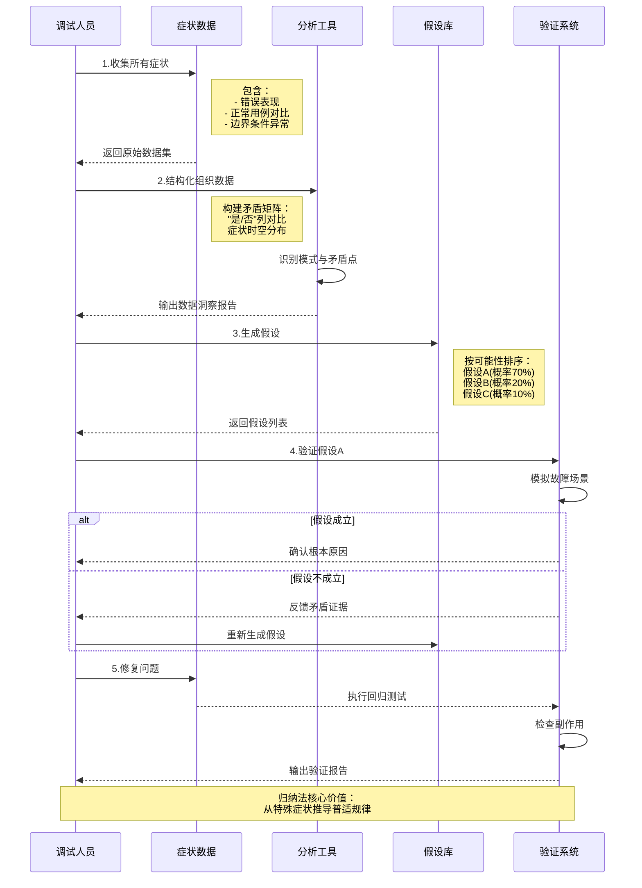
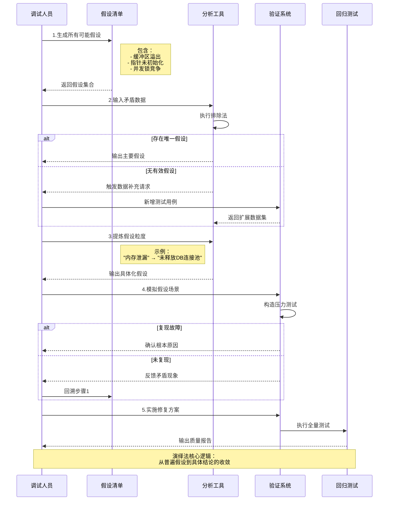

# 调试
## 调试的定义

成功的测试，是指它可以证明程序没有实现预期的功能
一个成功的测试用例、发现了一个问题之后开始。第一步，确定程序中可疑错误的准确性质和位置；第二步，修改错误

调试的方法
## 暴力调试法
暴力调试方法可至少被划分为三种类型：
1.利用内存信息输出来调试。
2.根据一般的“在程序中插入打印语句”建议来调试。
3.使用自动化的调试工具进

暴力调试法 第一种类型，使用内存信息输出 缺乏效率的原因
·难以在内存区域与源程序中的变量之间建立对应关系。
·即使对于复杂程度较低的程序，内存信息输出也会产生数量非常庞大的数据，其中的大多数都是与调试无关的。
.内存信息输出显示的是程序的静态快照，仅能显示出在某一个时刻程序的状态；为了发现错误，还需要研究程序的动态状
·内存信息输出很少可以精确地在错误发生的地方产生，因此无法显示在错误发生时程序的状态。错误发生到输出内存信息这段时间之内程序执行的活动，可能会掩盖掉发现错误所需的线索。

第二种类型，在失效的程序中插入输出变量值的语句
·它不是鼓励我们去思考程序中的问题，而主要是一种碰运气的方法。
·它所产生的需要分析的数据量非常庞大。
·它要求我们修改程序，这些修改可能会掩盖掉错误、改变关键的时序关系，或者会引入新的错误。
·它可能对小型程序有效，但如果应用到大型程序，成本就相当高

第三种类型，自动化调试工具的工作机制类似于在程序中插入打印语句
- 会产生大量的输出数据，这些数据需要分析。碰运气的方法

只有在其他方法都失败的时候才使用暴力调试方法：​（1）其他的方法都失败了
## 归纳法
归纳是一种特殊的思考过程，可以从细节转到全局，也就是从线索（即错误的症状，可能是一个或多个测试用例的结果）出发，寻找线索之间的联系

以下是使用 Mermaid 时序图对调试中归纳法作用的梳理，展示从数据收集到问题解决的完整闭环流程：

## 演绎法

演绎的过程是从一些普遍的理论
1.列举出所有可能的原因或假设。第一步是建立一份所有想象得到的错误线索的清单，线索不需要有完整的解释；它们纯粹是一些推测，帮助我们组织和分析现有的数据。2.利用数据排除可能的原因。详细检查所有的数据，尤其寻找存在矛盾的地方（图8-2可以用在此处）​，然后尽量排除所有可能的原因，仅留下一条。如果所有的原因都排除掉了，需要增加额外的测试用例，得到更多的数据来设计新的推测。如果剩下的原因多于一个，那么首先选择最有可能的原因，即主要假设。3.提炼剩下的假设。此时的可能原因也许是正确的，但可能不够具体，不能指出错误来。因此，下一步是使用现有的线索来提炼这个推测。举例来说，我们可能会首先想到“对文件中最后事务的处理可能存在错误”​，并将其提炼为“缓冲区中的最后事务被文件结束指示器覆盖”​。4.证明剩下的假设。这个重要步骤与归纳法中的第4步骤相同。5.修复问题。这一步与归纳法中的第5步一样。这里再次强调，应该针对修复的问题进行彻底测试以确保应用程序没有引入新的问题。

### 回溯法
在小型程序中定位错误的一种有效方法是沿着程序的逻辑结构回溯不正确的结果，直到找出程序逻辑出错的位置。换句话说，从程序产生不正确结果（如打印了不正确的数据）的地方开始，从该处观察到的结果推断出程序变量应该是些什么值。在头脑中，从这个位置开始逆向执行程序，重复使用“如果程序在此处的状态是这样的，那么程序在上面位置的状态就必然是那样的”过程，就能很快定位出错误。使用这个过程，可以确定程序中从状态符合预期值的位置点，到第一个状态不符合预期值的位置点之间的范围。
### 测试法调试

型”的调试方法是使用测试用例。这听起来可能有些奇怪，因为从本章一开始就将调试和测试区分了开来。然而，考虑下面两种类型的测试用例：供测试的测试用例，其目的是暴露出以前尚未发现的错误；供调试的测试用例，其目的是提供有用的信息，供定位某个被怀疑的错误之用。两者之间的区别是，供测试的测试用例会“胖”一些，因为我们尽量使用较少数量的测试用例来涵盖较多的条件，而供调试的测试用例则“瘦”一些，因为每个测试用例仅需要覆盖一个或几个条件。

### 调试的原则
- 动脑筋思考
- 如果在合理时间内（也许小型程序为30分钟，大一点的程序为几个小时）​，我们还不能定位某个问题，就丢开它，做些其他的事情，因为思维的效率开始明显下
- 3.如果遇到了困境，就把问题描述给其他人听
- 4.仅将调试工具作为第二种手段
- 5.避免使用试验法—仅将其作为最后的手段

### 修复错误的步骤
- 1.存在一个缺陷的地方，很有可能还存在其他缺陷
- 2.应纠正错误本身，而不仅是其症状
- 3.正确纠正错误的可能性并非100%
- 4.随着程序规模的增加，正确修改错误的可能性反而降低
- 不仅应在修改之后对错误的情境进行测试，还应执行回归测试以判断是否引入了新错误。
- 6.修改错误的过程也是临时回到设计阶段的过程
- 7.应修改源代码，而不是目标代码

### 错误分析
详细的错误分析会包括如下内容 错误出现在哪些地方，谁制造了错误，如何避免该错误的出现
·为什么错误没有早些发现？如果错误是在测试阶段发现的，我们就应该研究为什么在更早些的测试阶段、代码审查和设计评审中没有发现该错误。·该如何更早地发现错误？
