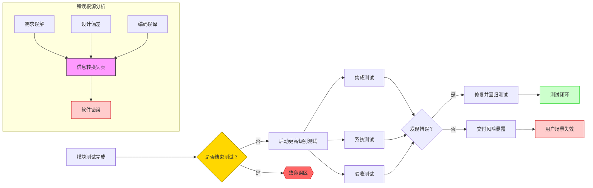
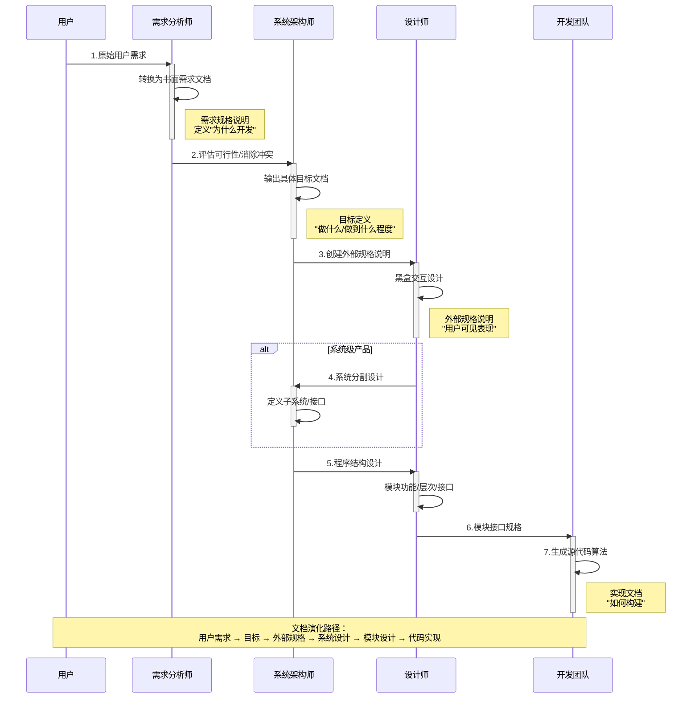
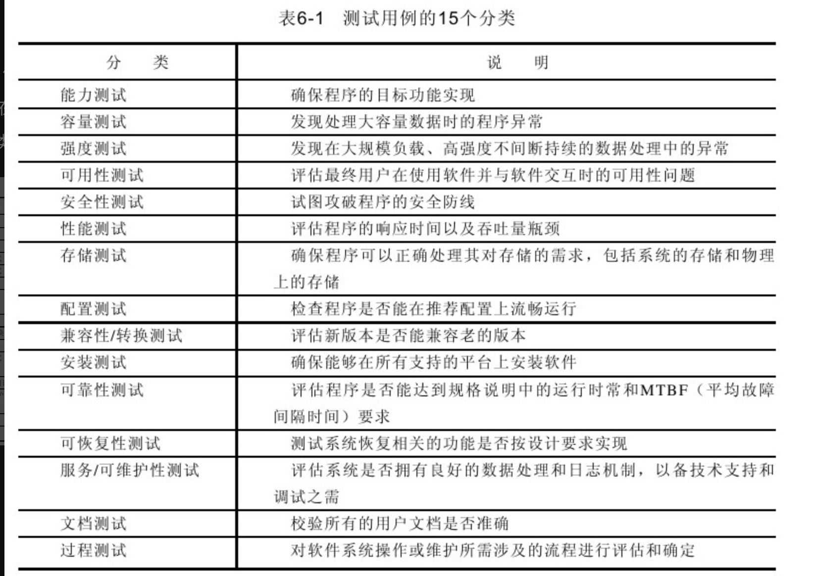
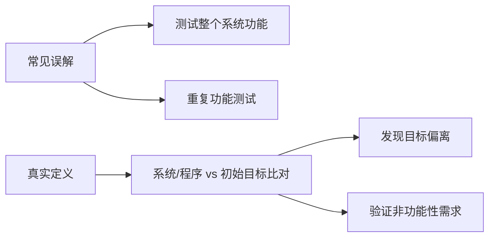
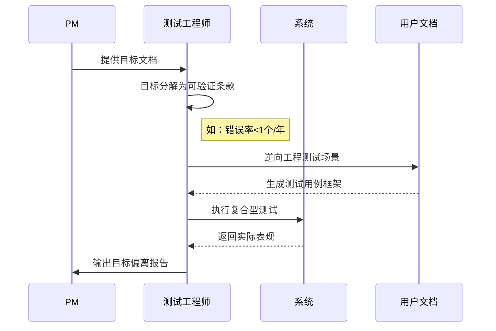

在模块功能完成测试之后
但是软件是面向客户的，程序无法实现其最终用户要求的合理功能时，就发生了一个软件错误。
即使完成了一次非常完美的模块测试，仍然不能保证已经找出了程序中的所有错误。因此，要结束整个测试任务，还必须进行其他形式的更深入的测试。我们将这些新形式的测试称为“更高级别的”测试。

## 软件开发的过程
软件开发过程在很大程度上是沟通有关最终程序的信息、并将信息从一种形式转换到另一种形式。由于这个原因，绝大部分软件错误都可以归因为信息沟通和转换时发生的故障、差错和干扰。

1.将软件最终用户的要求转换为一系列书面的需求。这些需求就是该软件产品要实现的目标。
2.通过评估可行性与成本、消除相抵触的用户需求、建立优先级和平衡关系，将用户需求转换为具体的目标。
3.将上述目标转换为一个准确的产品规格说明，将产品视为一个黑盒，仅考虑其接口以及与最终用户的交互。该规格说明被称为“外部规格说明
4.如果该产品是一个系统，如操作系统、飞行控制系统、数据库管理系统或雇员人事系统等，而不仅是一个程序（编译器、工资程序、字处理程序等）​，那么下一步骤就是系统设计。该步骤将系统分割为单独的程序、部件或子系统，并定义它们的接口。
5.通过定义每个模块的功能、模块的层次结构以及模块间的接口，来设计程序或程序集合的结构。
6.设计一份准确的规格说明，定义每个模块的接口与功能。
7.经过一个或更多的子步骤，将模块接口规格说明转换为每个模块的源代码算法。
（·需求规格说明定义了为什么要开发程序。·目标定义了程序要做什么，以及应做得怎样。·外部规格说明定义了程序对用户的准确表现。·与后续阶段相关的文档越来越详细地规定了程序是如何建立起来的。）
此流程图既保持了技术严谨性，又通过视觉层次清晰呈现了原文的核心论点：**测试必须穿透信息转换层，直达用户真实场景**。

开发软件中遇到的信息沟通错误的3个解决方法
以及大多数的软件错误都来源于信息处理中的故障，那么现在有三个补充的方法来预防或识别这些错误。。
首先，我们可以使软件开发过程更加精密，以防其中出现很多错误
其次，在每个阶段结束时可以引入个独立的验证过程，在进入下一个阶段之前尽可能多地发现问题
第三个方法是对不同的开发阶段采用不同的测试方法。
·模块测试的目的是发现程序模块与其接口规格说明之间的不一致。
·功能测试的目的是为了证明程序未能符合其外部规格说明。
·系统测试的目的是为了证明软件产品与其初始目标不一致。

## 功能测试
功能测试的目的是为了暴露程序的错误以及发现程序与规格说明书中的不一致之处，而不是为了证明程序符合其规格说明书。
在功能测试中，应记住对无效和未预想到的输入条件给予足够的重视

## 系统测试
系统测试下面的测试方法

### **一、系统测试本质与误区**

---

### **二、系统测试关键要素**

| 要素         | 说明                     | 示例（DISPLAY命令）    |
| ------------ | ------------------------ | ---------------------- |
| **目标文档** | 定义程序应达成的业务目标 | 命令响应时间≤2秒       |
| **用户文档** | 操作手册/API文档等       | 输出格式规范           |
| **测试基准** | 目标+用户文档组合验证    | 验证地址范围默认值逻辑 |
| **验证重点** | 设计阶段的转换错误       | 语法一致性实现缺陷     |

---

### **三、系统测试实施步骤**

---

## 测试的计划和控制
为了避免第二章出现的人力资源不充分问题，需要对测试进行系统性的计划。计划是管理测试过程中至关重要的一环。一个良好的测试计划应包括以下要素：

### 1. 目标
必须定义每个测试阶段的具体目标。

### 2. 结束准则
1.用完了安排的测试时间后，测试便结束
2.当执行完所有测试用例都未发现错误，测试便结束。也就是说，当所有的测试用例不成功时便结束。

#### 单元模块测试的结束准则
1）满足多重条件覆盖准则，​
2）对模块接口规格说明进行边界值分析，产生的所有测试用例最终都是不成功的。

#### 功能测试结束准则
测试用例来源于（1）因果图分析，​（2）边界值分析，​（3）错误猜测，产生的所有测试用例最终都是不成功的。

#### 其他类型测试结束的准则

### 3. 进度
- 每个阶段都须有时间表
- 明确指出测试用例的设计、编写和执行时间
- 考虑特定软件开发方法学（如极限编程）的要求

### 4. 责任分工
- 确定测试用例的设计、编写和验证人员
- 指定错误修改负责人
- 设立仲裁者（针对大型项目中的测试结果争议）

### 5. 测试用例库及标准
在大型项目中，需要建立系统化的测试用例管理方法。

### 6. 工具
- 确定所需测试工具
- 明确工具的开发/采购计划
- 规定工具使用方法和时机

### 7. 计算机时间
规划各测试阶段所需的计算资源：
- 应用程序编译服务器
- 安装测试用桌面计算机
- Web应用服务器
- 网络设备等

### 8. 硬件配置
如需特殊硬件配置：
- 详细描述需求
- 制定满足方案
- 确定时间节点

### 9. 集成策略
- 定义程序组装方法（如自顶向下增量测试）
- 制定系统集成计划（针对大型系统）：
  - 确定集成顺序
  - 规划版本功能
  - 分配脚手架代码开发职责

### 10. 跟踪机制
- 监控错误易发模块
- 追踪进度
- 评估资源使用
- 检查结束准则达成情况

### 11. 调试流程
建立完整的错误处理机制：
- 错误上报流程
- 修改跟踪系统
- 系统整合方案
- 进度和责任明确
- 工具和资源分配

### 12. 回归测试
- 目的：验证程序改动未引入新问题
- 执行策略：选择性重运行测试用例
- 重要性：改动和修复比原代码更易出错
- 计划要素：人员、方法、时间安排
