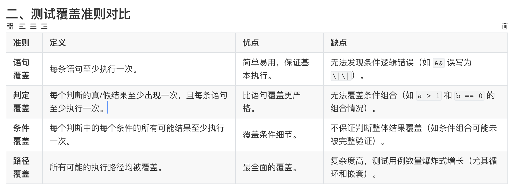
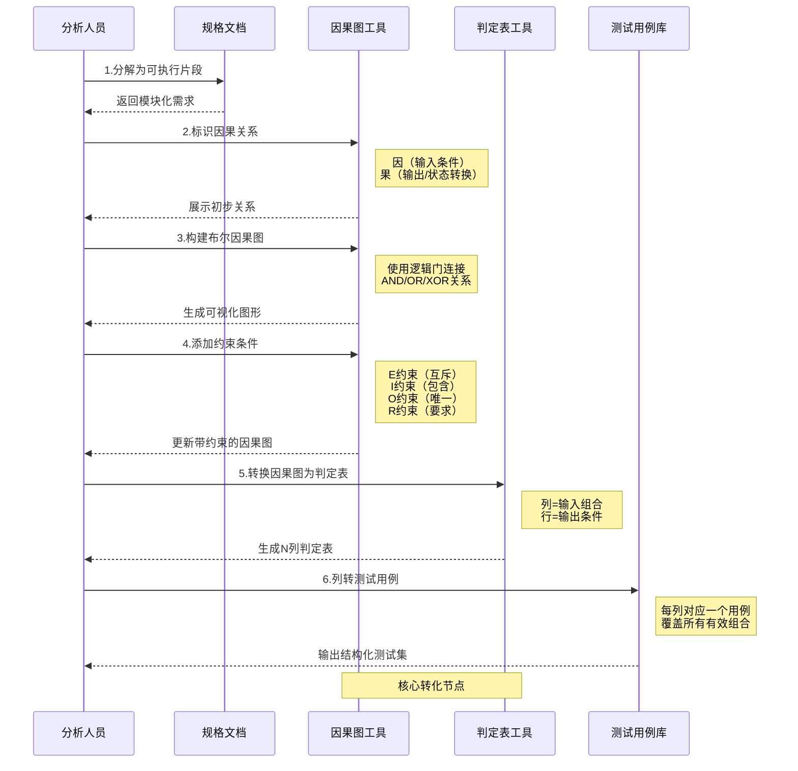

## 测试用例的设计
软件测试中最重要的因素是设计和生成有效的测试用例。核心问题是"如何在有限的资源下，选择最能暴露错误的测试用例子集？"

由于时间和成本的约束，软件测试的最关键问题是：在所有可能的测试用例中，哪个子集最有可能发现最多的错误？
- **核心矛盾**：完全测试不可行 vs 需要最大化测试覆盖率  
- **关键结论**：测试用例质量（而非数量）直接决定测试有效性 

## 白盒测试
完全的白盒测试是将程序中每条路径都执行到，然而对一个带有循环的程序来说，完全的路径测试并不切合实（有价值的目标似乎就是将程序中的每条语句至少执行一次）

白盒测试的覆盖标准：
- 语句覆盖：每条语句至少执行一次
- 判定覆盖：每个判定至少取一次真值和一次假值
- 条件覆盖：每个判定的每个条件至少取一次真值和一次假值
- 判定/条件覆盖：每个判定至少取一次真值和一次假值，每个条件至少取一次真值和一次假值
- 条件组合覆盖：每个可能的条件组合至少出现一次

## 黑盒测试
## 黑盒测试
黑盒测试也称为行为测试或数据驱动测试，它不考虑程序的内部逻辑结构，仅关注程序的外部行为。测试人员将程序视为一个黑盒子，只关注： （在于程序规格说明书黑盒测试的目标是找出程序不符合规格说明书的地方。）

- 输入条件（有效和无效的）
- 输出结果（期望的结果）
- 程序功能（程序应该做什么）

黑盒测试的主要优点：
- 不需要了解代码实现细节
- 从用户角度验证软件行为
- 可以及早发现规格说明和需求中的问题
- 测试用例可以在编码前设计

常见的黑盒测试方法包括：
- 等价类划分
- 边界值分析 
- 错误推测
- 因果图
- 状态转换测试

### 等价类划分法
将一个好的测试用例描述为具有相当高的可能性发现某个错误来
当测试某个程序时，我们就被限制在从所有可能的输入中努力找出某个小的子集。理所当然，我们要找的子集必须是正确的，并且是可能发现最多错误的子集。（1.严格控制测试用例的增加，减少为达到“合理测试”的某些既定目标而必须设计的其他测试用例的数量。’，2.它覆盖了大部分其他可能的测试用例）

使用等价划分方法设计测试用例主要有两个步骤：
​（1）确定等价类；​（2）生成测试用例。
确定等价类是选取每一个输入条件（通常是规格说明中的一个句子或短语）并将其划分为两个或更多的组（有效等价类和无效等价类-我们确定了两类等价类：有效等价类代表对程序的有效输入，而无效等价类代表的则是其他任何可能的输入条件（即不正确的输入值）

### 边界值分析法
边界值分析是一种黑盒测试方法，它通过分析输入条件的边界值来确定测试用例。边界值分析的主要目的是找到输入条件的边界值，以便测试程序在这些边界值上的行为。

边界值分析法和等价类划分法的区别在于：
边界值分析方法和等价划分之间的重要区别是，边界值分析考察正处于等价划分边界或在边界附近的状态。
边界值分析的主要步骤：
1.确定输入条件的边界值；(1。边界值分析需要选择一个或多个元素，以便等价类的每个边界都经过一次测试。与仅仅关注输入条件（输入空间）不同，还需要考虑从结果空间（输出等价类）设计测试用例。)
2.为每个边界值生成测试用例。
3.检查程序在边界值上的行为。
4.检查程序在边界值附近的行为。
5.检查程序在边界值之外的行为。

#### 边界值分析法通用的指导
1.如果输入条件规定了一个输入值范围，那么应针对范围的边界设计测试用例
2.如果输入条件规定了输入值的数量，那么应针对最小数量输入值、最大数量输入值，以及比最小数量少一个、比最大数量多一个的情况设计测试用例

3.对每个输出条件应用指南1。举例来说，如果某个程序按月计算FICA[1]的扣除额，且最小金额是$0.00，最大金额为$1165.25，那么应该设计测试用例来测试扣除$0.00和$1165.25的情况。此外，还应观察是否可能设计出导致扣除金额为负数或超过$1165.25的测试用例。
4.对每个输出条件应用指南2。如果某个信息检索系统根据输入请求显示关联程度最高的信息摘要，而摘要的数量从未超过4条，则应编写测试用例，使程序显示0条、1条和4条摘要，还应设计测试用例，导致程序错误地显示5条摘要。
5.如果程序的输入或输出是一个有序序列（例如顺序的文件、线性列表或表格）​，则应特别注意该序列的第一个和最后一个元素。

### 在黑褐测试中 的测试策略
1.如果规格说明中包含输入条件组合的情况，应首先使用因果图分析方法。
2.在任何情况下都应使用边界值分析方法。应记住，这是对输入和输出边界进行的分析。边界值分析可以产生一系列补充的测试条件，但是，也正如“因果图分析”一节所述，多数甚至全部条件都可以被整合到因果图分析中。
3.应为输入和输出确定有效和无效等价类，在必要情况下对上面确认的测试用例进行补充
4.使用错误猜测技术增加更多的测试用例。
5.针对上述测试用例集检查程序的逻辑结构。应使用判定覆盖、条件覆盖、判定/条件覆盖或多重条件覆盖准则（最后的一个最为完整）​。如果覆盖准则未能被前四个步骤中确定的测试用例所满足，并且满足准则也并非不可能（由于程序的性质限制，某些条件的组合也许是不可能实现的）​，那么增加足够数量的测试用例，以使覆盖准则得到满足

### 因果图法

边界值分析和等价划分的一个弱点是未对输入条件的组合进行分析。
因果图是一种形式语言，用自然语言描述的规格说明可以转换为因果图。因果图实际上是一种数字逻辑电路（一个组合的逻辑网络）​，但没有使用标准的电子学符号，而是使用了稍微简单点的符号。

因果图分析是一种黑盒测试方法，它通过分析输入条件之间的因果关系来确定测试用例。因果图分析的主要目的是找到输入条件之间的因果关系，以便测试程序在这些因果关系上的行为。

因果图分析的主要步骤：
1.确定输入条件之间的因果关系；
2.为每个因果关系生成测试用例。
3.检查程序在因果关系上的行为。
4.检查程序在因果关系附近的行为。
5.检查程序在因果关系之外的行为。

因果图法的 好处
因果图有助于用一个系统的方法选择出高效的测试用例集。它还有一个额外的好处，就是可以指出规格说明的不完整性和不明确之处

因果图法得到测试用例的过程
1.将规格说明分解为可执行的片段。这是必须的步骤，因为因果图不善于处理较大的规格说
2.确定规格说明中的因果关系。所谓“因”​，是指一个明确的输入条件或输入条件的等价类。所谓“果”​，是指一个输出条件或系统转换（输入对程序或系统状态的延续影响
3.分析规格说明的语义内容，并将其转换为连接因果关系的布尔图。这就是所谓的因果图。
4.给图加上注解符号，说明由于语法或环境的限制而不能联系起来的“因”和“果”​。
5.通过仔细地跟踪图中的状态变化情况，将因果图转换成一个有限项的判定表。表中的每一列代表一个测试用例。
6.将判定表中的列转换成测试用例

以下是使用时序图说明因果图法生成测试用例全流程的示意图：

### 错误推测法
错误猜测主要是一项依赖于直觉的非正规的过程，因此很难描述出这种方法的规程。其基本思想是列举出可能犯的错误或错误易发情况的清单，然后依 据清单来编写测试用例
例如，在测试一个用户注册系统时，可以尝试以下错误推测测试用例：

1. 输入相关：
   - 输入特殊字符（如 !@#$%^）
   - 输入超长字符串
   - 输入空白字符
   - 输入 SQL 注入语句
   - 输入跨站脚本(XSS)代码

2. 边界条件：
   - 在时间临界点操作（如 23:59:59）
   - 在存储容量即将达到上限时操作
   - 在并发用户数接近最大值时操作

3. 异常操作：
   - 快速重复提交表单
   - 在处理过程中断网
   - 在提交时关闭浏览器
   - 同时打开多个会话

4. 数据一致性：
   - 重复注册相同用户名
   - 使用已删除用户的信息重新注册
   - 修改部分关联数据后的操作

这些测试用例都是基于经验和对系统可能存在问题的推测而设计的。
