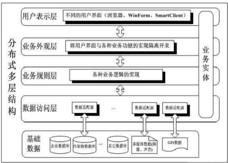

以下是 **第10章核心内容** 的简化总结：

---

### **核心观点**
1. **互联网应用的普及性**  
   - 从“高端技术”变为“生活必需品”，覆盖商业、教育、政府等全领域。  
   - 用户需求：从简单网页（中小企业）到复杂电商平台（大型企业）。  

## 相关概念
### SEO
Search Engine Optimization，搜索引擎优化。

SEO 是指从自然搜索结果获得网站流量的技术和过程，是在了解搜索引擎自然排名机制的基础上，对网站进行内部及外部的调整优化，改进网站在搜索引擎中的关键词自然排名，获得更多流量，从而达成网站销售及品牌建设的目标。

### ERP
Enterprise Resource Planning，企业资源计划。

功能涵盖生产资源计划、制造、财务、销售、采购、质量管理，实验室管理，业务流程管理，产品数据管理，存货、分销与运输管理，人力资源管理和定期报告系统。

目前，在我国 ERP 所代表的含义已经被扩大，用于企业的各类软件，已经统统被纳入 ERP 的范畴。

它跳出了传统企业边界，从供应链范围去优化企业的资源，是基于网络经济时代的新一代信息系统，主要用于改善企业业务流程以提高企业核心竞争力。

### CRM
Customer Relationship Management，客户关系管理系统。

企业用 CRM 技术来管理与客户之间的关系，功能涵盖自动化分析销售、市场营销、客户服务以及应用等流程的软件系统。它的目标是通过提高客户的价值、满意度、赢利性和忠实度来缩减销售周期和销售成本、增加收入、寻找扩展业务所需的新的市场和渠道。CRM 是选择和管理有价值客户及其关系的一种商业策略，CRM 要求以客户为中心的企业文化来支持有效的市场营销、销售与服务流程。

2. **互联网应用的本质与复杂性**  
   - **架构**：基于浏览器（客户端）与服务器（服务端）的C/S模式。  
   - **分类**：B2C（用户直接交易）与B2B（企业间协作，如供应链）。  
   - **挑战**：耦合度高、组件复杂，测试需覆盖多端交互和性能瓶颈。  

3. **测试的重要性**  
   - **用户容忍度低**：互联网用户对质量差、响应慢的容忍度远低于传统软件。  
     - **传统软件**：用户已付费，即使质量一般也会勉强使用。  
     - **互联网应用**：用户可随时转向竞品，质量差直接导致用户流失和收入损失。  
   - **品牌影响**：网站是企业的“第一印象”，低质量网站损害公司形象（如用户质疑车企能力）。  

4. **测试目标与策略**  
   - **目标**：在部署前发现错误，避免线上故障。  
   - **策略差异**：B2C需优先测试用户体验（UI流畅性、支付成功率），B2B需关注接口稳定性和数据一致性。  

---

### **对比总结**
| **维度**         | **传统软件**                        | **互联网应用**                      |
|------------------|-----------------------------------|-----------------------------------|
| **用户粘性**      | 高（已付费、安装成本高）              | 低（免费、切换成本低）                 |
| **质量容忍度**    | 中等（满足基本需求即可）               | 极低（体验差即流失）                   |
| **测试优先级**    | 功能正确性、稳定性                   | 性能（响应速度）、兼容性（多浏览器/设备）  |
| **业务影响**      | 影响用户使用效率                     | 直接决定收入与品牌声誉                 |

---

## CS架构
互联网应用系统被视为三层的C/S程序。图10-2中的每一层定义如下：·表示层。互联网应用系统的这一层提供了GUI（图形用户接口）​。·业务逻辑层。该层模拟业务流程，比如用户身份验证、事务处理等。·数据访问层。该层存储了供应用系统使用的或从最终用户收集来的数据。

## 测试的挑战

## 测试的数据

## 测试的策略
规格说明文档对于成功测试一般的应用程序非常关键，这里也需要一份规格说明文档来描述Web站点的预期功能和性能。如果没有这份文档，就无法设计出合适的测试。
互联网应用系统的结构允许我们选出单个的区域来进行测试

## Web 测试的方法
### 3.1 功能测试
功能测试主要从链接、表单、Cookies、设计语言、数据库、文件上传等方面进行。
#### 3.1.1 链接
 也称超链接，是指从一个网页指向另一个目标的连接关系，所指向的目标可能
是一个网页、相同网页上的不同位置、图片、电子邮件地址、文件、应用程序
等。
 链接最容易出现以下几种错误
 错误链接
 如 URL 地址拼写错误、URL 后缀多余或缺少斜杠、URL 地址中出现
的字母大小写不完全匹配、用户输入的域名拼写错误。
 空链接
 单击该链接时不会指向任何内容。
 死链接
 原来正常，后来失效的链接。
 孤立页面
 指没有链接指向该页面，只有知道正确的 URL 地址才能访问。
#### 3.1.2 表单
 表单是系统与用户交互最主要的界面，测试过程主要关注程序是否能正确地处
理客户提交的信息，并将信息正确地反馈到客户端。
 测试过程中应该注意以下几方面的测试
 文本输入框对长度是否有限制。
 文本输入框对字符类型是否有限制。
 文本输入框模式匹配是否正确，如该文本框只能输入日期格式的数据，那
么只能匹配不同的日期格式，而不能匹配其他格式的数据。
 各按钮实现的功能是否正确。
#### 3.1.3 Cookies
 Cookies 能够让网站服务器把少量数据存储到客户端的硬盘或内存，或是从客
户端的硬盘读取数据的技术。
 Cookie 有哪些用途
 自动登录，登录时，选择记住用户名，下次登录会自动带出用户名来。
 广告精准投放，当我们用浏览器搜索过一些关键字，如：web 测试书，某
手机，打开浏览器时，会推送相关浏览过的商品。
 查看 Cookies
 打开 IE，在工具栏点工具→Internet 选项→常规→（Internet 临时文件）浏
览历史记录→设置，这样可以查看到 Cookies 所存位置，还可以对其进行
设置。
 Cookies 的测试包含以下几个方面
 Cookies 的安全性
 Cookie 中最好不要存储一些敏感的信息，需要时应该对 Cookie 中的
一些字段进行加密处理。
 Cookies 的过期时间是否正确；
 Cookies 的变量名与值是否正确；
 Cookies 是否必要，是否缺少：一是生成的 Cookie 文件是否与创建的一致，
不能多也不能少，二是对于不必要的 Cookie 可以删除。
 Cookies 的作用域是否正确合理；
 多个 Cookies 的作用域之间关系的测试。
#### 3.1.4 设计语言测试
 Web 设计语言版本的差异可以引起客户端或服务器端严重的问题，如使用哪
种版本的 HTML 等。
 不同的脚本语言，如 Java、JavaScript、ActiveX、VBScript 或 Perl 等，也要进
行验证。
 关于设计语言的测试，应该注意以下几个方面
 不同的浏览器内核引擎不同，会导致与不同的开发语言的兼容情况不同，
当前主流浏览器的内核有 Trident、Tasman、Pesto、Gecko、KHTML、
WebCore 和 WebKit。
 不同的设计语言与平台有不同的兼容性。
 不同脚本语言执行的时间也不同。
 嵌入其他语言的能力。脚本语言对一些操作无法实现，如读取客户端的信
息，此时需要同时借助其他语言来实现。要考虑当前脚本语言对其他语言
的支持程度。
 系统数据库可能升级，测试时需要考虑脚本语言支持数据库的完善程度。
#### 3.1.5 文件上传
 只能上传允许的附件类型；
 不能上传脚本或可执行文件；
 不能单纯以后缀名来判断文件类型；
 浏览好文件后，可以正常处理删除目标文件时出现的异常情况；
 上传超大文件时可以正常处理，比如给出提示信息等；
 上传的文件应该提供接口查看；
 上传的文件不应该直接保存于数据库中，而是将文件保存在服务器端硬盘，而
在数据库中保存该文件的基本信息；
 文件上传到服务器端后应该被重命名，防止文件名冲突

### 3.2 性能测试
链接速度测试
链接的响应时间不能太长，一般不超过 5 秒。
负载测试（Load Testing）
测试系统能够承受的最大负载（如最大用户量、最大业务量、最大数据量等）以及性能表现。
压力测试
测试系统在一定压力下的性能表现，通常业务的错误率不能超过 5%。

### 3.3 界面测试
GUI（Graphical User Interface）即图形用户界面。
#### 3.3.1 格式验证
验证 Web 页面中一些空间默认的标准定义，如默认值、项目按顺序排列等。
#### 3.3.2 导航条测试
 各页面导航条是否能正确地显示；
 各页面下导航条显示的内容是否正确；
 不同状态下（如登录与未登录），导航条显示的内容是否正确；
 导航条的每项内容链接是否正确。
#### 3.3.3 拼写和语法测试
验证页面内容、菜单和链接、图片、表格内容的拼写和语法。
#### 3.3.4 页面排版测试
 页面标题验证；
 页面元素（文字、窗体、菜单、链接、公司商标等）排版验证；
 页面图形验证；
 页面版本信息验证；
 不同分辨率下的页面显示情况验证；
 页面长度验证。
#### 3.3.5 Tab 键测试
Tab 顺序正确跳转。

### 安全性测试
3.4.1 基本安全测试
 各种登录模式的安全性验证、对口令各种要求的测试。
 用户权限（如功能限制、数据访问限制等）的验证。
 Cookie 和 Session 的有效期验证等特殊机制的验证。
 敏感数据加密、数据存储安全性的验证。
 验证系统的日志文件是否得到保护。
 测试软件不会因在异常条件下错误操作而导致不安全状态。
 其他各种安全漏洞的检查，如 WSDigger 扫描。
 跨站点攻击 XSS
 get 方式在 URL 后输入如 
入的字符串则存在漏洞。
 SQL 注入
 sql='select yhm,mm from users where username=' +
yhmTextField.getTex（t ） +' and password=' +mmTextField.getTex（t ）
'  如用户名中输入 admin' --后，不输入密码也可以登录

### 认证测试
登录页面是否存在验证码，不存在说明存在漏洞。
 验证码和用户名、密码是否一次性、同时提交给服务器验证，如果分开提交，
则存在漏洞。
 在服务器端，只有在验证码检验通过后才进行用户名和密码的检验，否则存在
漏洞。
 验证码是否为图片形式且在一张图片中，不为图片形式或不在一张图片中，说
明存在漏洞。
 请求 10 次观察验证码是否随机生成，如果存在一定的规律（例如 5 次后出现
同一验证码）说明存在漏洞。
 观察验证码图片中背景是否存在无规律的点或线条，如果背景为纯色（例如只
有白色）说明存在漏洞。
 验证码在认证一次后是否立即失效。
 服务器不能对认证错误提示准确的信息，如用户名错误、密码错误等。
 提供合理的锁定策略。
 预防认证被绕过，如 sql 注入

### 数据库测试
数据库测试是为了发现错误和缺陷而运行数据库的过程。
 数据库测试方法也分为白盒测试和黑盒测试。
 数据库黑盒测试
 数据库表结构是否合理；
 数据结构（如数据类型、长度）是否正确定义，并且需要注意数据结构与
输入界面中数据的类型和长度是否一致，如果不一致，数据库则会报错；
 表与表之间的关系是否正确，主外键是否合理；
 索引的创建是否合理；
 存储过程功能是否完整，能否正确接受输入、输出正确结果；
 能否正确插入（增加）、更新、删除数据；
 数据库操作权限定义是否正确；
 能否正确处理并发操作；
 表级、列级完整性约束条件是否满足；
 数据库的处理能力、可靠性、可维护性、性能是否满足要求。

### 表示层的测试
面列举了表示层测试中的三个主要内容：1.内容测试。包括整体审美、字体、色彩、拼写、内容准确性和默认值。2.Web站点结构。包括无效的链接或图形。3.用户环境。包括Web浏览器版本和操作系统配置。
内容测试包括检查Web站点的人机界面元素，需要在字体类型、屏幕布局、色彩、图形分辨率及其他直接会影响最终用户体验的特性中检查错误(工具可以自动执行验证链接、检查丢失文件等过程)
表示层要克服的第二个点是 兼容性的测试

### 业务层的测试
业务层测试的重点是发现互联网应用系统的业务逻辑中的错误
·性能。测试的目的在于检查应用系统是否满足书面的性能规格说明（通常定义为响应时间和吞吐率）​。·数据有效性。测试的目的在于发现从客户那里采集到的数据中的错误。
·事务。测试的目的在于发现事务处理过程中的错误，其中可能包括信用卡处理、电子邮件验证以及消费税计算等。

### 数据层的测试
数据层的测试，主要是指对应用系统用于储存和获取信息的数据库管理系统的测试
数据层测试的最大挑战之一，是复制应用系统的运行环境。
·响应时间。应量化结构化查询语言SQL语句的消耗时间。·数据完整性。验证数据存储适当且正确。·容错性和可恢复性。最大化MTBF，最小化MTTR。