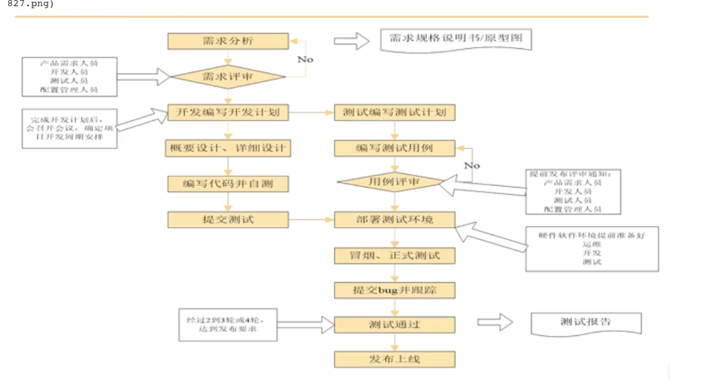
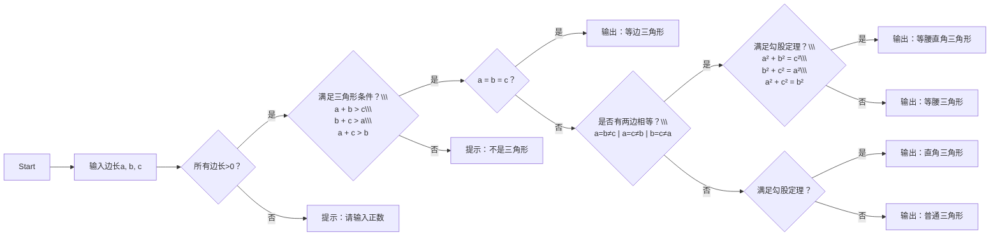
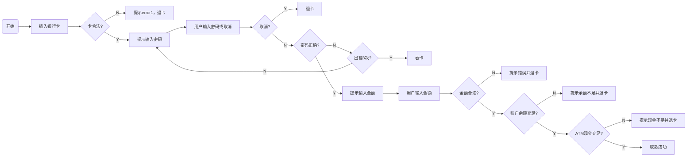
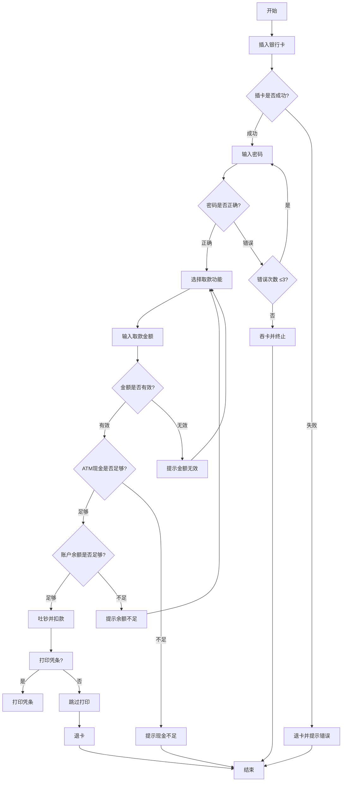

# 软件测试相关流程 &测试用例编写&文档编写规范


##  软件测试的工作流程图


需求评审-中评审的是什么？ 

输出-需求规格说明书（原型图）

计划：测试工作的统筹的安排（测试的内容， 哪些人来执行测试，任务的分配，测试的环境，工具，时间安排）

编写测试用例 ： 什么是测试用例？---文档（具体怎么来测试的文档）

软件在符合什么条件下可以发布： bug数量为0？ 剩余的bug数量很少+用例的执行覆盖率

发布流程 ：开发打包-->运维-->部署到生产环境，实现发布上线



概念

开发环境： 开发人员编写代码的环境

测试环境：测试人员进行测试的环境

生产环境：真实用户使用的环境

预发布的环境：验收测试执行的环境


测试需求分析阶段：阅读需求，理解需求，主要就是对业务的学习，分析需求点。参与需求评审会议

测试计划阶段：主要任务是编写测试计划，参考软件需求规格说明书、项目总体计划，内容包括测试范围（来自需求文档）、进度的安排，人力物力的分配，整体测试策略的制定，和风险的评估与规避措施有一个制定，一般有测试负责人编写，当然我们可能也会参与相关的评审工作。

测试设计阶段：主要任务是编写测试用例，会参考需求文档（原型图）、概要设计、详细设计等文档，有不明确的也会及时和开发、产品经理沟通。用例编写完成后会进行评审。

测试执行阶段：首先搭建测试环境，执行预测（冒烟），以判定当前版本可测与否，如果预测通过，正式进入系统测试，遇到问题提交Bug到缺陷管理平台，并对bug进行跟踪，直到被测软件达到测试需求要求，没有重大bug，测试结束。-----（完善测试用例）

测试评估阶段：出测试报告，对整个测试的过程和版本质量做一个详细的评估。确认是否可以上线。


如果在 面试中 怎么执行


view

生命周期包含哪些阶段？你们开发的模型是什么？

测试流程包含哪些阶段？

3.你们公司的开发流程是怎样的？…-了解

4，你们公司的测试流程是怎样的？各个阶段的输出是什么？

5.开发环境，测试环境，生产环境是什么？你在测试环境后台添加的数据和信息，能够在生产环境看到


## 软件测试的需求分析 

测试需求是什么？

测试需求主要解决 测试什么的问题 ，一般来自需求规格说明书中你的原始需求

测试需求应该全部覆盖已经定义的业务流程，以及功能和非功能方面的需求

功能需求：业务流程

非功能需求： 页面，文档，兼容性，易用性，性能 ，安全性

比如淘宝 中的 选择商品，搜索商品 ，购买商品 这些就是功能需求


什么是测试的需求分析？

根据规格需求说明书明确测试的内容 去细分需求（提取测试点）

什么是测试点？

软件是 =多个功能组成（多个子功能点（测试点）组成一个功能，测试点是软件的最小单元）


为什么需要将 测试点意义列举出来 ？

避免漏测

测试需求分析的目的-

测试需求分析是编写测试用例的依据


### 为什么要做测试的需求分析

- 软件测试需求是设计测试用例的依据
- 有助于保证测试的质量和进度
- 测试需求是衡量测试覆盖率的重要指标


测试覆盖率= 测试用例覆盖率*测试点覆盖率

简单来说：只有明确的了测试需求，才能知道怎么去测试？什么时候开始测试?需要多少人测试？在什么环境上测试？


### 需求分析的作用


### 需求分析的流程 （测试需求分析中怎么进行测试需求分析）

对这个功能进行 测试的 话怎么样进行需求分析？ 提取测试点 细分功能？


#### 怎么列举出测试点？

1. 查阅需求规格说明书（原型图）1.了解被测软件的核心业务流程
2. 正针对某一个功能，细化需求，列出测试点


#### 一个页面如何进行测试需求


1.进行页面检查（参考原型图，查看页面类型是否一致）

2.依次区分析每一个输入项，按照从上到下从左到右进行分析

- （约束限制 命名长度之类的，格式的限制，是否是重复的限制）
- （是否是必填项，）
- 隐形需求？ 比如手机号码、- 需求规格中没有提及但是要验证的（需要结合基本的常识，熟悉业务，根据成熟同类产品来处理 ，来挖掘一个需求）

3. 按钮（根业务逻辑的先后顺序来进行依次分析），

   1. 一般按钮存在操作成功，操作失败， 所以子什么条件下操作成功，什么条件下操作失败， 怎么验证操作结果？ -
   2. 需要验证按钮的操作结果 验证交互功能（验证关联功能） 验证当前操作结果的功能 （比如登录成功，进入首页，展示个人信息）（比如验证注册成功， （查验当前这个注册的账号能登录成功）））

4. 提取测试点的特点：测试点不包含测试数据，测试点必须是可以核实可观察的结果

   


#### example  注册登录的 模块


#### exmaple2 微信朋友圈的测试需求说明 思维导图


面试题
1，遇到隐形的 需求该怎么处理

2. 给你一个带了logo的水杯哦，你会如何测试
3. 3 你会如何测试朋友圈， 购物车等熟悉的产品？


如果你没有需求规格说明书中， 你怎么来做需求分析？

参考其他同类成熟的产品，结合项目经验，站在用户的角度来进行


## 测试计划


### 编写测试计划的目的是

明确了测试范围和目标：测试计划详细的描述了需要测试的功能和不需要测试的会给你，这样可以防止测试团队在实际工作中少走弯路，同时规定了测试的主要目标，比如找到致命的缺陷或者验证新的功能，这些目标有助于测试团队集中精力在关键问题上

### 测试计划包含哪些内容

1.测试的目标和范围

2.测试的策略

3.资源的需求

4.时间的安排

6.风险管理以及应对的策略（需求变更的风险，人员变更的风险）


### 测试结束的标准是什么？

#### 测试的充分性说明

用例已经全面覆盖需求：测试用例的覆盖率达到100%，且结果符合预期

漏洞修复完毕，所有严重和高优先级的漏洞已经修复并通过了回归测试

质量达标：软件的质量达标（比如Bug率，性能指标等）符合预定的目标或者说是在可以接受的水平

代码覆盖率：达到预定的测试覆盖率的要求，

时间和资源：项目已经分配了时间设资源，进一步投入到测试中的性价比已经不高

分线评估：通过风险评估认为未发现的问题不会对产品1的稳定性和业务功能产生重大的影响

管理和审批：甲方认为可以了


## 软件测试用例设计规范及其用例要素详解&实操应用

需求评审：评审是否存在漏测和错测的测试点

参与人员：测试人员开发人员


### 什么是软件的测试用例

**测试用例（testcase）是为了项目需求而编制的一组测试输入，执行条件以及预期结果，以便测试某个程序是否满足客户需求**

**可以理解为每一个测试点的数据设计和步骤设计**

**核心定义**：  

- 为验证**特定功能或需求**而设计的一组**测试输入、执行条件和预期结果**。  
- 本质是**测试执行的说明书**，指导测试人员按步骤操作并验证结果。  

- **类比**：  
  - 类似“实验步骤”：明确输入（如实验材料）、操作（如实验流程）、预期输出（如实验结果）。  

#### 测试用例的重要性

测试用例是软件测试的核心。

软件测试的重要性是毋庸置疑的，测试用例是测试工作的指导，是软件测试质量稳定的根本保障。影响软件测试的因素很多，如软件本身的复杂程度，开发质量，测试方法和技术的运用但有些因素是客观存在，不可避免的，如IT团队的流动，环境，情绪等。

2、评估测试结果的基准

测试用例的通过率以及错误率，是测试结束的一个重要依据，用来判断该软件测试结果是否

通过，能否达到上线的标准

1. 保证测试的时候不遗漏测试功能点。平以在测试人员疲累的时候起到一个牵引的作用。
2. 在编写测试用例的过程，可以熟悉需求，对系统架构或者业务流程有一个整体的，深入地了解。
3. 好的测试用例不仅方便自己和别人查看，而且能帮助设计的时候考虑的更周全，因此测试用例的写作和设计一样，也是非常重要的。执行性（指导性

```txt
测试用例是针对某一个功能、模块或特定场景，设计的一套通过自动化或手动方式验证系统或者软件正确性的操作步骤、输入数据和预期结果的集合。其目的是为了确保系统在不同情况下都能按预期工作，从而提高软件质量，减少缺陷，确保用户体验。
编写测试用例的重要性主要体现在以下几个方面：
1）确保软件的正确性和可靠性。通过全面的测试用例，可以覆盖各种可能出现的场景，寻找潜在的问题。
2）提高软件质量。测试用例能帮助找出代码中的bug，从而在开发阶段就能修复这些问题，减少产品发布后的缺陷。
3）节省时间和成本。提前发现并修复问题，比在后期发现bug并进行修复更经济高效。
4）提供开发和测试团队的沟通桥梁。测试用例能清晰地描述系统应如何工作，方便团队在开发和测试过程中明确需求和期望。
5）提高维护性。良好的测试用例文档可以在系统更新或功能扩展时，迅速验证新改动是否影响了现有功能。
```


#### 测试用例的八大要素

1. 用例编号：产品名-测试阶段 （it st uat）-测试项-xxx（英文） （it-集成测试-接口测试 st-系统测试 uat-验收测试）
     1. 用例编号必须唯一
     2. 格式 项目_it/st/uat_功能_编号/项目编号
2. 测试项目：对应一个功能模块（细分功能）（当前测试点覆盖的模块）
3. 测试标题：直接对测试点进行细化得出，输入内容＋结果，同一功能模块标题不能重复自测试点）
     1. 特点是 简单说明，用例标题不能重复
     2. 一般的格式是输入+动作
4. 重要级别：高/中/低
     1. 高：主要的核心业务功能，冒烟用例
     2. 中： 错误异常测试点
     3. 低：兼容性，页面错误
5. 预置条件：需要满足一些前提条件，否则用例无法执行
     1. 比如qq号成功用例的预置条件是（1.网络正常，存在有效的qq号）
6. 测试输入（数据）：需要加工的输入信息，根据具体情况来设计（跟步骤结合起来一定要！

有指导性意义）

1. 操作步骤：明确给出每个步骤的描述，执行人员可以根据该步骤完成执行工作
     1. 路径（用户+管理模块）
     2. 具体的测试数据的输入
     3. 执行的动作
2. 预期结果：根据预期输出比对实际结果，来判断被测对象是否符合需求。（预期结果唯一不能出现“是否或者”）
3. 实际结果：（通过pass，不通过 failed,用例无法执行）

一个标准的测试用例应包含以下要素：  

| **要素**     | **说明**                                              | **示例（以“用户登录”为例）**            |
| ------------ | ----------------------------------------------------- | --------------------------------------- |
| **用例编号** | 唯一标识符（如`TC_LOGIN_001`）。                      | `TC_LOGIN_001`                          |
| **用例名称** | 简要描述测试目标（动词+对象）。                       | “验证正确密码登录成功”                  |
| **优先级**   | 标记执行顺序（P0最高，P3最低）。                      | P1（核心功能）                          |
| **测试模块** | 所属功能模块。                                        | “用户登录模块”                          |
| **前置条件** | 执行前的必备状态。                                    | “已注册用户账号”                        |
| **测试输入** | 操作所需的数据或动作。                                | 用户名：`test@demo.com`，密码：`123456` |
| **操作步骤** | 详细执行步骤（1. 打开登录页；2. 输入用户名和密码…）。 | 分步写明点击、输入等动作。              |
| **预期结果** | 正确情况下应输出的结果。                              | “跳转到用户首页”                        |
| **实际结果** | 执行后真实结果（由测试人员填写）。                    | （执行后补充）                          |


### 用例设计的问题？


#### 用例是根据测试点进行编辑，是不是针对每一个测试点编辑一条用例

不是，重复测试，测试效率低（不同的测试点之间，测试用例有系统的情况）

#### 具体怎么编写测试公里，多一个测试点对应一个用例，怎么样不重复测试？

避免重复测试点的覆盖

#### 编写测试用例的时候，如何选择测试数据进行测试？ 在怎么达到最大覆盖的情况下。用最少的测试数据获取最多的bug

编写测试用例需要测试方法和技巧


### 测试用例设计的完整的过程是

1） 需求分析：

在这一步中，我们需要仔细分析软件需求文档（SRS），包括功能需求和非功能需求。理解客户和用户的需求是关键，这有助于确保测试用例覆盖所有预期的功能和边界情况。

2）测试计划：

在测试计划阶段，制定整体的测试策略和计划。包括确定测试范围、测试目标、测试资源、测试环境、测试工具和关键时间节点。一个好的测试计划帮助项目在执行阶段有条不紊。

3）测试设计：

测试设计是核心部分。在这一步中，需要详细设计测试用例，包括输入数据、预期输出、测试步骤和环境设置等。设计时可以使用各种测试方法，如边界值分析、等价类划分（分块设计）、错误推测及决策表等。

4） 测试实现：

在测试实现阶段，根据设计的测试用例，进行具体的准备工作。例如，编写自动化测试脚本、配置测试环境、准

5） 测试执行：

测试执行阶段是运行测试的实际过程。测试人员根据设计的测试用例来执行测试，记录测试结果，并标记通过或失败的羊丝 测试用例。任何发现的问题和缺陷需要记录下来，并反馈给开发团队。

6）测试评估：

测试结束后，进入测试评估阶段。我们需要评估测试的覆盖率、测试结果及测试的有效性。分析未通过的测试用例和未行！被覆盖的代码或功能，以决定是否需要进一步测试或更改设计


## 软件测试用例设计方法 

- 穷举测试不可行

### 等价类划分法

为了达到 测试的目标 我们可以使用等价类法

**等价类划分法是一种典型的、重要的黑盒测试方法，是指某个输入域的子集合。在该子集合中，所有的输入数据对于揭露软件中的错误都是等效的。**

**等价类：把所有可能输入项划分为N个子集，在每一个子集中抽取最具有代表性的数据来进行测试**


等价类划分有效等价类和无效等价类。

- 有效等价类：有效的正确的有 意义数据的输入

- 无效等价类 ：无效的错误的无意义的数据输入


举例：微信红包

```
按数据范围划分：不超过2位小数的值有效的：0.01-200（1）

无效的：小于0.01（2）

大于200 （3）

0.01-200区间小数点后超出2位的值（4）

按数据类型组成划分：

有效：数字（5）

无效：非数字类型，f、#、中文⋯（6）
```


#### 等价类划分法用例设计原则

1）划分有效及无效等价类，为每一个等价类规定一个唯一的编号；

 2） 设计一个新的测试用例数据，使其尽可能多地覆盖尚未被覆盖的有效等价类，重复这一步，直到所有的有效等价类都被覆盖为止；（用最少的用例去覆盖量多的有效等价类）

3）设计一个新的测试用例数据，使其仅覆盖一个尚未被覆盖的无效等价类，重复这一步，直到所有的无效等价类都被覆盖为zhi

（用最多的用例来覆盖无效等价类）


#### 等价类；分析的步骤

1。根据需求分别找出需求的条件，根据条件，分别找出无效等价类和有效等价类

2. 对有效等价类和无效等价类进行一一编号
3. 选择测试用例，根据有效等价类选择正例，根据无效等价类选择反例
   1. 用最少的用例覆盖最多的有效等价类
   2. 针对每个无效等价类，用一条用例覆盖


#### 等价类方法的 使用场景

输入项内容 存在无穷尽的情况下，一般就会使用等价类的方法来实现

通过等价类方法把穷举测试转化为有效测试，捕捉到更多的bug

- 输入字段的有效和无效值测试
- 数值范围的边界值测试
- 日期和时间的有效性测试


#### 怎么划分等价类

1. **范围条件作为输入**：
   - 定义一个有效等价类和两个无效等价类。
   - 示例：输入范围为 1 到 100，有效等价类为 1 ≤ 输入 ≤ 100，无效等价类为 输入 < 1 和 输入 > 100。

2. **特定值作为输入**：
   - 定义一个有效等价类和两个无效等价类。
   - 示例：输入值为 50，有效等价类为 输入 = 50，无效等价类为 输入 < 50 和 输入 > 50。

3. **集合成员作为输入**：
   - 定义一个有效等价类和一个无效等价类。
   - 示例：输入为集合 {A, B, C} 的成员，有效等价类为 输入 ∈ {A, B, C}，无效等价类为 输入 ∉ {A, B, C}。

4. **布尔值作为输入**：
   - 定义一个有效等价类和一个无效等价类。
   - 示例：输入为布尔值，有效等价类为 输入 = true 或 false，无效等价类为 输入 ≠ true 且 输入 ≠ false。


#### 需求1 用户名输入 6-18位的长度，必须是已字母，数字，下划线2者或者2者以上的组合


在集合中选择一个数据，作为代表，来代表这个集合（找到bug的效果是等价的）

难点是 怎么划分一个集合？

- 找到约束条件
  - 组合规则：必须是已字母，数字，下划线2者或者2者以上的组合


#### 需求2 实战案例1：用户名输入框测试（慕课网登录）


##### **需求**：用户名支持手机号或邮箱登录。  

##### **等价类划分**：  

| **输入类型** | **有效等价类**           | **无效等价类**                       |
| ------------ | ------------------------ | ------------------------------------ |
| **手机号**   | 13812345678（11位数字）  | 138123456（位数不足）、abc（非数字） |
| **邮箱**     | user@163.com（符合格式） | user@（无后缀）、123（无@符号）      |

##### **测试用例设计**（部分示例）：  

| **用例编号** | **用例名称**           | **优先级** | **测试输入** | **预期结果**                 |
| ------------ | ---------------------- | ---------- | ------------ | ---------------------------- |
| TC_LOGIN_01  | 正确手机号登录         | P1         | 13812345678  | 无错误提示                   |
| TC_LOGIN_02  | 正确邮箱登录           | P1         | user@163.com | 无错误提示                   |
| TC_LOGIN_03  | 错误手机号（位数不足） | P2         | 138123456    | 提示“请输入正确手机号或邮箱” |
| TC_LOGIN_04  | 错误邮箱（无@符号）    | P2         | user163.com  | 提示“请输入正确手机号或邮箱” |

  

#### example3

```javascript
function validatePercentage(percentage) {
    // 定义有效等价类和无效等价类
    const validRange = { min: 50, max: 90 };
    const invalidLow = percentage < validRange.min;
    const invalidHigh = percentage > validRange.max;

    // 检查输入是否在有效范围内
    if (invalidLow || invalidHigh) {
        return "Invalid percentage. Please enter a value between 50 and 90.";
    } else {
        return "Valid percentage. Proceeding with admission process.";
    }
}

// 测试用例
const testCases = [49, 50, 75, 90, 91];
testCases.forEach(testCase => {
    console.log(`Percentage: ${testCase}% - ${validatePercentage(testCase)}`);
});
```

```txt
Percentage: 49% - Invalid percentage. Please enter a value between 50 and 90.
Percentage: 50% - Valid percentage. Proceeding with admission process.
Percentage: 75% - Valid percentage. Proceeding with admission process.
Percentage: 90% - Valid percentage. Proceeding with admission process.
Percentage: 91% - Invalid percentage. Please enter a value between 50 and 90.
```

操作过程

1. **确定输入条件**：
   - 输入条件为百分比，范围为 50% 到 90%。
   - 有效等价类：50 ≤ 百分比 ≤ 90
   - 无效等价类：百分比 < 50 或 百分比 > 90

2. **设计测试用例**：
   - 有效等价类测试用例：50, 75, 90
   - 无效等价类测试用例：49, 91

3. **执行测试**：
   - 对每个测试用例进行验证，检查系统是否正确处理输入。

4. **记录结果**：
   - 记录每个测试用例的输入和输出结果，确保系统行为符合预期。

##### 测试用例表格

| 测试用例编号 | 输入百分比 | 预期结果   | 实际结果   |
| ------------ | ---------- | ---------- | ---------- |
| 1            | 49         | 无效百分比 | 无效百分比 |
| 2            | 50         | 有效百分比 | 有效百分比 |
| 3            | 75         | 有效百分比 | 有效百分比 |
| 4            | 90         | 有效百分比 | 有效百分比 |
| 5            | 91         | 无效百分比 | 无效百分比 |

- **有效等价类**：输入百分比在 50 到 90 之间，系统应接受并继续录取流程。
- **无效等价类**：输入百分比小于 50 或大于 90，系统应拒绝并显示错误信息。

通过以上操作过程和测试用例表格，可以清晰地展示等价类划分法在实际应用中的使用方式和验证过程。


#### example4 在线购物网站的产品搜索

```javascript
function validateProductID(productID) {
    // 定义有效产品 ID 集合
    const validProductIDs = [45, 54, 67, 76, 34];
    const isValid = validProductIDs.includes(productID);

    // 检查输入是否为有效产品 ID
    if (isValid) {
        return "Valid product ID. Displaying product information.";
    } else {
        return "Invalid product ID. Redirecting to error page.";
    }
}

// 测试用例
const testCases = [45, 54, 67, 76, 34, 100];
testCases.forEach(testCase => {
    console.log(`Product ID: ${testCase} - ${validateProductID(testCase)}`);
});
```

```txt
Product ID: 45 - Valid product ID. Displaying product information.
Product ID: 54 - Valid product ID. Displaying product information.
Product ID: 67 - Valid product ID. Displaying product information.
Product ID: 76 - Valid product ID. Displaying product information.
Product ID: 34 - Valid product ID. Displaying product information.
Product ID: 100 - Invalid product ID. Redirecting to error page.
```

操作过程

1. **确定输入条件**：
   - 输入条件为产品 ID 或产品名称。
   - 有效等价类：有效的产品 ID 或产品名称
   - 无效等价类：无效的产品 ID 或产品名称

2. **设计测试用例**：
   - 有效等价类测试用例：45（手机）, 54（笔记本电脑）, 67（随身碟）, 76（键盘）, 34（耳机）
   - 无效等价类测试用例：100（无效产品 ID）

3. **执行测试**：
   - 对每个测试用例进行验证，检查系统是否正确处理输入。

4. **记录结果**：
   - 记录每个测试用例的输入和输出结果，确保系统行为符合预期。

##### 测试用例表格

| 测试用例编号 | 输入产品 ID | 预期结果    | 实际结果    |
| ------------ | ----------- | ----------- | ----------- |
| 1            | 45          | 有效产品 ID | 有效产品 ID |
| 2            | 54          | 有效产品 ID | 有效产品 ID |
| 3            | 67          | 有效产品 ID | 有效产品 ID |
| 4            | 76          | 有效产品 ID | 有效产品 ID |
| 5            | 34          | 有效产品 ID | 有效产品 ID |
| 6            | 100         | 无效产品 ID | 无效产品 ID |

解释

- **有效等价类**：输入产品 ID 在有效范围内，系统应接受并显示相应产品信息。
- **无效等价类**：输入产品 ID 不在有效范围内，系统应拒绝并显示错误信息。


​          

#### example5. 等价类划分法的代码示例（OTP 验证）

```javascript
function validateOTP(otp) {
    // 定义有效 OTP 的长度
    const validLength = 6;
    const isLengthValid = otp.length === validLength;

    // 检查输入是否为 6 位数字
    if (isLengthValid) {
        return "Valid OTP. Proceeding with verification.";
    } else {
        return "Invalid OTP. Redirecting to error page.";
    }
}

// 测试用例
const testCases = ["12345", "123456", "1234567"];
testCases.forEach(testCase => {
    console.log(`OTP: ${testCase} - ${validateOTP(testCase)}`);
});
```

```txt
OTP: 12345 - Invalid OTP. Redirecting to error page.
OTP: 123456 - Valid OTP. Proceeding with verification.
OTP: 1234567 - Invalid OTP. Redirecting to error page.
```

操作过程

1. **确定输入条件**：
   - 输入条件为 OTP 号码，必须为 6 位数字。
   - 有效等价类：输入为 6 位数字
   - 无效等价类：输入少于 6 位或多于 6 位

2. **设计测试用例**：
   - 有效等价类测试用例：123456
   - 无效等价类测试用例：12345（少于 6 位）, 1234567（多于 6 位）

3. **执行测试**：
   - 对每个测试用例进行验证，检查系统是否正确处理输入。

4. **记录结果**：
   - 记录每个测试用例的输入和输出结果，确保系统行为符合预期。

测试用例表格

| 测试用例编号 | 输入 OTP | 预期结果 | 实际结果 |
| ------------ | -------- | -------- | -------- |
| 1            | 12345    | 无效 OTP | 无效 OTP |
| 2            | 123456   | 有效 OTP | 有效 OTP |
| 3            | 1234567  | 无效 OTP | 无效 OTP |

解释

- **有效等价类**：输入为 6 位数字，系统应接受并继续验证流程。
- **无效等价类**：输入少于 6 位或多于 6 位，系统应拒绝并显示错误信息。


​          


通过等价类划分法，可系统化设计用例，高效发现输入类缺陷！  

以下是结合您提供的"Bug的一生"流程图风格，用Mermaid绘制的测试用例设计等价类划分法示意图：  


### 边界值分析法

是对等价类的补充，会选择等价类的边缘值进行测试

边缘值

- 正好等于，刚刚大于，刚刚下雨
- 比如有效等价类是6-12 （5,6,11,12)


上点 

离点

内点


- **定义**：边界值分析法是一种功能测试技术，基于对有效和无效划分边界值的测试。它检查边界附近、错误概率较高的输入值，因为等价划分边缘的行为比划分内的行为更有可能出现错误。

- **目的**：验证软件在边界条件下的行为，确保系统能够正确处理边界值输入。

- **特点**：

  - 每个分区都有其最大值和最小值，这些值就是分区的边界值。
  - 测试重点是边界值及其邻近值，因为这些区域更容易出现错误。
  - 简单来说，边界值分析就像测试软件的边缘情况，大多数情况下软件都会崩溃，因此在部署代码之前进行边界值分析非常重要。

- **核心思想**：程序在边界值附近最容易出现错误（如“≤”误写为“<”）。  

- **应用场景**：

  - 输入字段的边界值测试（如最小长度、最大长度）
  - 数值范围的边界值测试（如最小值、最大值）
  - 日期和时间的边界值测试（如最小日期、最大日期）

  ## 2. 边界值分析法的笔记

- **有效边界值**：有效分区的边界值是有效边界值。

- **无效边界值**：无效分区的边界值是无效边界值。

- **测试点**：对于每个变量，我们检查以下值：

  - 最小值
  - 略高于最小值
  - 标称值
  - 略低于最大值
  - 最大值

- **单一故障假设**：当检查同一应用中的多个变量时，可以使用单一故障假设。除一个变量外，其他所有变量均保持极值，并允许剩余变量取极值。对于需要检查的第 n 个变量，最多需要 4n+1 个测试用例。

#### **二、边界值选取规则**

对于输入范围 **A ≤ x ≤ B**，需测试以下值：  

1. **有效边界值**：  
   - 最小值（A）、最大值（B）。  
   - 示例：密码长度6~20位 → 测试6位和20位密码。  
2. **无效边界值**：  
   - 略小于最小值（A-1）、略大于最大值（B+1）。  
   - 示例：密码长度6~20位 → 测试5位和21位密码。  

**特殊场景**：  

- 若需求未明确是否包含边界（如“6~20位”是否含6和20），需额外确认。  

## 3. 边界值分析法的例子

### 示例 1：年龄输入（18 到 56 岁）

- **无效边界值**：
  - 最小值 - 1：17
  - 最大值 + 1：57
- **有效边界值**：
  - 最小值：18
  - 最小值 + 1：19
  - 标称值：37
  - 最大值 - 1：55
  - 最大值：56

### 示例 2：日期输入

- **输入范围**：
  - 1 ≤ 月 ≤ 12
  - 1 ≤ 日 ≤ 31
  - 1900 ≤ 年 ≤ 2000
- **测试点**：
  - 月：1, 2, 6, 11, 12
  - 日：1, 2, 15, 30, 31
  - 年：1900, 1901, 1950, 1999, 2000


以下是边界值分析测试用例的设置和边界值分析法的局限性：

### 1. 边界值分析测试用例的设置

#### 示例：日期输入（年、月、日）

- **输入范围**：
  - 1 ≤ 月 ≤ 12
  - 1 ≤ 日 ≤ 31
  - 1900 ≤ 年 ≤ 2000
- **测试用例**：
  - **年作为单一故障假设**：
    - 最小值：1900
    - 最小值 + 1：1901
    - 标称值：1960
    - 最大值 - 1：1999
    - 最大值：2000
  - **日作为单一故障假设**：
    - 最小值：1
    - 最小值 + 1：2
    - 标称值：15
    - 最大值 - 1：30
    - 最大值：31
  - **月作为单一故障假设**：
    - 最小值：1
    - 最小值 + 1：2
    - 标称值：6
    - 最大值 - 1：11
    - 最大值：12

#### 测试用例表

| 测试用例编号 | 月   | 日   | 年   | 输出           |
| ------------ | ---- | ---- | ---- | -------------- |
| 1            | 6    | 15   | 1900 | 1900年6月14日  |
| 2            | 6    | 15   | 1901 | 1901年6月14日  |
| 3            | 6    | 15   | 1960 | 1960年6月14日  |
| 4            | 6    | 15   | 1999 | 1999年6月14日  |
| 5            | 6    | 15   | 2000 | 2000年6月14日  |
| 6            | 6    | 1    | 1960 | 1960年5月31日  |
| 7            | 6    | 2    | 1960 | 1960年6月1日   |
| 8            | 6    | 30   | 1960 | 1960年6月29日  |
| 9            | 6    | 31   | 1960 | 无效日期       |
| 10           | 1    | 15   | 1960 | 1960年1月14日  |
| 11           | 2    | 15   | 1960 | 1960年2月14日  |
| 12           | 11   | 15   | 1960 | 1960年11月14日 |
| 13           | 12   | 15   | 1960 | 1960年12月14日 |

##### **案例3：密码长度校验（6~20位）**

| **输入类型** | **测试数据**               | **预期结果**           | **说明**     |
| ------------ | -------------------------- | ---------------------- | ------------ |
| **有效边界** | 6位（如"Abc123"）          | 登录成功               | 最小合法长度 |
| **有效边界** | 20位（如"Abc123...xyz20"） | 登录成功               | 最大合法长度 |
| **无效边界** | 5位（如"Abc12"）           | 提示“请输入6~20位密码” | 低于最小值   |
| **无效边界** | 21位（如"Abc123...xyz21"） | 提示“请输入6~20位密码” | 超出最大值   |

##### **案例4：考试分数录入（0~100分）**

| **输入类型** | **测试数据** | **预期结果**            |
| ------------ | ------------ | ----------------------- |
| **有效边界** | 0分          | 提交成功                |
| **有效边界** | 100分        | 提交成功                |
| **无效边界** | -1分         | 提示“分数需在0~100之间” |
| **无效边界** | 101分        | 提示“分数需在0~100之间” |


### 2. 边界值分析法的局限性

- **适用性**：边界值分析法在产品测试阶段表现良好，但不适用于所有场景。
- **功能依赖性**：它无法考虑变量之间的功能依赖性。
- **初级性**：边界值分析法较为初级，可能无法覆盖所有潜在问题。
- **语言限制**：不适用于自由格式语言（如 COBOL 和 FORTRAN），这些语言被称为弱类型语言。强类型语言（如 PASCAL、ADA）更适合使用边界值分析法。

通过以上测试用例和局限性分析，可以更好地理解和应用边界值分析法。


### 场景法

通过场景描述的业务流程（业务逻辑），也包括代码的视线逻辑，设计用例来遍历

场景（路径）验证软件系统功能的正确性

在什么情况下会使用到场景法？

- 对项目业务流程的功能用例设计，基于场景法来进行设计

业务流程图- 基于场景法设计测试用例的依据 （由产品来提供的业务流程）

画流程图

- mermaid的flowchart
- Process on 和draw.io

正常流程：从起点开始，通过各个路径，最后的节点结束对应的流程

异常流程/错误流程 ：从起点开始，然后可能在某个节点技术或者返回上一节点，这样的流程


（将正常流和异常流的 所有场景组合起来 就是测试用例）




#### example  ATM取款





场景法是一种通过用户使用“场景”对软件系统的功能点或业务流程进行描述，即针对需求模拟出不同的场景进行所有功能点及业务流程的覆盖，从而提高测试效率并达到良好效果的方法。

场景法要求我们通过两个层面去理解被测软件，分别是业务层面和技术层面。

业务层面：测试人员要熟悉所测软件的业务逻辑，对业务了如指掌
技术层面：
基本流：也叫有效流或正确流，模拟用户正确的业务操作流程
备选流：也叫无效流或错误流，模拟用户错误的业务操作流程

- **基本流（Happy Path）**  
  用户完成目标的最理想路径（如：电商下单→支付→收货）

- **备选流（Alternative Flow）**  
  异常或分支路径（如：支付失败、库存不足、地址修改）

- **异常流（Exception Flow）**  
  系统错误处理路径（如：网络中断、服务超时）

使用场景法进行黑盒测试的一般步骤如下：

构造基本流和备选流
根据基本流和备选流构造场景
根据场景审计测试用例
对每个测试用例补充必要的测试数据

#### 1. **定义基本流（正确流程）**

**场景描述**：用户成功完成取款操作  
**流程步骤**：

```
插卡 → 输入正确密码 → 选择"取款" → 输入有效金额（≤账户余额且≤ATM限额）  
→ ATM有足够现金 → 吐钞 → 打印凭条 → 退卡 → 结束
```

**对应测试用例**：  

| 用例编号 | 输入金额 | ATM现金 | 账户余额 | 预期结果            |
| -------- | -------- | ------- | -------- | ------------------- |
| T1       | 500      | 10000   | 2000     | 成功取款500元，退卡 |

---

#### 2. **定义备选流（错误流程）**

**备选流 1**：插卡失败  

```
插卡 → 卡片无法识别 → 退卡 → 终止流程
```

**测试用例**：  

| T2   | 输入动作   | 预期结果             |
| ---- | ---------- | -------------------- |
|      | 插入损坏卡 | 提示"卡片无效"，退卡 |

---

**备选流 2**：密码错误（分层处理）  

- **首次错误**：  

  ```
  输入错误密码 → 提示"密码错误，请重试" → 返回基本流（重新输入）
  ```

- **三次错误**：  

  ```
  连续错误3次 → 吞卡 → 终止流程
  ```

  **测试用例**：  

| T3   | 输入密码    | 预期结果                   |
| ---- | ----------- | -------------------------- |
|      | 错误→正确   | 允许重新输入，最终成功取款 |
| T4   | 连续错误3次 | 吞卡并提示"请联系银行"     |

---

**备选流 3**：ATM现金不足  

```
输入金额500 → ATM仅剩300元 → 提示"现金不足" → 退卡 → 终止流程
```

**测试用例**：  

| T5   | 输入金额 | ATM现金 | 预期结果             |
| ---- | -------- | ------- | -------------------- |
|      | 500      | 300     | 提示"现金不足"，退卡 |

---

**备选流 4**：账户余额不足  

```
输入金额2000 → 账户余额1000 → 提示"余额不足" → 返回基本流（重新输入）
```

**测试用例**：  

| T6   | 输入金额 | 账户余额 | 预期结果                     |
| ---- | -------- | -------- | ---------------------------- |
|      | 2000     | 1000     | 提示"余额不足"，允许重新输入 |

---

#### 3. **场景法执行路径示意图

```plaintext
        开始
          ↓
        [插卡] → 失败 → 备选流1（退卡终止）
          ↓
  [输入密码] → 错误 → 备选流2（重试/吞卡）
          ↓
      [选择取款] → 输入金额 → 无效 → 备选流4（余额不足）
          ↓
      [ATM吐钞] → 失败 → 备选流3（现金不足）
          ↓
    成功取款 → 退卡结束
```

---

### 场景法核心思想总结

1. **基本流**：覆盖用户最常用的完整成功路径（如T1）。  
2. **备选流**：  
   - 模拟真实操作中的**分支场景**（如密码错误、余额不足）  
   - 关注流程的**中断与恢复**（如T3允许重试，T4强制终止）  
3. **测试设计目标**：  
   - 通过 **基本流+备选流组合**，覆盖所有可能路径  
   - 验证系统在**异常分支**下的行为是否符合预期（如吞卡、凭条打印）  
4. **与ATM取款映射关系**：  
   - 基本流 ≈ 用户顺利取款  
   - 备选流 ≈ 插卡异常、密码错误、ATM故障等现实问题

```

```


以下是使用 **Mermaid 流程图**对 ATM 取款场景法的完整说明：



---

### **关键说明**：

1. **基本流路径**（绿色路径）：  
   `A → B → C(成功) → D → F(正确) → G → J → K(有效) → L(足够) → N(足够) → P → U → END`  
   **对应测试用例**: T1（正常取款流程）

2. **备选流分支**（红色路径）：  
   - **插卡失败**：`C → E → END`（用例T2）  
   - **密码错误**：  
     - 单次错误：`F → H(≤3) → D`（允许重试）  
     - 三次错误：`F → H(>3) → I → END`（用例T4）  
   - **现金不足**：`L → O → END`（用例T5）  
   - **余额不足**：`N → Q → G`（用例T6）

3. **决策节点**：  
   - 菱形节点 `{}` 表示条件判断（如密码是否正确）  
   - 圆角矩形 `[]` 表示操作或状态（如吐钞、退卡）

---

### **与场景法的映射关系**：

| Mermaid 元素         | 场景法对应内容               |
| -------------------- | ---------------------------- |
| 基本流路径           | 用户成功取款的核心流程       |
| 备选流分支           | 密码错误、现金不足等异常场景 |
| 条件节点（菱形）     | 流程中的关键决策点           |
| 操作节点（圆角矩形） | 具体的系统响应动作           |


### 错误推断法

是基于经验和直接也推测程序中所有肯存在的各种错误，从而有针对性的设计用例的测试方法


案例：某平台登录页面

既然是用错误猜测法，那么我们首先列出可能导致结果出错的情况，如下：

1. 用户名跟密码的对应关系验证
2. 账号或密码为空
3. 用户名和密码，如果太短或者太长，应该怎么处理（安全性，密码太短时是否有提示）

格式+满足格式要求但不是正确的

1. 用户名和密码，中有特殊字符（比如空格），和其他非英文的情况（是否做了过滤）
2. 用户名和密码前后有空格的处理（过滤）
3. 错误登录的次数限制
4. 提交登录时，网络异常
5. 多次点击提交操作，只能被执行一次
6. 单点登


### 因果图判定表法

使用场景

当需求存在不同条件，在不同条件中存在不同的结果，就会使用因果图法

判定表 =条件状+动作状 （条件zhuan 需求中的因子，动作zhaun ：需求的结果 ，条件系那个 不同因子的组合，动作项 不同因子组合的结果）

因果图判定表的分析步骤

1.找出需求中的因子和结果

2.确定判定表中的条件zhaun和动作zhaun

3.列出所有的条件项

4.根据条件项，画出对应的动作项，得到一个判定表

5.简化判定表

​	1.合并条件项及动作项 (合并的项，它的动作项是相同的吗，合并的因子在不通知的情况下，动作项的值是不变的)

6.根据简化的判定表，针对每种条件项来 编写对应的测试用例


#### example1


#### example2 行李托运问题


#### 决策表法的定义

决策表是一种用于表示复杂逻辑关系的工具，广泛应用于各种工程领域。在软件测试中，决策表是一种非常有效的测试工具，用于管理需求和测试软件。决策表以表格形式展示各种输入条件的组合，这些条件以“真”(T) 和“假”(F) 的形式呈现。输出可能依赖于多个输入条件，决策表还提供了测试所需的一组条件及其相应的操作。

#### 2. 决策表的组成部分

在软件测试中，决策表通常分为以下四个部分：

1. **条件存根（Condition Stubs）**：
   - 位于决策表的左上角，列出了用于确定特定动作或一组动作的条件。

2. **动作存根（Action Stubs）**：
   - 位于决策表的左下角（即条件存根下方），列出了所有可能的动作。

3. **条件条目（Condition Entries）**：
   - 位于决策表的右上角，输入条件值。在条件条目部分，有多个行和列，称为规则（Rule）。

4. **动作条目（Action Entries）**：
   - 位于决策表的右下角，每个条目都有一些相关的动作或动作集，这些值称为输出。


### 基于决策表的测试示例

#### 1. 测试用例表

以下是基于决策表的测试用例表，用于确定三个数字中最大的一个：

| 测试用例编号 | 输入 (x, y, z)  | 预期结果 | 实际结果 |
| ------------ | --------------- | -------- | -------- |
| 1            | (0, 50, 100)    | 无效输入 | 无效输入 |
| 2            | (301, 50, 100)  | 无效输入 | 无效输入 |
| 3            | (50, 0, 100)    | 无效输入 | 无效输入 |
| 4            | (50, 301, 100)  | 无效输入 | 无效输入 |
| 5            | (50, 100, 0)    | 无效输入 | 无效输入 |
| 6            | (50, 100, 301)  | 无效输入 | 无效输入 |
| 7            | (200, 100, 50)  | x 最大   | x 最大   |
| 8            | (100, 200, 50)  | y 最大   | y 最大   |
| 9            | (50, 100, 200)  | z 最大   | z 最大   |
| 10           | (200, 50, 100)  | x 最大   | x 最大   |
| 11           | (100, 50, 200)  | z 最大   | z 最大   |
| 12           | (50, 200, 100)  | y 最大   | y 最大   |
| 13           | (200, 200, 100) | x 最大   | x 最大   |
| 14           | (100, 200, 200) | y 最大   | y 最大   |
| 15           | (200, 100, 200) | x 最大   | x 最大   |

#### 2. JavaScript 代码示例

以下是基于决策表的 JavaScript 代码示例，用于确定三个数字中最大的一个：

```javascript
function findLargestNumber(x, y, z) {
    // 定义有效输入范围
    const min = 1;
    const max = 300;

    // 检查输入是否在有效范围内
    if (x < min || x > max || y < min || y > max || z < min || z > max) {
        return "Invalid input";
    }

    // 确定最大的数字
    if (x > y && x > z) {
        return "x is largest";
    } else if (y > x && y > z) {
        return "y is largest";
    } else if (z > x && z > y) {
        return "z is largest";
    } else {
        return "Impossible";
    }
}

// 测试用例
const testCases = [
    { x: 0, y: 50, z: 100 },
    { x: 301, y: 50, z: 100 },
    { x: 50, y: 0, z: 100 },
    { x: 50, y: 301, z: 100 },
    { x: 50, y: 100, z: 0 },
    { x: 50, y: 100, z: 301 },
    { x: 200, y: 100, z: 50 },
    { x: 100, y: 200, z: 50 },
    { x: 50, y: 100, z: 200 },
    { x: 200, y: 50, z: 100 },
    { x: 100, y: 50, z: 200 },
    { x: 50, y: 200, z: 100 },
    { x: 200, y: 200, z: 100 },
    { x: 100, y: 200, z: 200 },
    { x: 200, y: 100, z: 200 }
];

testCases.forEach(testCase => {
    console.log(`Input: (${testCase.x}, ${testCase.y}, ${testCase.z}) - ${findLargestNumber(testCase.x, testCase.y, testCase.z)}`);
});
```

### 测试结果

```plaintext
Input: (0, 50, 100) - Invalid input
Input: (301, 50, 100) - Invalid input
Input: (50, 0, 100) - Invalid input
Input: (50, 301, 100) - Invalid input
Input: (50, 100, 0) - Invalid input
Input: (50, 100, 301) - Invalid input
Input: (200, 100, 50) - x is largest
Input: (100, 200, 50) - y is largest
Input: (50, 100, 200) - z is largest
Input: (200, 50, 100) - x is largest
Input: (100, 50, 200) - z is largest
Input: (50, 200, 100) - y is largest
Input: (200, 200, 100) - x is largest
Input: (100, 200, 200) - y is largest
Input: (200, 100, 200) - x is largest
```

通过以上测试用例表和 JavaScript 代码，可以清晰地展示基于决策表的测试方法在实际应用中的使用方式。


#### **二、判定表驱动法**

1. **核心思想**：  

   - 通过**条件组合**覆盖所有可能的逻辑分支，生成测试用例。  
   - 关键步骤：  
     - 列出所有**输入条件**（如闰年判断规则）。  
     - 组合条件（Y/N），对应**输出结果**。  

2. **判定表结构**（以闰年判断为例）：  

   | **条件/规则**        | R1   | R2   | R3     | R4     |
   | -------------------- | ---- | ---- | ------ | ------ |
   | 能被4整除（Y/N）     | Y    | Y    | Y      | N      |
   | 不能被100整除（Y/N） | Y    | N    | N      | -      |
   | 能被400整除（Y/N）   | N    | Y    | N      | -      |
   | **结果**             | 闰年 | 闰年 | 非闰年 | 非闰年 |

3. **设计流程**：  

   - **Step1**：提取条件（如闰年3个条件）。  
   - **Step2**：组合条件（2^3=8种可能，剔除无效组合）。  
   - **Step3**：映射结果，生成用例（如“能被4整除且不能被100整除→闰年”）。  

4. **适用场景**：  

   - 多条件逻辑判断（如优惠券规则：会员等级+消费金额→折扣）。  

5. **优缺点**：  

   - **优点**：逻辑覆盖全面，避免遗漏。  
   - **缺点**：条件过多时组合爆炸（需优化）。


### 正交实验法（了解）

利用因果图来设计测试用例时，作为输入条件的原因和输出结果之间的因果关系，有时候衡南从软件需求规格的说明中 得到。往往因果关系非常庞大，以至于从因果图发而得到的蹲厕所用例的数目极多，给软件测试带来负担，为了有效的合理的减少测试的时间，可以使用正交实验设计的方法进行测试用例的设计

#### **1. 正交试验法**  

- **核心思想**：  
  - 通过**正交表**（一种数学表格）筛选代表性组合，用最少用例覆盖多因素多状态的测试场景。  
  - **适用场景**：多输入条件（如登录需填用户名、密码、验证码），每个条件有多个状态（如填/不填）。  

- **关键步骤**：  
  1. **确定因素与水平**：  
     - 因素（列）：输入条件（如用户名、密码、验证码）。  
     - 水平（状态）：每个条件的取值（如填/不填、有效/无效）。  
  2. **选择正交表**：  
     - 公式计算最少用例数：`n = k×(m-1) + 1`  
       - `k`：因素数（如3个字段）  
       - `m`：水平数（如填/不填→2种）  
     - 示例：登录页3字段×2状态 → `n=3×(2-1)+1=4`（最少需4条用例）。  
  3. **生成用例**：  
     - 按正交表组合输入（如填用户名+不填密码+填验证码）。  

- **特点**：  
  - **优点**：减少冗余用例，高效覆盖组合。  
  - **缺点**：需依赖正交表工具，复杂场景需手动优化。  

案例


#### example 字符属性设置


在一个窗体中有多个控件（宇体、宇符样式、颜色、宇号），每个控件有多个取值

- 字体：仿宋、楷体，华文彩云
- 字符样式：粗体、斜体、下划线
- 颜色：红色、绿色、蓝色
- 字号：20号、30号、40号
- 在测试时，要考虑这些控件的组合情况，組合量非常大（34
   =81种组合情况）


怎么使用在一定的测试中覆盖啊

## 软件测试用例的评审（组内评审，三方评审）及小项目


组内评审的流程


组外评审1


测试用例的变更通常 包括

1.需求变动

2.执行完成后的用例完善

3.评审后的用例修改

#### InterView

1：用例需要评审么？紧急情况用例也需要评审么？

​       需要评审，需要评审， 把用例发送邮件给相关人员

2： 如果被测项目很紧急，来不及写用例，怎么办？

​	checklist (xmind列出测试点) -- 补充完善用例

3：遇到隐性需求如何写用例？（需求不明确）

​	（需求不明确） 熟悉功能，参考成熟的产品，站在用户的角度

4：用例有没有优先级？如果一定要有优先级，依据什么来确定呢？

​	有优先解， 用户使用的功能 高  错误的场景 中等 ， 页面错误 ， 低

5：如何编写测试用例？（以项目为基础来讲一个小模块 用例设计，手机号）

​      （考核用例设计方法 ，什么场景使用什么方法 ，进行用例的设计，测试的思维）

6：编写测试用例会用到什么方法？

​      结合项目，来回答（核心思路是  在项目中 --- 使用了场景法， 输入框中根据约束条件选择等价类法， 多个条件组合的选择因果图法）

​      接着问，你觉得你在写用例的时候用到了吗？（结合项目来答


### 软件测试报告的编写规范&应用实战&测试结果分析


### 测试报告中包含哪些内容


### 测试报告中的测试结论是什么、


